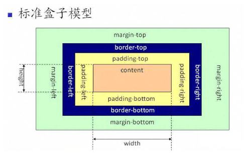

# CSS 盒子模型与怪异盒子模型

盒子模式（`box module`） 可以用来对元素进行布局，包括边距，边框，外边距，和实际内容这几个部分。
盒子模型分为两种：一种是 W3c 标准的盒子模型（标准盒子模型）、第二种是 IE 标准的盒子模型（怪异盒子模型）
当前大部分的浏览器支持的是 W3c 的标准盒子模型，当然 IE 浏览器沿用的是怪异盒子模型。怪异模式是“部分浏览器在支持 W3C 标准的同时还保留了原来的解析模式”，怪异模式主要表现在 IE 内核的浏览器。

### 标准盒子模型与怪异盒子模型的表现效果区别

1、标准盒子模型中 width 指的是内容区域`content`的宽度；`height`指的是内容区域`content`的高度
`标准盒子模型下盒子的大小 = content + border + padding + margin`

2、怪异盒子模型的 width 指的是内容、边框、内边距总的宽度（`content + border + padding`）；高度是指内容、边框、内边距总的高度
`怪异盒子模型下盒子的大小 = width （ content + border + padding ） + margin`

### 如何选择盒子模型

如果是定义了完整的 `doctype` 的标准文档类型，无论是哪种模型情况，最终都会触发标准模式，如果 doctype 协议缺失，会有浏览器自己界定，在 IE 浏览器中 IE9 以下的版本触发怪异模式，其他浏览器中会默认为 W3c 标准模式

### box-sizing

我们还可以通过属性 `box-sizing` 来设置盒子模型的解析模式

`box-sizing` 可选值有 4 个：

**content-box**: 默认值，`border`和 padding 不算到`width`范围内，可以理解为是 W3c 的标准模型（`default`）

**border-box**: `border`和`padding`划归到`width`范围内，可以理解为是`IE`的怪异盒子模型

**unset**: 取消设置

**revert**: 还原
