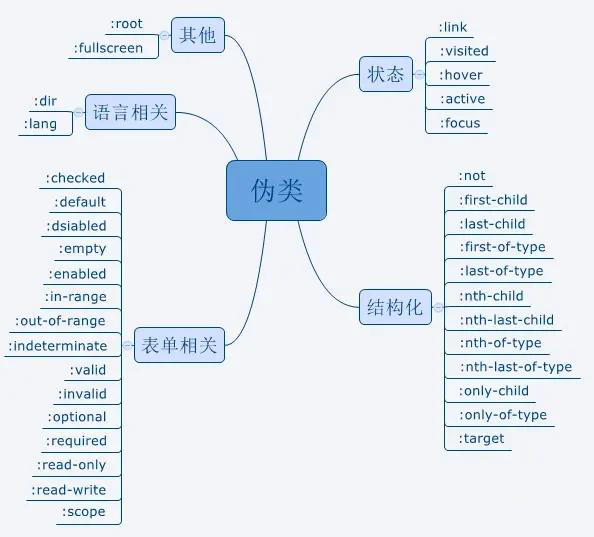

# CSS3中什么是伪类和伪元素？

## 伪类

伪类存在的一样是为了通过选择器找到那些不存在DOM树中的信息以及不能被常规CSS选择器获取到的信息。

1、获取不存在与DOM树中的信息。比如a标签的:link,:visited等，这些信息不存在与DOM树结构中，只能通过CSS选择器来获取；
2、获取不能别常规CSS选择器获取的信息。比如：要获取第一个子元素，我们无法用常规的CSS选择器获取，但可以用个:first-child来获取到。

## 伪元素
伪元素用于创造一些不在文档树中的元素，并为其添加样式。比如说，我们可以通过::berfore来在一个元素前增加一些文本，并为这些文本添加样式。虽然用户可以看到这些文本，但是这些文本实际上不在文档树总。常见的伪元素有::before,::after,::first-line,::first-letter,::selection,::placeholder等。

因此，伪类与伪元素的区别在于：有没有创建一个文档树之外的元素。

## ::after与:after的区别
在实际的开发工作中，我们会看到有人把伪元素写成:after,这实际是CSS2与CSS3新旧标准的归档中不同而导致的。

CSS2中的伪元使用1个冒号，在CSS3中，为了区分伪类和伪元素，归档伪元素使用2个冒号。所以，对于CSS2标准的老伪元素，比如:before,:after,:first-line,:first-letter,写一个冒号浏览器也能识别，但对于CSS3标准的新伪元素，比如:selection,就必须写2个冒号。