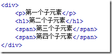

# css 选择器中:first-child 与:first-of-type 的区别

:first-child 选择器是 css2 中定义的选择器，从字面意思上来看也很好理解，就是第一个子元素。比如有段代码：

p:first-child 匹配到的是 p 元素,因为 p 元素是 div 的第一个子元素；

h1:first-child 匹配不到任何元素，因为在这里 h1 是 div 的第二个子元素，而不是第一个；

span:first-child 匹配不到任何元素，因为在这里两个 span 元素都不是 div 的第一个子元素；

然后，在 css3 中又定义了:first-of-type 这个选择器，这个跟:first-child 有什么区别呢？还是看那段代码：

p:first-of-type 匹配到的是 p 元素,因为 p 是 div 的所有类型为 p 的子元素中的第一个；

h1:first-of-type 匹配到的是 h1 元素，因为 h1 是 div 的所有类型为 h1 的子元素中的第一个；

span:first-of-type 匹配到的是第三个子元素 span。这里 div 有两个为 span 的子元素，匹配到的是它们中的第一个。

所以，通过以上两个例子可以得出结论：

:first-child 匹配的是某父元素的第一个子元素，可以说是结构上的第一个子元素。

:first-of-type 匹配的是某父元素下相同类型子元素中的第一个，比如 p:first-of-type，就是指所有类型为 p 的子元素中的第一个。这里不再限制是第一个子元素了，只要是该类型元素的第一个就行了。

同样类型的选择器 :last-child 和 :last-of-type、:nth-child(n) 和 :nth-of-type(n) 也可以这样去理解。
