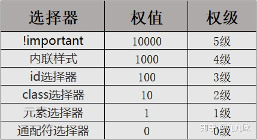

# CSS权重

### 选择器的种类

- !important
- 内联样式
- ID选择器
- class选择器|伪类选择器|属性选择器
- 元素选择器|伪元素选择器
- 通配符选择器

### 权值和权级的概念

我们可以通过给选择器添加权值和权级这两个概念的方式来更好的理解选择器的权重
（注意:“权值”和“权级”的概念是为了更好的理解权重而提出的，并不是真是存在的)

**权值相同时**

由于HTML代码的执行特点时从上往下执行，因此在权值相同的情况下，后面的选择器会覆盖前面的选择器相同的属性

**权值不同时**

两种选择器覆盖了同一属性，此时权重高的选择器生效

**权值跃迁**

权值跃迁讨论的问题是，当有11个元素选择器和1个类选择器同时选中同一元素时，哪个选择器的样式会生效。
结论是：权级高的选择器的样式会生效。
理解方式1
因为权值不能跃迁，也就意味着无论有多少个0级的选择器，生效的仍然是1级选择器，因 为选择器的权级无法跃迁。
理解方式2
CSS里面的进制并不是10进制，而是256进制，所以10个低级选择器并不能等于1个高级选择器。

### 其他选择器

**伪类选择器**
**属性选择器**

伪类选择器和属性选择器的权重相当于类选择器的权重，权级为2级。

**伪元素选择器**

伪元素选择器的权重相当于元素选择器的权重，权级为1级。

**子代选择器**
**后代选择器**

子代和后代有可能是元素选择器、类选择器、id选择器，因此要根据具体情况来具体分析