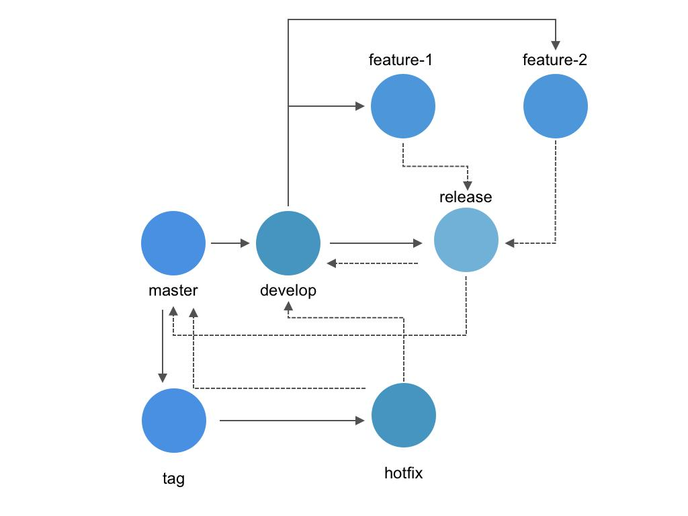

# git flow

## 如何规范 git 版本分支的管理

在团队开发中，我们需要规范 `Git` 版本分支的管理，提高开发效率

以下是一些原则建议：

1、最稳定的代码放到`master`分支上
2、不要直接在`master`提交代码，通过其他分支的代码进行合并
3、需要从`master`分支上拉一条`develop`分支
4、基于`develop`分支，在此基础上拉分支，比如`feature-1`、`feature-2`分支来开发相关新特性
5、新功能开发完后，基于`develop`分支，再拉出一条`release`分支，比如 `release`，然后将`feature`的相关分支合并到`release`分支上，接下来将`release`分支的代码部署到测试环境测试，无`bug`时，再将`release`分支合并到`develop`部署到预发布环境中进行测试，如无任何`bug`，将`develop`合并到`master`分支并部署到生产环境中。
6、上线完成后，在`master`分支上打个`tag`，比如`v1.0.0`

如线上发现`bug`
1、在当前`tag`上拉取一条`hotfix`分支，比如`hotfix-1.0.1`,并在此分支上进行修复
2、修复完成后，同时将`hotfix`合并到`develop`分支合`master`分支

