# 浏览器的Http缓存机制

浏览器的缓存机制也就是我们说的http缓存机制，其机制是根据HTTP报文的缓存标识进行的，所以在分析浏览器缓存机制之前，我们先使用图文简单介绍一下HTTP报文，HTTP报文分两种：

**HTTP请求（request）报文**
报文格式为：请求行-HTTP头（通用信息头，请求头，实体头）-请求报文主体（只有POST才有报文主体）

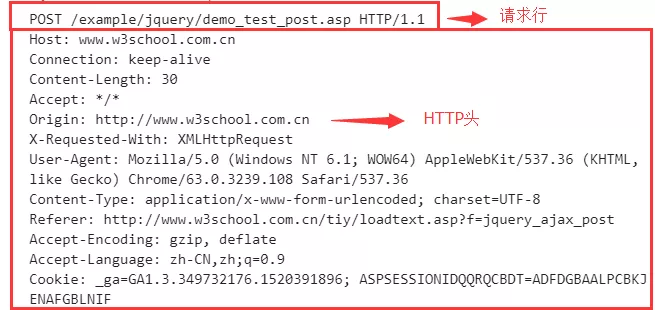

**HTTP响应（response）报文**报文格式为：状态行-HTTP头（通用信息头，响应头，实体头）-响应报文主体

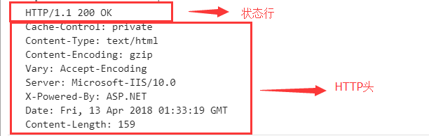

> 注：通用信息头指的是请求和响应报文都支持的头域，分别为Cache-Control、Connection、Date、Transfer-Encoding、Upgrade、Via； 实体头则是实体信息的实体头域，分别为Allow、Content-Base、Content-Encoding、Content-Language、Content-Length、Content-Location、Content-MD5、Content-Range、Content-Type、Etag、Expries、Last-Modified\extension-header.

### 缓存过程分析

浏览器与服务器通信的方式为应答模式，即是：浏览器发起HTTP请求-服务器响应该请求。那么浏览器第一次向服务器发起该请求后拿到结果，会根据响应报文中HTTP头的缓存标识，决定是否缓存结果，是则将请求结果和缓存标识存入浏览器缓存中

**1、浏览器每次发起请求，都会先在浏览器缓存中查找该请求的结果以及缓存标识**

**2、浏览器每次拿到返回的请求结果都会将该结果和缓存标识存入浏览器缓存中**

以上两点结论就是浏览器缓存机制的关键，他确保了每个请求的缓存存入和读取，只要我们再理解浏览器缓存的使用规则，那么所有的问题就迎刃而解了，根据是否需要向服务器重新发起HTTP请求将缓存过程分为两部分，分别为强制缓存和协商缓存

### 强制缓存
强制缓存就是向浏览器缓存查找该请求结果，并根据该结果的缓存规则来决定是否使用该缓存结果的过程，强制缓存的情况主要有三种（暂不分析协商缓存过程），不存在该缓存结果和缓存标识，强制缓存失效，则直接向服务器发起请求（跟第一次发起请求一致）

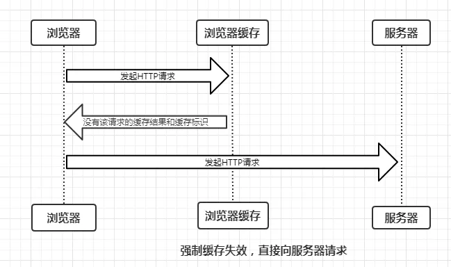

存在改缓存结果和缓存标识，但该结果已失效，则使用协商缓存

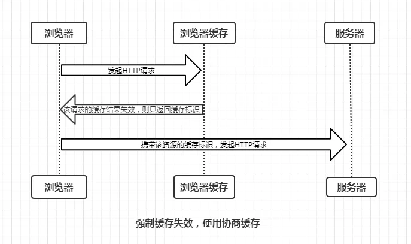

存在该缓存结果和缓存标识，且该结果尚未失效，强制缓存生效，直接返回该结果

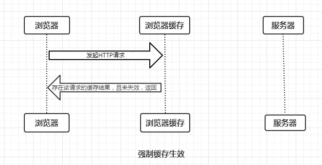

### 强制缓存的缓存规则
当浏览器向服务器发起请求时，服务器会将缓存规则放入HTTP响应报文的HTTP头中和请求结果一起返回给浏览器，控制强制缓存的字段分别是Expires和Cache-Control,其中Cache-Control优先级比Expires高

### Expires
Expires是HTTP/1.0控制网页缓存的字段，其值为服务器返回该请求结果缓存的到期时间，即再次发起该请求时，如果客户端的时间小于Expires的值时，直接使用缓存结果。

** Expires是HTTP/1.0的字段，但是现在浏览器默认使用的是HTTP/1.1，那么在HTTP/1.1中网页缓存是否有Expires控制？**

到了HTTP/1.1，Expires已经被Cache-Control替代，原因在于Expries控制缓存的原来是使用客户端的时间和服务端返回的时间做对比，那边如果客户端与服务端的时间因为某些原因（例如时区不同；客户端和服务端有一方的时间不准确）发生误差，那么强壮缓存则会直接失效，这样的话强制缓存的存在则毫无意义，那么Cache-Control是如何控制的呢？

### Cache-Control
在HTTP/1.1中，Cache-Control是最重要的规则，主要用于控制网页缓存，主要取值为：

1、public：所有内容都将被缓存（客户端和代理服务器都可以缓存）

2、private：所有内容只有客户端可以缓存，Cache-Control的默认取值

3、no-cache：客户端缓存内容，但是是否使用缓存规则则需要经过协商缓存来验证决定

4、no-store：所有内容都不会被缓存，即不使用强制缓存，也不使用协商缓存

5、max-age=xxx(xxx os nimeric)：缓存内容将在xxx秒失效

接下来，我们直接看一个例子

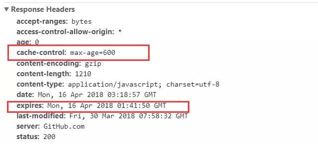

由图上得出结论：

**HTTP响应报文中Expries的时间值，是一个绝对值**

**HTTP响应报文中Cache-Control为max-age=600，是相对值**

由于Cache-Control的优先级比expries，那么直接根据Cache-Control的值进行缓存，意思是在600秒内再次发起该请求，则会直接使用缓存结果，强制缓存生效。注：在无法确定客户端的时间是否与服务端的时间同步的情况下，Cache-Control相比于expires是更好的选择，所以同时存在时，只有Cache-Control生效。了解强制缓存的过程后，我们扩展性的思考一下：
**浏览器的缓存存放在哪里，如何在浏览器中判断强制缓存是否生效？**

状态码为灰色的请求则代表使用了强制缓存，请求对象的size值则代表该缓存存储的位置，分别为from memory cache 和 from disk cache

**from memory cache代表使用内存中的缓存，from disk cache则代表使用的是硬盘中的缓存，浏览器读取缓存的顺序为memory –> disk。**

在浏览器中，浏览器会在js，字体，图片等文件解析执行后直接存入内存缓存中，那么当刷新页面时只需直接从内存缓存中读取(from memory cache)；而css文件则会存入硬盘文件中，所以每次渲染页面都需要从硬盘读取缓存(from disk cache)。

### 为什么CSS会放在硬盘缓存中？
因为CSS文件加载一次就可渲染出来,我们不会频繁读取它,所以它不适合缓存到内存中,但是js之类的脚本却随时可能会执行,如果脚本在磁盘当中,我们在执行脚本的时候需要从磁盘取到内存中来,这样IO开销就很大了,有可能导致浏览器失去响应。

### 协商缓存

协商缓存就是强制缓存失效后，浏览器携带缓存标识向服务器发起请求，由服务器根据缓存标识决定是否使用缓存的过程，主要有以下两种情况：协商缓存生效，返回304；

协商缓存失效，返回200和请求结果；

同样，协商缓存的标识也是在响应报文的HTTP头中和请求结果一起返回给浏览器的，控制协商缓存的字段分别有：Last-Modified / If-Modified-Since 和 Etag / If-None-Match，其中 Etag/ If-None-Match的优先级比Last-Modified / If-Modified-Since高

### Last-Modified / If-Modified-Since
Last-Modified是服务器响应请求时，返回该资源文件在服务器最后被修改的时间

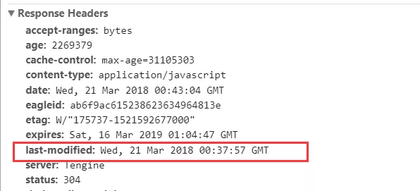

If-Modified-Since 则是客户端再次发起请求是，携带上次请求返回的Last-Modified值，通过此字段值告诉服务器该资源上次请求返回的最好被修改时间。服务器收到该请求，发现请求头含有If-Modified-Since字段，则会根据If-Modified-Since的字段值，则重新返回资源，状态码为200；否则则返回304，代表资源无更新，可继续使用缓存文件

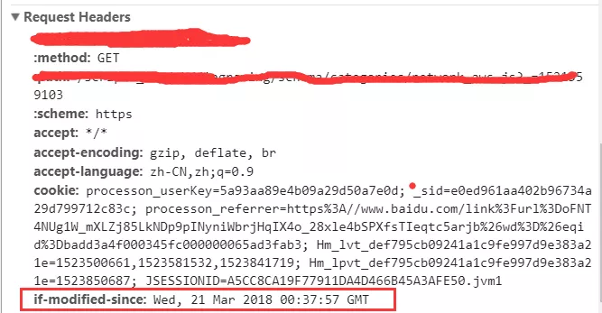

### Etag / If-None-Match
Etag是服务器响应请求时，返回当前资源文件的一个唯一标识（由服务器生产）

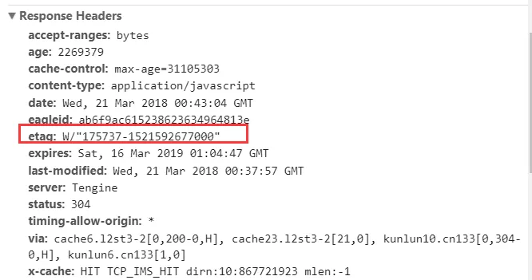

If-None-Match是客户端再次发起该请求时，携带上次请求返回的唯一标识Etag值，通过此字段告诉服务器该资源上次请求返回的唯一标识值。服务器收到该请求后，发现该请求头中含有If-None-Match,则会根据If-None-Match的字段值与该资源在服务器的Etag值做对比，一致则返回304，代表资源无更新，继续使用缓存文件；不一致则重新返回资源文件，状态码为200

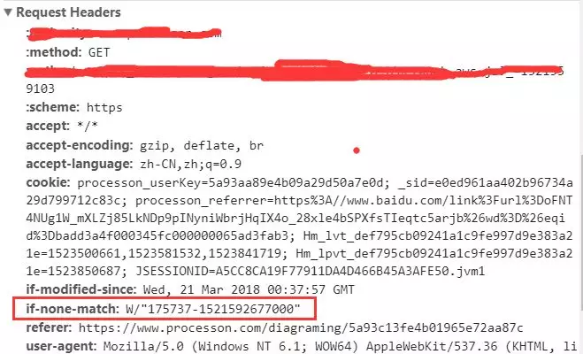

> 注：Etag / If-None-Match 优先级高于 Last-Modified / If-Modified-Since，同时存在则只有Etag / If-None-Match生效

### 总结

强制缓存优先于协商缓存进行，若强制缓存（Expries 和 Cache-Control） 生效则直接使用缓存，若不生效则进行协商缓存（Last-Modified / If-Modified-Since 和 Etag / If-None-Match），协商缓存由服务器决定是否使用缓存，若协商缓存失效，那么代表该请求的缓存失效，重新获取请求结果，再存入浏览器缓存中；生效则返回304，继续使用缓存

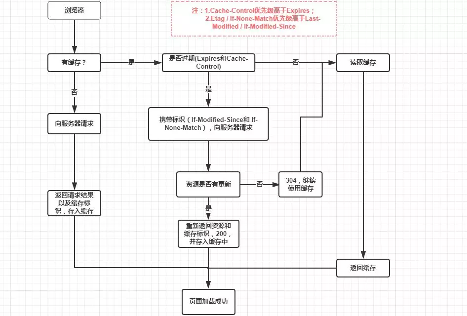

