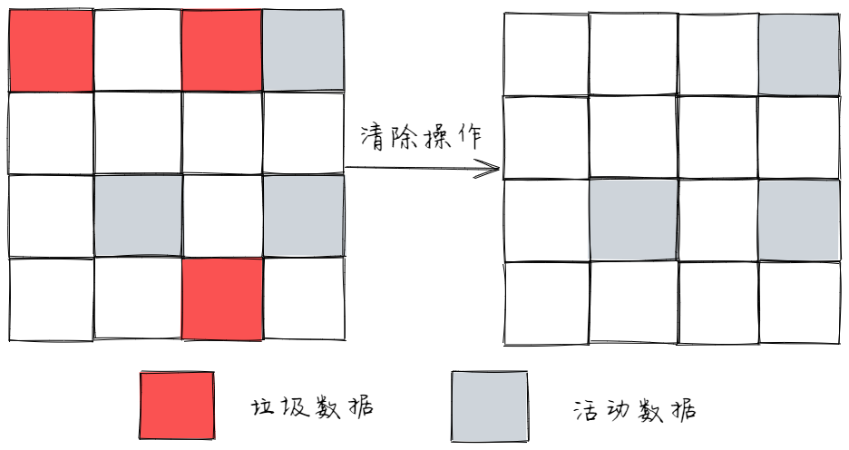
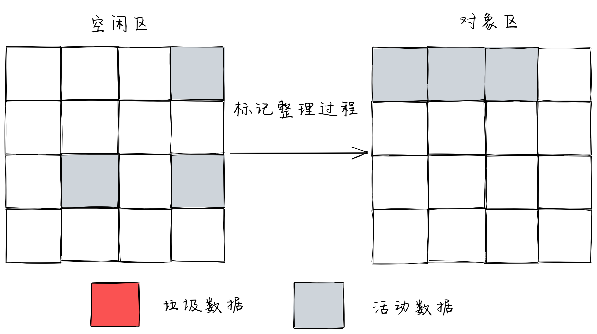
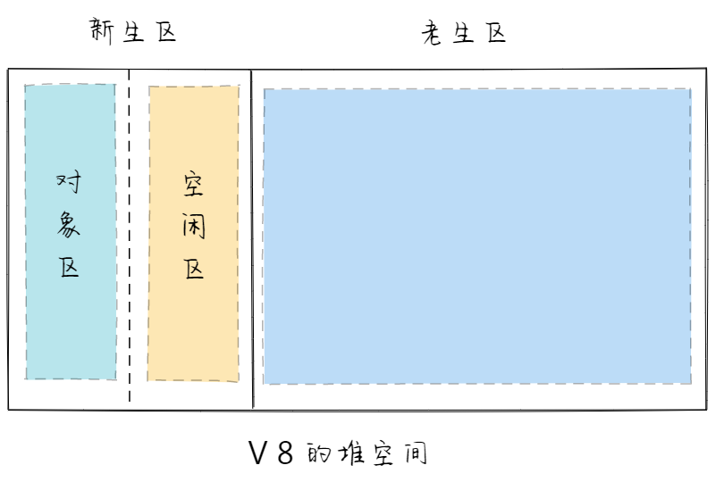
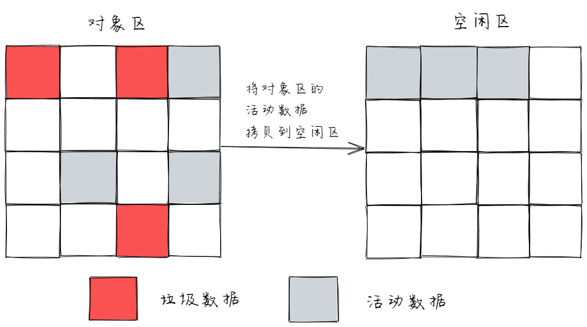
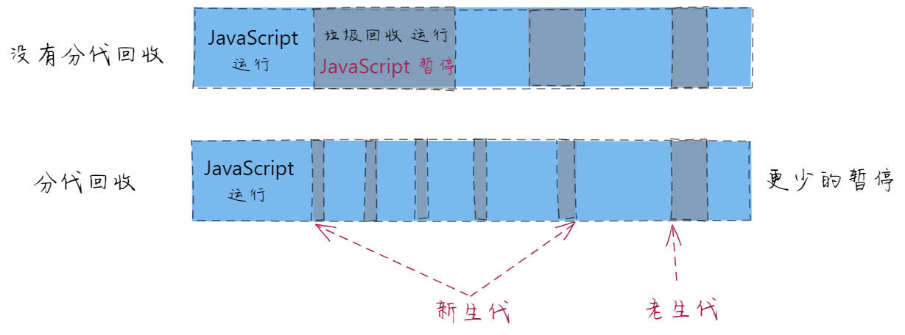
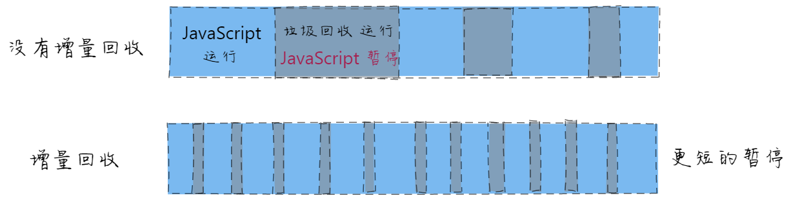

# 垃圾回收

### 垃圾回收算法

可以将这个过程想象从根溢出一个具体的油漆桶，它从一个根节点触发将可到达的对象标记染色，然后移除未标记的
**第一步：标记空间中可达值**
V8 采用的是可达性（reachability）算法来判断对中的对象应不应该被回收

- 从根节点（Root）出发，遍历所有的对象。
- 可以遍历到的对象，是可达的（reachable）
- 没有被遍历到的对象，不可达的（unreachable）

在浏览器环境下，根节点有很多，主要包括这几个

- 全局变量 window，位于每个 iframe 中
- 文档 DOM 树
- 存放在栈上的变量
- ...

这些根节点不是垃圾，不可能被回收

**回收不可达的值所占据的内存**

在所有的标记完成之后，统一清理内存中所有不可达的对象

**做内存整理**

在频繁回收对象后，内存中会存在大量不连续控件，专业名称叫内存碎片

当内存出现了大量的内存碎片，如果需要分配较大的联系内存时，就有可能出现内存不足的情况。

所以最后一步是整理内存碎片。（但这步其实是可选的，因为有的垃圾回收器不会产生内存碎片，比如副垃圾回收器）

### 什么时候垃圾回收

浏览器进行垃圾回收的时候，会暂停 Javascript 脚本，等垃圾回收完毕再继续执行。

对于普通应用这样没什么问题，但对于 Js 游戏、动画对连贯性要求比较高的应用，如果暂停时间很长就会造成页面卡顿。

### 如何避免长时间暂停-分代收集

浏览器将数据分成 2 种，一种是临时对象，一种是长久对象

**临时对象**

大部分对象在内存存活的时间很短。

比如函数内部声明的变量，或者块级作用域中的变量。当函数或者代码块执行结束时，作用域中定义的变量就会被销毁。

这类对象很快变得不可访问，应该快点回收

**长久对象**

生命周长很长的对象，比如全局的 window，DOM，Web API 等等

这类对象可以慢点回收

这 2 种对象对应于不同的回收策略，所以 V8 把堆分为新生代和老生代两个两个区域，新生代中存放临时对象，老生代存放持久对象。

并且让副垃圾回收器、主垃圾回收器，分别负责新生代、老生代的垃圾回收。

这样就可以实现高效的垃圾回收

**主垃圾回收器**

负责老生代的垃圾回收，有两个特点

1、对象占用空间大。
2、对象存活时间长。

它使用标记清除的算法执行垃圾回收

1、收下是标记

- 从一组跟元素开始，递归遍历这组跟元素
- 在这个遍历过程，能到达的元素称为活动对象，没有到达的元素就可以判断为垃圾数据

2、然后是垃圾清除，直接将标记为垃圾的数据清理掉

3、多次标记清除后，会产生大量不连续的内碎片，需要进行内存整理

**副垃圾回收器**

负责新生代的垃圾回收，通常只支持 1~8M 的容量

新生代被分为两个区域：一半是对象区域，一半是空闲区域

新加入的对象都被放入对象区域，等对象区域快满的时候会执行一次垃圾清理。

1、先给对象区域所有垃圾做标记

2、标记完成后，存活的对象被复制到空闲区域，并且将他们有序的排列一遍

因为空闲区域里此时是有序的，没有碎片，也不需要整理

3、复制完成后，对象区域会和空闲区域进行对调。将空闲区域中存活的对象放入对象区域里。

这样，就完成了垃圾回收

因为副垃圾回收器操作比较频繁，所以为了执行效率，一般新生区的控件会被设置得比较小

一旦检测到控件装满了，就执行垃圾回收。

**分代收集**

一句话总结分代回收就是：将堆分为新生代与老生代，多回收新生代，少回收老生代。这样就减少了每次需遍历的对象，从而减少每次垃圾回收的耗时。

**增量收集**

如果脚本中有许多对象，引擎一次性遍历整个对象，会造成一个长时间暂停。

所以引擎将垃圾收集工作分成更小的块，每次处理一部分，多次处理。

这样就解决了长时间停顿的问题。

**闲时收集**

垃圾收集器只会在 cpu 空闲时尝试运行，以减少可能对代码执行的影响。

### 【面试题】浏览器怎么进行垃圾回收

从三个点回答什么是垃圾，如何捡垃圾，什么时候捡垃圾

1、什么是垃圾

不再需要，即为垃圾

全局变量随时可能用到，所以一定不是垃圾

2、如何捡垃圾

标记空间中可达值

从根节点触发，遍历所有的对象。

可以遍历到的对象，是可达的

没有被遍历到的对象，不可达的

回收不可达的值所占据的内存

做内存整理

3、什么时候捡垃圾

前端有其特殊性，垃圾回收的时候会造成页面卡顿

分代收集，增量收集，闲时收集

### 【面试题】浏览器中不同类型变量的内存是如何释放？

Javascript 中类型：值类型，引用类型

- 引用类型 在没有引用之后通过 V8 自动回收。

值类型

- 如果处于闭包的情况下，要等闭包没有引用才会 V8 回收
- 非闭包的情况下，等待 V8 的新生代切换的时候回收

### 【面试题】哪些情况会导致内存泄漏，如何避免

**内存泄漏是指访问不到的变量依然占据着内存空间，不能被再次利用起来。**

以 Vue 为例，通常有这些情况：

- 监听在 window/ body 等事件没有解绑
- 绑在 EventBus 的事件没有解绑
- Vuex 的\$store, watch 了之后没有 unwatch
- 使用第三方库创建，没有调用正确的销毁函数

解决的方法： beforeDestory 中及时销毁

- 绑定了 DOM/BOM 对象中的事件 addEventListener，removeEventListner
- 观察者模式$on，$off 处理
- 如果在组件中使用了定时器，应销毁处理
- 如果在 mounted/created 钩子中使用了第三方库初始化，对应的销毁。
- 使用弱引用 weakMap，weakSet

### 【面试题】闭包会导致内存泄漏吗

不会

### 【面试题】 weakMap，weakSet 和 Map， Set 有什么区别

在 ES6 中新增两个数据结构 WeakMap、WeakSet，就是为了解决内存泄漏的问题。

它的键名所引用的对象都是弱引用，就是垃圾回收机制就会释放该对象所占用的内存。

也就是，一旦不再需要，WeakMap 里面的键名对象和所应对的键值对会自动释放，不用手动删除引用
