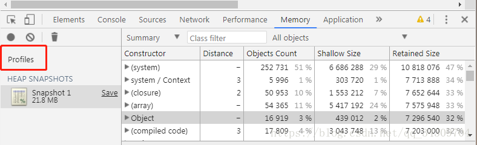
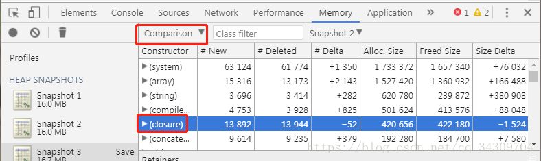

# JS内存泄漏排查方法
## 1、使用工具 Heap Profiling
1.  Heap Profiling 可以记录当前的堆内存（heap）的快照，并生成对象的描述文件，该描述文件给出了当时Js运行所用的所有对象，以及这些对象所占用的内存大小，引用的层级关系等等。
2. JS运行的时候，会有栈内存（stack）和堆内存（heap），当我们new一个类的时候，这个new出来的对象就报错在heap里，而这个对象的引用则存储在stack里。程序通过stack的引用找到这个对象。例如：var a = [1,2,3], heap里存储着内容[1,2,3]的Array对象
3. 打开调试工具，点击Memory中的Profiles标签，选中“Take heap Snapshot”,点击“start”按钮，就可以拍到当前JS的heap快照了。

右边视图中列出了heap里面的对象列表
* constructor:     类名
* Distance:        对象到根的引用层级距离
* Object Count:    该类的对象数
* Shallow Size:    对象所占内存（不包括内存引用的其他对象所占的内存）
* Retained Size:   对象所占的总内存

点击上图左上角的黑圈圈，会出现第二个内存快照

## 2、 内存泄漏的排查

将上图框框切换到comparise（对照）选项，该视图列出了当前实体与上个实体的对象差异

* #New : 新建了多少对象
* #Deleted: 回收了多少对象
* #Delta: 新建的对象格式减去回收的对象个数

重点看closure(闭包)，如果#Delta为正数，则表示创建了闭包函数，如果多个快照中都没有变负数，则表示没有销毁闭包