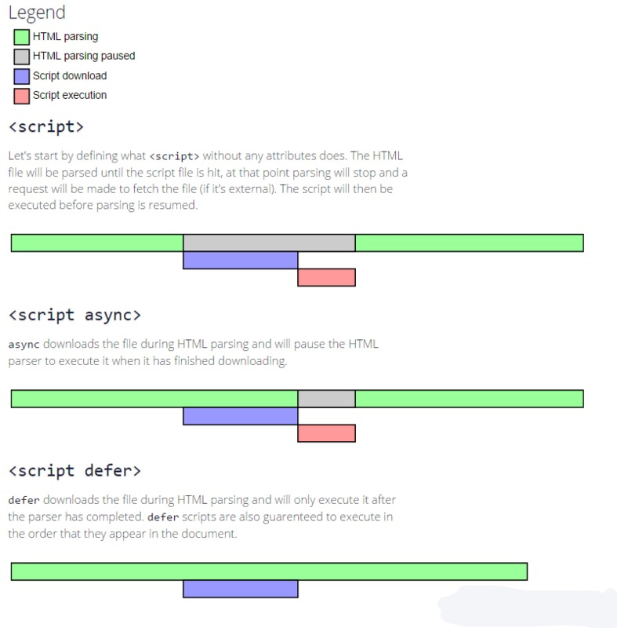

# script标签




### script标签的位置

传统的做法是：所有script元素都放在head元素中，必须等到全部的js代码都被下载、解析、执行完毕后，才开始呈现网页的内容（浏览器在遇到&lt;body&gt;标签时才开始呈现内容），这在需要很多JS代码的页面来说，会造成浏览器在呈现页面时出现明显的延迟，而延迟期间的浏览器窗口将是一片空白。因此，一般把script标签放在&lt;body&gt;标签前面

### 嵌入脚本与外部脚本

尽可能使用外部脚本

- 将所有js文件放到一个文件夹中，在不触及HTML代码的情况下编辑js文件，便于维护

- 浏览器可以根据具体的设置所有外部js文件，同一个文件只需下载一次，可以加快页面加载的速度


### defer和async

- 1、defer="defer"和async="true/false"

html4.0中定义了defer；html5.0中定义了async

（1）没有defer或async，浏览器会立即加载并执行指定的JS脚本，也就是说，不等待后续载入的文档元素，读到JS脚本就加载并执行。

（2）有async，加载后续文档元素的过程将和JS的加载与执行并行进行（异步）

（3）有defer，加载后续文档元素的过程将和JS的加载并行进行（异步），但JS的执行要在所有文档元素解析完成之后，DOMContentLoaded事件触发之前完成。

- 2、defer和async的共同点：

（1）不会阻塞文档元素的加载

（2）使用这两个属性的脚本中不能调用domcument.write方法

（3）允许不定义属性值，仅仅使用属性名

（4）只适用于外部脚本

- 3、defer和async的不同点

（1）每一个async属性的脚本一旦加载完毕就会立即执行，一定会在window.onload之前执行，但可能在document的DOMContentLoaded之前或者之后执行。不能保证安装指定他们的顺序来执行，如果JS有依赖性就需要注意了。指定异步脚本的目的是不让页面等待两个脚本下载和执行，从而异步加载页面其他内容，因此，建议异步脚本不要在加载期间修改DOM

（2）每一个defer属性的脚本都是在文档元素完成载入后，一般会按照原本的顺序执行，同时一般会在document的DOMContentLoaded之前执行，相当于window.onload，但应用上比window.onload更灵活。实际上，defer更接近于DomContentLoad。实际上，延迟脚本不一定会按顺序执行，也不一定会在会在DOMContentLoaded事件触发之前执行，隐藏最好只包含一个延迟脚本

### 动态创建script

在没有定义defer和async之前，异步加载的方式是动态创建script，通过window.onload方法确保页面加载完毕再将script标签插入到DOM中

```js

function addScript(url) {
  var script = document.createElement('script')
  script.setAttribute('type', 'text/javascript')
  script.src = url
  script.addEventListener('load', function(event){ console.log(event) })
  document.body.appendChild(script)
}

window.onload = function onload() {
  addScript('js/index.js')
}
```