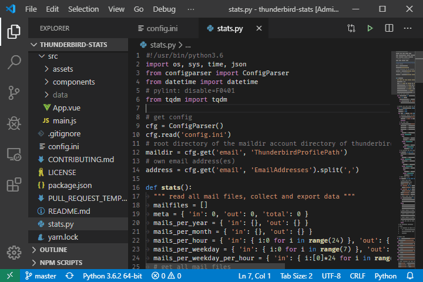
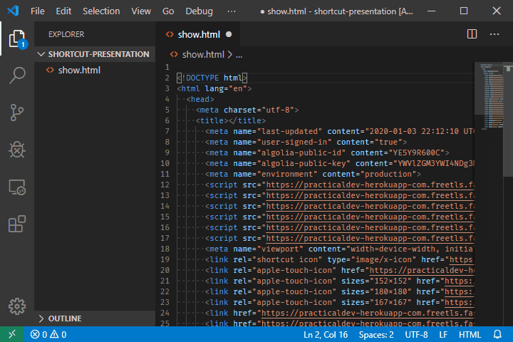
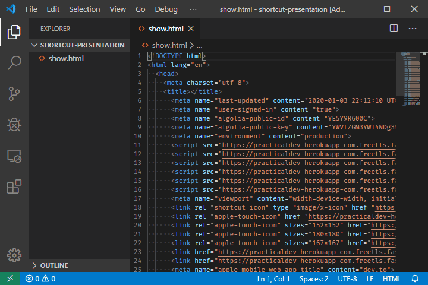
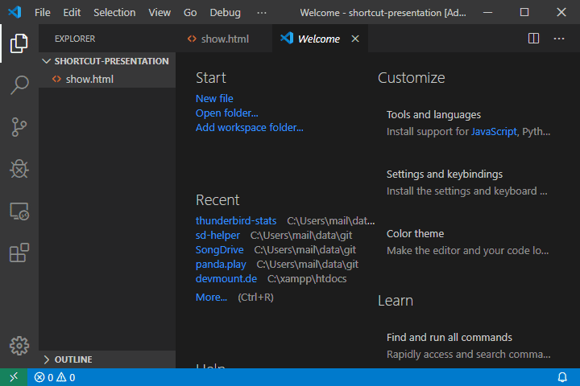
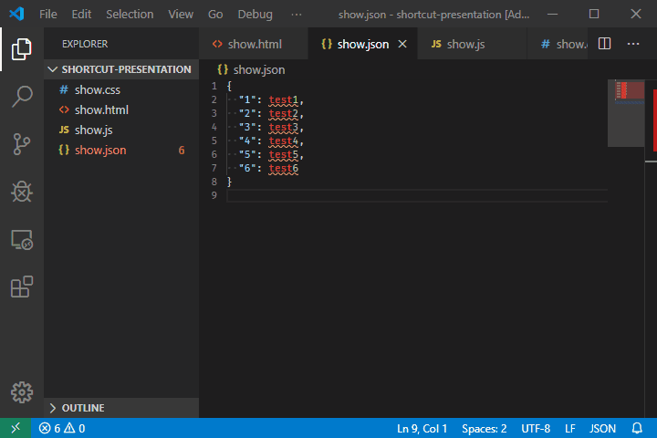
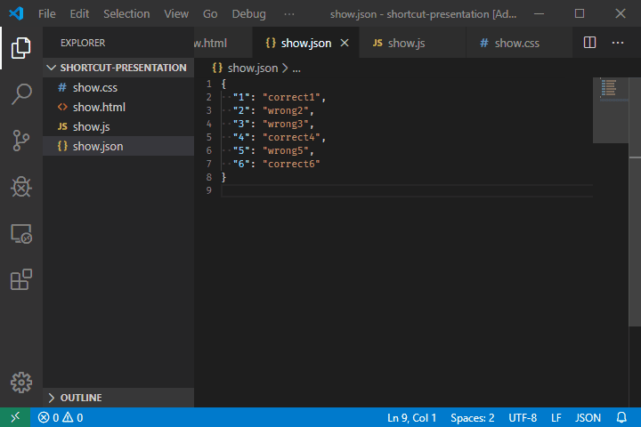
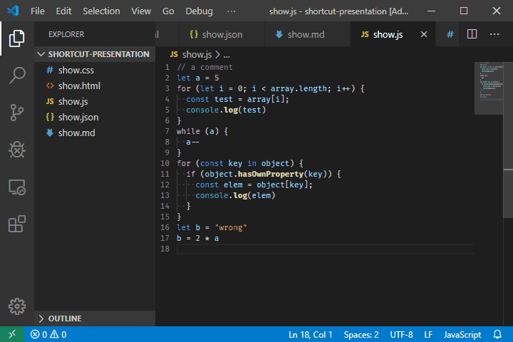
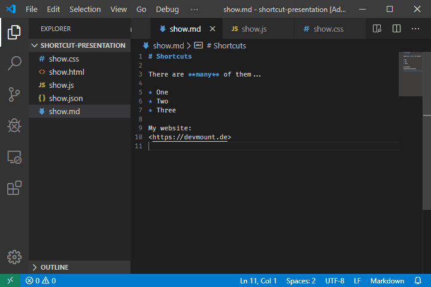
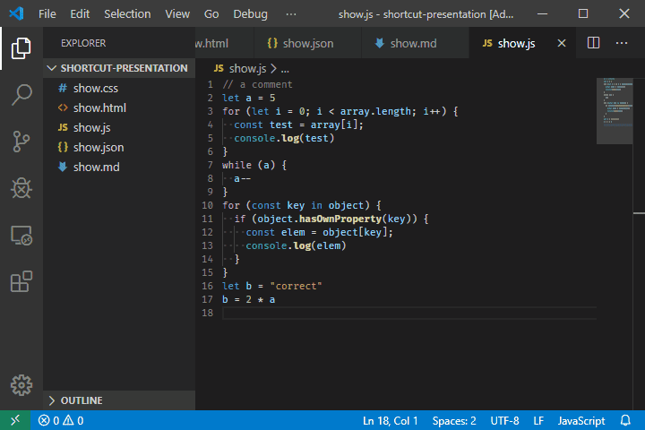

# VS Code 快捷键

列出VS Code实用的快捷方式，记住快捷键能够提高工作效率，尤其是使用笔记本开发的。

### 1、切换工作区 CTRL + R

### 2、切换自动换行 ALT + Z 

### 3、CTRL + G 跳转到行 

### 4、CTRL + P 跳转到文件 

### 5、SHIFT + ALT + I 在所选的每一行的末尾插入光标

### 6、CTRL + L 选中当前行

### 7. CTRL + SHIFT + L 选中所有找到的匹配项

### 8、CTRL + SHIFT + H 替换文件 

### 9、CTRL + K V  打开 MarkDown 侧边预览

### 10、CTRL + K Z 切换禅模式
编码无干扰。要退出禅模式，按ESC即可

