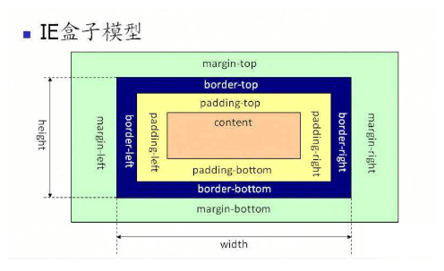

# CSS盒子模型与怪异盒子模型
盒子模式（box module） 可以用来对元素进行布局，包括边距，边框，外边距，和实际内容这几个部分。
盒子模型分为两种：一种是W3c标准的盒子模型（标准盒子模型）、第二种是IE标准的盒子模型（怪异盒子模型）
当前大部分的浏览器支持的是W3c的标准盒子模型，当然IE浏览器沿用的是怪异盒子模型。怪异模式是“部分浏览器在支持W3C标准的同时还保留了原来的解析模式”，怪异模式主要表现在IE内核的浏览器。

### 标准盒子模型与怪异盒子模型的表现效果区别

1、标准盒子模型中width指的是内容区域content的宽度；height指的是内容区域content的高度
标准盒子模型下盒子的大小 = content + border + padding + margin

2、怪异盒子模型的width指的是内容、边框、内边距总的宽度（content + border + padding）；高度是指内容、边框、内边距总的高度
怪异盒子模型下盒子的大小 = width （ content + border + padding ） + margin

### 如何选择盒子模型
如果是定义了完整的doctype的标准文档类型，无论是哪种模型情况，最终都会触发标准模式，如果doctype协议缺失，会有浏览器自己界定，在IE浏览器中IE9以下的版本触发怪异模式，其他浏览器中会默认为W3c标准模式

### box-sizing
我们还可以通过属性box-sizing来设置盒子模型的解析模式
box-sizing可选值有三个：
content-box: 默认值，border和padding不算到width范围内，可以理解为是W3c的标准模型（default）
border-box: border和padding划归到width范围内，可以理解为是IE的怪异盒子模型
padding-box: 将padding算入width范围
