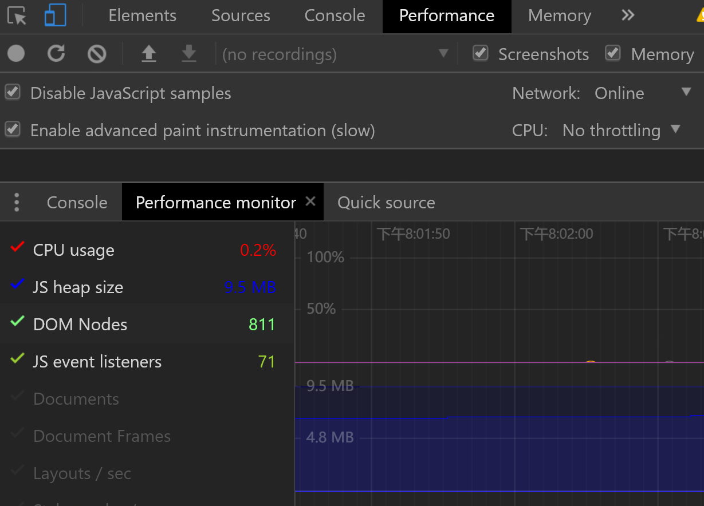

# 前端性能分析工具
chrome的强大性能监测功能 performance monitor
首先打开chrome的开发者工具，然后 ctrl+shift+p （mac: command+shift+p）
输入命令 show performance monitor。可以看到chrome的性能监测面板
使用这个面板可以实时的查看程序运行的性能。

面板有以下几个指标

- CPU usage

 cpu占用率

- Js heap size

js使用内存情况

- DOM Nodes

DOM 的节点数（不是绑定在dom上才算）

- JS event listeners

绑定事件个数

- 页面重绘重排等指标

通过操作页面，可以看到指标值发生变化

 1、如果CPU占用率很高而且降不下来则程序会有很耗cpu的运算函数

 2、如果JS内存只有上升没有下降，则程序会有内存溢出，可能有闭包函数，内存不能释放

 3、通过document.createElement('div') 可以增加DOM的节点数，不一定存在文档中

 4、添加dom的事件，则会增加JS event listeners 个数