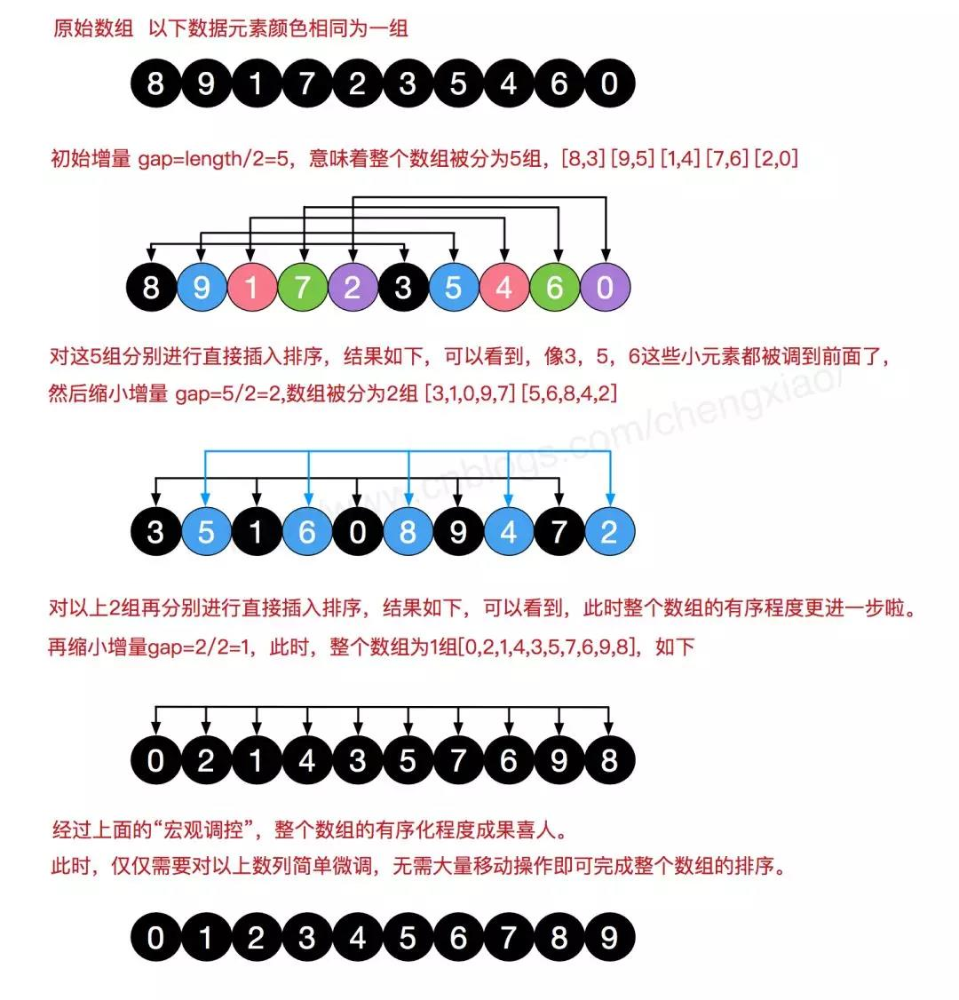
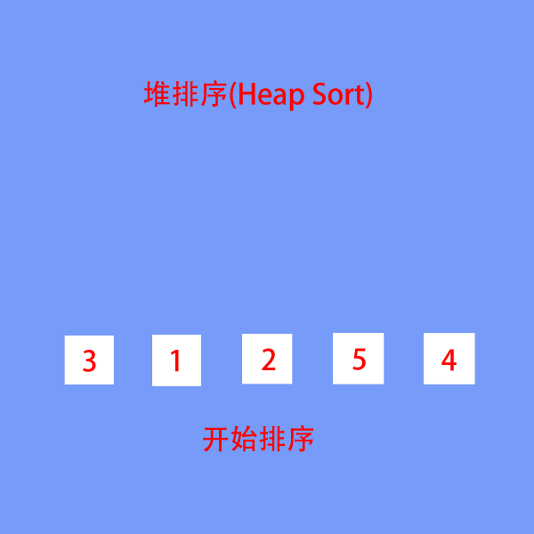
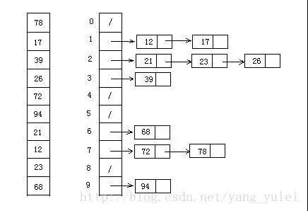
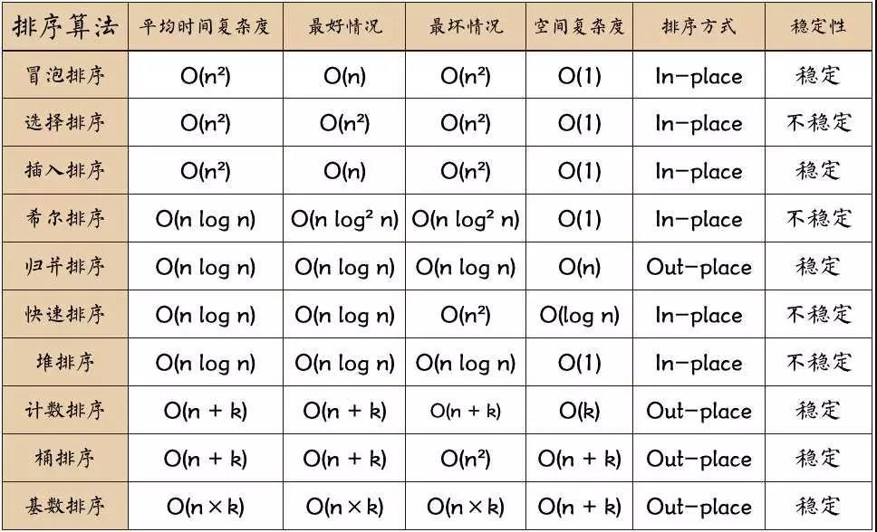

# 十大算法

十大排序算法可以说是每个程序都必须得掌握的。

#### 术语解析

1、稳定排序：如果 a 原本在 b 的前面，而且 a == b，排序之后 a 仍然在 b 的前面，则为稳定排序，否则为非稳定排序

2、原地排序：在排序过程中不申请多余的存储空间，只利用原来存储待排数据的存储空间进行比较和交换的数据排序，否则为非原地排序

3、时间复杂度：一个算法执行所消耗的时间

4、空间复杂度：一个算法所需的内存的大小

### 选择排序

过程：找到数组中最小的那个元素，其次，将他和数组的第一个元素交换位置（如果 第一个元素就是最小元素，那么他就和自己交换）。其次，在剩下的元素中找到最小的元素，将他与数组的第二个元素交换为止，如此往复，直到将整个数组排序。


```js
function selectSort(arr) {
  const len = arr.length;
  for (let i = 0; i < len - 1; i++) {
    let min = i;
    for (let j = i + 1; j < len; j++) {
      if (arr[min] > arr[j]) {
        min = j;
      }
    }
    const temp = arr[i];
    arr[i] = arr[min];
    arr[min] = temp;
  }
  return arr;
}

selectSort([1, 3, 4, 5, 8, 1, 3, 4]);
```

性质：
1、时间复杂度（O(n2)）
2、空间复杂度（O(1)）
3、非稳定排序
4、原地排序

### 插入排序

过程：从数组第 2 个元素开始抽取元素，把他与左边第一个元素比较，如果左边第一个元素比他大，则继续与左边第二个元素比较下去，直到遇到不比他大的元素，然后插到这个元素的右边，继续选取第 3、4,...n 个元素，重复操作，选择适当的位置插入


```js
function insertSort(arr) {
  const len = arr.length;
  for (let i = 1; i < n; i++) {
    let temp = arr[i];
    let k = i - 1;
    while (k >= 0 && arr[k] > temp) {
      k--;
    }
    for (let j = i; j > k + 1; j--) {
      arr[j] = arr[j - 1];
    }
    arr[k + 1] = temp;
  }
  return arr;
}
```

性质：
1、时间复杂度（O(n2)）
2、空间复杂度（O(1)）
3、稳定排序
4、原地排序

### 冒泡排序

过程：把第一个元素与第二个元素比较，如果第一个比第二个大，则交换他们的位置。接着继续比较第二个与第三个，如果第二个比第三个大，则交换他们的位置...
对每一对相邻元素做同样的工作，从开始第一对到结尾的最后一对，这样一趟比较交换下来，排在最右边的元素就会是最大的数，除去最右边的元素，对剩余的元素做同样的工作，如此重复下去，直到排序完成


```js
function bubbleSort(arr) {
  const len = arr.length;
  for (let i = 0; i < len; i++) {
    for (let j = 0; j < len - i - 1; j++) {
      if (arr[j + 1] < arr[j]) {
        let temp = arr[j];
        arr[j] = arr[j + 1];
        arr[j + 1] = temp;
      }
    }
  }
}
```

性质：
1、时间复杂度（O(n2)）
2、空间复杂度（O(1)）
3、稳定排序
4、原地排序

优化冒泡排序算法
假如从开始第一对到结尾的最后一对，相邻的元素直接都没有发生交换的操作，这意味着右边的元素总是大于左边的元素，此时的数组已经是有序的了，无需再对剩余的元素重复比较下去

```js
function bubbleSort(arr) {
  const len = arr.length;
  for (let i = 0; i < len; i++) {
    let flag = true;
    for (let j = 0; j < len - i - 1; j++) {
      if (arr[j + 1] < arr[j]) {
        flag = false;
        let temp = arr[j];
        arr[j] = arr[j + 1];
        arr[j + 1] = temp;
      }
    }
    if (flag) {
      break;
    }
  }
}
```

### 快速排序

从数组中选择一个元素，把这个元素称为中轴元素，然后把数组中所有小于中轴元素的元素放在左边，所有大于或等于中轴元素的元素放在右边，显然，此时中轴元素所处的位置是有序的，也就是说，无需再一对中轴元素的位置
从中轴元素那里开始把大的数组介个成两个小的数组（两个数组都不包含中轴元素），接着我们通过递归的方式，让中轴元素左边的数组和右边的数组也重复同样的操作，直到数组的大小为 1，此时每个元素都处于有序的位置


```js
function quickSort(arr, left, right) {
  if (left < right) {
    // 获取中轴元素所处的位置
    let mid = partition(arr, left, right);
    // 进行分割
    arr = quickSort(arr, left, mid - 1);
    arr = quickSort(arr, mid + 1, right);
  }
  return arr;
}

function partition(arr, left, right) {
  // 选取中轴元素
  let pivot = arr[left];
  let i = left + 1;
  let j = right;
  while (true) {
    // 向右找到第一个大于等于 pivot 的元素位置
    while (i <= j && arr[i] <= pivot) {
      i++;
    }
    // 向左找到第一个大于等于 pivot 的元素位置
    while (i <= j && arr[j] >= pivot) {
      j--;
    }
    if (i >= j) {
      break;
    }
    //   交换两个元素的位置，使得左边的元素不大于pivot,右边的不小于pivot
    let temp = arr[i];
    arr[i] = arr[j];
    arr[j] = temp;
  }
  arr[left] = arr[j];
  // 使中轴元素处于有序的位置
  arr[j] = pivot;
  return j;
}

quickSort([1, 3, 4, 5, 8, 1, 3, 4], 0, 7);
```

性质：
1、时间复杂度（O(nlogn)）
2、空间复杂度（O(logn)）
3、非稳定排序
4、原地排序

### 希尔排序（插入排序的变种）

希尔排序可以说是插入排序的一种变种，无论是插入排序还是冒泡排序，如果数组的最大值刚好是第一位，要将他挪到正确的位置就需要 n -1 次移动。也就是说，原数组的一个元素如果距离他正确的位置很远的话，则需要与相邻元素交换很多次才能到达正确的位置，这样是相对比较花时间
希尔排序就是为了加快速度简单地改进了插入排序，交换不相邻的元素以对数组的举报进行排序
希尔排序的实现是采用插入排序的方法，先让数组中人员间隔为 h 的元素有序，刚开始 h 的大小可以是 h = n / 2,接着让 h = n / 4, 让 h 一直缩小，当 h = 1 时，也就是此时数组中任意间隔为 1 的元素有序，此时的数组就是有序的了。



```js
function shellSort(arr) {
  const len = arr.length;
  for (let h = Math.floor(len / 2); h > 0; h = Math.floor(h / 2)) {
    for (let i = h; i < len; i++) {
      insertI(arr, h, i);
    }
  }
  return arr;
}

function insertI(arr, h, i) {
  const temp = arr[i];
  let k;
  for (k = i - h; k > 0 && temp < arr[k]; k -= h) {
    arr[k + h] = arr[k];
  }
  arr[k + h] = temp;
}

shellSort([8, 9, 1, 7, 2, 3, 5, 4, 6, 0]);
```

性质：
1、时间复杂度（O(nlogn)）
2、空间复杂度（O(1)）
3、非稳定排序
4、原地排序

### 归并排序

过程：将一个大的无需数组有序，我们可以把大的数组分成两个，然后对这两个数组分别进行排序，之后在把这两个数组合并成一个有序的数组。由于两个小的数组都是有序的，所以在合并的时候是很快的
通过递归的方式将大的数组一直分割，直到数组的大小为 1，此时只有一个元素，那么该数组就是有序的了，之后再把两个数组大小为 1 的合并成一个大小为 2 的，再把两个大小为 2 的合并成 4 的...直到全部小的数组合并起来


```js
function mergeSort(arr, left, right) {
  if (left < right) {
    let mid = Math.floor((left + right) / 2);
    arr = mergeSort(arr, left, mid);
    arr = mergeSort(arr, mid + 1, right);
    merge(arr, left, mid, right);
  }
  return arr;
}

function merge(arr, left, mid, right) {
  const a = Array(right + left - 1);
  let i = left;
  let j = right;
  let k = 0;
  while (i <= mid && j <= right) {
    if (arr[i] < arr[j]) {
      a[k++] = arr[i++];
    } else {
      a[k++] = arr[j++];
    }
  }
  while (i <= mid) {
    a[k++] = arr[i++];
  }
  while (j <= right) {
    a[k++] = arr[j++];
  }
  for (i = 0; i < k; i++) {
    arr[left++] = a[i];
  }
}

mergeSort([1, 3, 4, 5, 8, 1, 3, 4], 0, 7);
```

性质：
1、时间复杂度（O(nlogn)）
2、空间复杂度（O(n)）
3、稳定排序
4、非原地排序

### 堆排序

堆的特点是堆顶的元素时一个最值，大顶堆得堆顶是最大值，小顶堆则是最小值。
堆排序就是把堆顶的元素与最后一个元素交换，交换之后破坏了堆得特性，再把堆中剩余的元素再次构成一个大顶堆，然后再把堆顶元素与最后第二个元素交换...如此往复下去，等到剩余的元素只有一个的时候，此时的数组就是有序的了。



```js
function headSort(arr) {
  let n = arr.length;
  for (let i = Math.floor((n - 2) / 2); i >= 0; i--) {
    downAdjust(arr, i, n - 1);
  }
  for (let i = n - 1; i >= 1; i--) {
    let temp = arr[i];
    arr[i] = arr[0];
    arr[0] = temp;
    // 把打乱的堆进行调整，恢复堆的特性
    downAdjust(arr, 0, i - 1);
  }
  return arr;
}

function downAdjust(arr, parent, n) {
  let temp = arr[parent];
  // 定位左孩子节点的位置
  let child = 2 * parent + 1;
  // 开始下沉
  while (child <= n) {
    // 如果右孩子节点比左孩子大，则定位到右孩子
    if (child + 1 <= n && arr[child] < arr[child + 1]) {
      child++;
    }
    if (arr[child] <= temp) {
      break;
    }
    arr[parent] = arr[child];
    parent = child;
    child = 2 * parent + 1;
  }
  arr[parent] = temp;
}

headSort([1, 3, 4, 5, 8, 1, 3, 4]);
```

性质：
1、时间复杂度（O(nlogn)）
2、空间复杂度（O(1)）
3、非稳定排序
4、原地排序

### 计数排序

计数排序是一种适合于最大数和最小数的差值不是很大的排序
过程：把数组元素作为数组的下标，然后用一个临时数组统计该元素出现的次数，例如 temp[i] = m ,表示元素 i 一共出现了 m 次。最后再把临时数组统计的数据从小到大汇总起来，此时汇总起来的数据是有序的


```js
function countSort(arr){
  let n = arr.length;
  let max = arr[0];
  // 寻找数组的最大值
  for (let i = 1; i < n; i++) {
      if(max < arr[i]){
        max = arr[i];
      }
  }
  //创建大小为max的临时数组
  const temp = Array(max).fill(0);
  //统计元素i出现的次数
  for (let i = 0; i < n; i++) {
      temp[arr[i]]++;
  }
  let k = 0;
  //把临时数组统计好的数据汇总到原数组
  for (let i = 0; i <= max; i++) {
      for (let j = temp[i]; j > 0; j--) {
          arr[k++] = i;
      }
  }
  return arr;
}

countSort([1, 3, 4, 5, 8, 1, 3, 4]);
```

优化存储空间

```js
function countSort(arr){
  let n = arr.length;
  let min = arr[0]
  let max = arr[0];
  // 寻找数组的最大值
  for (let i = 1; i < n; i++) {
      if(max < arr[i]){
        max = arr[i];
      }
      if(min > arr[i]) {
        min = arr[i]
      }
  }
  let d = max - min + 1
  //创建大小为max的临时数组
  const temp = Array(d).fill(0);
  //统计元素i出现的次数
  for (let i = 0; i < n; i++) {
      temp[arr[i] - min]++;
  }
  let k = 0;
  //把临时数组统计好的数据汇总到原数组
  for (let i = 0; i <= max; i++) {
      for (let j = temp[i]; j > 0; j--) {
          arr[k++] = i + min;
      }
  }
  return arr;
}

countSort([10001, 10003, 10004, 10005, 10008, 10001, 10003, 10004]);
```

性质：
1、时间复杂度（O(kn)）
2、空间复杂度（O(k)）
3、稳定排序
4、非原地排序

### 桶排序

过程：把最大值和最小值之间的数进行瓜分，例如分成 10 个区间，10 个区间对应 10 个桶，把各元素放到对应区间的桶中去，再对每个桶中 的数进行趴下，可以采用归并排序，也可以采用快速排序之类的，之后每个桶里面的数据就是有序的了，最后进行合并汇总。



```js
function bucketSort(arr) {
  let n = arr.length;
  let max = arr[0];
  let min = arr[0];
  // 寻找数组的最大值与最小值
  for (let i = 1; i < n; i++) {
    if (min > arr[i]) {
      min = arr[i];
    }
    if (max < arr[i]) {
      max = arr[i];
    }
  }
  // 和优化版本的计数排序一样，弄一个大小为 min 的偏移值
  let d = max - min;
  // 创建 d / 5 + 1 个桶，第 i 桶存放  5*i ~ 5*i+5-1范围的数
  let bucketNum = Math.floor(d / 5) + 1;
  // 初始化桶
  const bucketList = Array(bucketNum)
    .fill(0)
    .map(() => []);

  //遍历原数组，将每个元素放入桶中
  for (let i = 0; i < n; i++) {
    bucketList[Math.floor((arr[i] - min) / d)].push(arr[i] - min);
  }
  //对桶内的元素进行排序，我这里采用系统自带的排序工具
  for (let i = 0; i < bucketNum; i++) {
    bucketList[i].sort();
  }
  //把每个桶排序好的数据进行合并汇总放回原数组
  let k = 0;
  for (let i = 0; i < bucketNum; i++) {
    const tempList = bucketList[i];
    for (let j = 0; j < tempList.length; j++) {
      arr[k++] = tempList[j] + min;
    }
  }
  return arr;
}

bucketSort([1, 3, 4, 5, 8, 1, 3, 4]);
```

性质：
1、时间复杂度（O(kn)）
2、空间复杂度（O(n+k)）
3、稳定排序
4、非原地排序

### 基数排序

过程：先以个位数的大小来对数据进行排序，接着以十位数的大小来多数进行排序，接着以百位数的大小....排到最后，就是一组有序的元素了，不过，他在以某位数进行排序的时候，是用“桶”来排序的
由于某位数（个位/十位...，不是一整个数）的大小范围为 0-9，所以我们需要 10 个桶，然后把具有相同数值的数放进同一个桶里，之后再把同理的数按照 0 号桶到 9 号桶的顺序取出来，这样一趟下来，按照某位的排序就完成了。


```js
function radioSort(arr) {
  let n = arr.length;
  let max = arr[0];
  for (let i = 1; i < n; i++) {
    if (max < arr[i]) {
      max = arr[i];
    }
  }
  let num = 1;
  while (max / 10 > 1) {
    num++;
    max = max / 10;
  }
  let bucketList = Array(10)
    .fill(0)
    .map(() => []);
  for (let i = 1; i <= num; i++) {
    for (let j = 0; j < n; j++) {
      let radio = (arr[j] / Math.pow(10, i - 1)) % 10;
      bucketList[radio].push(arr[j]);
    }
    let k = 0;
    for (let j = 0; j < 10; j++) {
      const tempList = bucketList[j];
      for (let m = 0; m < tempList.length; m++) {
        arr[k++] = tempList[m];
      }
    }
  }
  return arr;
}

radioSort([1, 3, 4, 5, 8, 1, 3, 4]);
```

性质：
1、时间复杂度（O(kn)）
2、空间复杂度（O(n+k)）
3、稳定排序
4、非原地排序


### 汇总 

