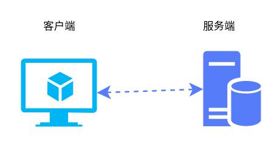
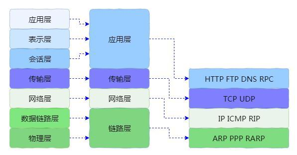
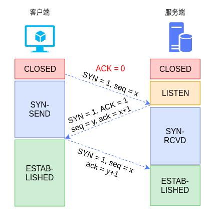
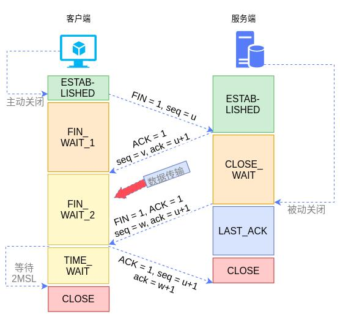

# TCP的基本原理

TCP/IP整体协议的实现采用CS架构（客户端-服务端架构）。其中程序包括两部分，分别为客户端（Client）和服务端（Server）。当然，实际的环境还要复杂的多，在客户端和服务端之间可能有多种不同种类和数量的设备，这些设备都会增加网络通信的复杂性。自然，也会增加程序开发容错的复杂性。

为了降低实现TCP/IP协议实现的复杂度，具体实现采用分层架构，其中每层的职责不同。其中下层为上层提供基础功能，而上层通常是对下层功能的完善。比如网络层的IP协议提供数据包的路由功能，但不保证数据可以被接收到。而传输层的TCP协议则保证数据包正确按序到达。如图2是网络分层及常见网络协议对比。

TCP协议的可靠性是通过其虚拟连接保证的，因此在客户端和服务端能够收发数据之前首先必须建立连接。这里的连接并不是物理连接，物理连接基于底层的协议已经建立完成，而且TCP建立连接也是要假设底层连接已经成功，TCP的连接其实是一个虚拟的，逻辑的连接。

简单粗暴的理解，所谓建立连接其实就是客户端和服务端分别记录了各自接受到的数据包的序号，并且将自身设置为某种状态。在TCP协议中，连接的建立通常成为3次握手，从字面的概念可以看出，连接的建立需要经过3次确认的过程。

TCP协议3次握手的过程如图所示，初始状态客户端和服务端都处于关闭状态。主要过程分为3步：

客户端发送预连接数据包： TCP的连接是由客户端主动发起建立，客户端会发送一个数据包（报文）给服务端，需要注意的是数据包中的SYN标识位为1。我们前文已经介绍，如果SYN为1，则说明为建立连接的数据包。同时，在该数据包中包含一个请求序列号，该序列号也是建立连接的依据。
服务端回复连接确认： 服务端确认可以建立连接（服务端不一定可以建立连接，因为系统中套接字的数量是有限的）的情况下会向客户端发送一个应答数据包。在应答数据包中会将ACK标志位设置为1，表示为服务端应答数据包。同时，在应答数据包中会设置请求序列号和应答序列号的值，具体参考图3.
客户端回复连接确认： 最后，客户端再次发送一个连接确认数据包，告诉服务端连接建立成功。
从上面流程可以看出，连接的建立需要经过多次交互， 这就是我们日常中所说的建立连接是高成本的操作。在实际生产环境中，为了应对这个问题，会减少连接建立的频度，通常的做法是建立连接池，传输数据时直接从连接池中获取连接，而不是新建连接。

有人可能觉得可以对建立连接的过程进行优化，比如将客户端最后一次的确认取消掉，觉得这个没有卵用。对于正常情况确实没有多大的作用，这里主要是应对异常情况。因为网络拓扑是非常复杂的，特别是在广域网中，有着数不清的网络节点，因此会出现各种异常情况。因此，TCP协议在设计的时候必须要保证异常情况下的可靠性。

我们这里举一个例子，就是连接请求超时的情况。假设客户端向服务端发送一个连接请求，由于各种原因，请求一直没有到达服务端，因此服务端也就没有回复连接确认消息。客户端连接超时，因此客户端重新发送一个连接请求到服务端，这次比较顺利，很快到达了，并且顺利建立了连接。之后，前一个数据包经过长途跋涉最终还是到了服务端，服务端也向客户端发送了回复数据包，服务端认为连接是建立成功的，并且会维持连接。但客户端层面认为连接是超时的，因此将永远不会关闭该连接。这样就会造成服务端有残留的资源，从而造成服务端资源浪费，久而久之可能会导致服务端无新连接资源可用。

另外一个需要说明的是客户端和服务端的套接字都有相应的状态，而且状态会随着连接的不同阶段变化。初始状态都是CLOSE，最终连接建立成功后都是ESTABLISHED,具体变化过程如图5所示。后面本文会详细介绍状态变化情况。

传输数据

完成连接建立之后，客户端和服务端就可以进行数据传输了。我们知道TCP是可靠的传输，那么传输的可靠性是通过什么来保证的呢？ 主要就是通过包头中的校验和、请求序列号和应答序列号（参考图3）。

TCP数据内容的可靠性是通过校验和保证的。TCP在发送数据时都会计算整个数据包的校验和，并存储在包头的校验和字段中。接收方会按照规则进行计算，从而确认接收到的数据是否是正确的。发送发计算校验和的流程大概如下：

把伪首部、TCP包头和TCP数据分为16为的字，并把TCP包头中的校验和字段置0
用反码加法累加所有16位数字
对计算结果去反，将其填充到TCP包头的校验和字段
接收方将所有原码相加，高位叠加，如果全为1则表示数据正确，否则说明数据有错误。

TCP数据包顺序的可靠性是通过请求序列号和应答序列号保证的。在数据传输中的每个请求都会有一个请求序列号，而在接收方接收到数据后会发送一个应答序列号，这样发送方就能知道数据是否被正确接收，而接收方也能知道数据是否出现乱序，从而保证数据包的顺序性。

除了保证数据的可靠性外， TCP协议还要保证数据传输的效率。因此在TCP协议中由于关于拥塞控制等相关的算法，这部分内容也是非常重要的。

断开连接

TCP关闭连接分为4步，称为4次挥手。连接的关闭不一定是在客户端发起，服务端也可以发起关闭连接。关闭连接的过程如下：

发起方发送一个FIN置位的数据包,用来请求关闭发送方到接收方的连接
接收方发送一个应答，ACK标志位为1，确认关闭。此时完成了发起方到接收方的连接，也即发送方无法再向接收方发送数据，但接收方还可以向发送方发送数据。
接收方数据传输完成后向发起方发送一个FIN为1的包，表示请求断开连接
发起方回复一个ACK包，确认关闭成功

