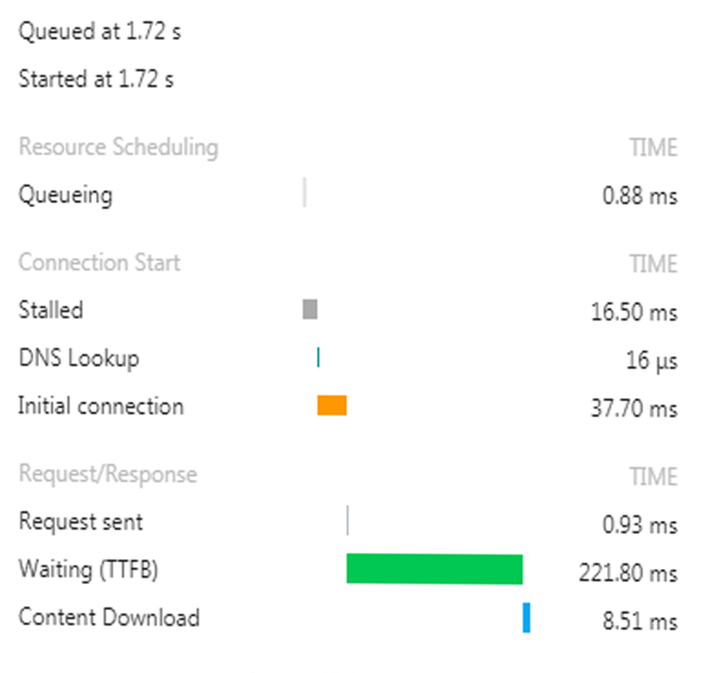
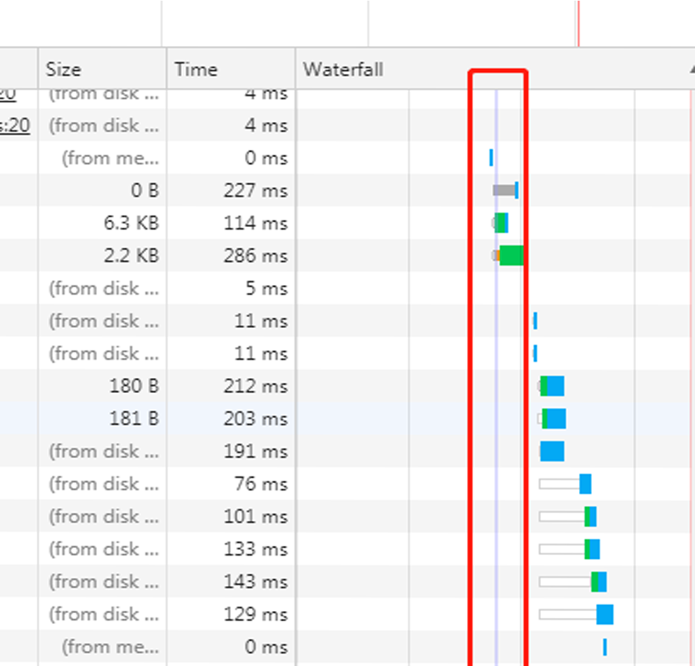

# 前端性能之Chrome的Waterfall

浏览器根据HTML中外连资源出现的顺序，依次放入队列，然后根据优先级确定向服务获取资源的顺序。同优先级的资源根据HTML中出现的先后顺序来向服务器获取资源

### 瀑布中各项内容的含义

**排队**：出现下面的情况时，浏览器会把当前请求放入队列中进行排队
1、有更高优先级的请求时
2、和目标服务器已经建立了6个TCP链接（最多6个，适用于HTTP/1.0 和 HTTP /1.1）
3、浏览器正在硬盘缓存上简单的分配空间

**停滞**: 请求会因为上面的任一个原因而阻塞

**DNS查询**：浏览器正在解析IP地址，在浏览器和服务器进行通信之前，必须经过DNS查询，将域名转换成IP地址，在这个阶段，你可以处理的东西很少，但幸运的是，并非所有的请求都需要经过这一阶段

**代理协商**：浏览器正在与代理服务器协商请求

**要求已发送**：请求已发送

**ServiceWorker准备**： 浏览器正在启动服务器

**请求ServiceWorker**：请求正在被发送到服务器

**等待（TTFB）**：浏览器等待响应第一个字节到达的时间，包含来回的延迟时间和服务器准备响应的时间

**内容下载**：浏览器正在读取以前接受到的本地数据

**接收推送**：浏览器正在读取以前接收到本地数据

**初始链接**：在浏览器发送请求之前，必须建立TCP连接，这个过程仅仅发生在瀑布图中的开头几行，否则这就是个性能问题

**SSL/TLS协商**：如果你的页面是通过SSL/TLS这类安全协议加载资源，这段时间就是浏览器建立安全连接的过程，目前谷歌将HTTPS作为其搜索排名因素之一，SSL/TLS协商的使用变得越来越普遍了

**下载**：这是浏览器用来下载资源所用的时间。这段时间越长，说明资源越大。理想情况下，你可以通过控制资源的大小来控制这段时间的长度

### 瀑布中的颜色

显然，瀑布有好几种颜色：浅灰，深灰，橙色，绿色，蓝色，结合上面的解释，大概就知道这些颜色代表的含义了

**浅灰**： 查询中

**深灰**：停滞，代理转发，请求发送

**橙色**：初始连接

**绿色**：等待中

**蓝色**：内容下载

除了这些横向的柱状图外，还有一条纵向的紫色的线

紫线是开始通过脚本加载资源的一个临界先，紫线之前，都是通过HTML文件进行加载的资源，要么是链接的SRC，要么是脚本的SRC；而紫色之后，就成了通过执行HTML文件加载进来的js script，进行加载资源的操作。这条线对于前端工程师至关重要，能够帮助他们进行前端性能优化分析。

### 如何根据瀑布图进行性能优化

瀑布图提供了三个直观的东西来帮助我们进行前端性能优化

首先，减少所有资源的加载时间。亦即减小瀑布图产品的宽度。瀑布图越窄，网站的访问速度越快

其次，减少请求数量也就就是降低瀑布图的高度。瀑布图越矮越好

最后，通过优化资源请求顺序来加快渲染时间。从图上看，就是将绿色的“开始渲染”线向左移。这条线向左移动的越远越好

