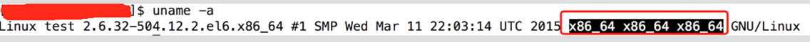
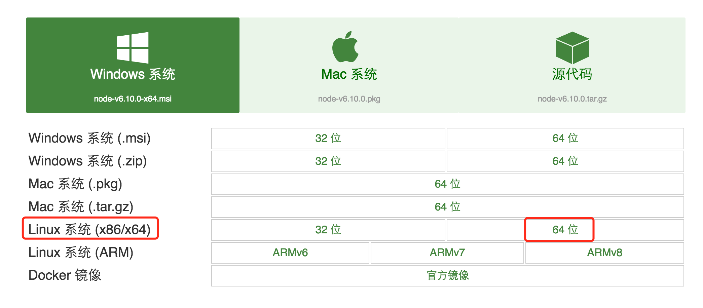

# 在 Linux 系统安装 Nodejs 最简单步骤

1、去官网下载和自己系统匹配的文件：

英文网址：[https://nodejs.org/en/download/](https://nodejs.org/en/download/)

中文网址：[http://nodejs.cn/download/](http://nodejs.cn/download/)

通过 uname -a 命令查看到我的 Linux 系统位数是 64 位（备注：x86_64 表示 64 位系统， i686 i386 表示 32 位系统），如图

故下载一下红色框中文件 ，版本为 v6.10.0

2、下载下来的 tar 文件上传到服务器并且解压，然后通过建立软连接变为全局；

1）上传服务器可以是自己任意路径，目前我的放置路径为 cd /app/software/

2）解压上传（解压后的文件我这边将名字改为了 nodejs，这个地方自己随意，只要在建立软连接的时候写正确就可以）

    tar -xvf   node-v6.10.0-linux-x64.tar.xz

    mv node-v6.10.0-linux-x64  nodejs

    确认一下nodejs下bin目录是否有node 和npm文件，如果有执行软连接，如果没有重新下载执行上边步骤；

3）建立软连接，变为全局

ln -s /app/software/nodejs/bin/npm /usr/local/bin/

ln -s /app/software/nodejs/bin/node /usr/local/bin/

4）最后一步检验 nodejs 是否已变为全局

在 Linux 命令行 node -v 命令会显示 nodejs 版本，如图所示为大功告成
