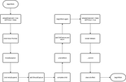

# throwException

首先给这个`Fiber`加上`Incomplete`的`side effect`，并且清空`effect`链

主要分为 `suspend` 和 `did error` 两种情况

### suspend

需要符合条件：`throw value`是一个`promise`

```js
if (
value !== null &&
typeof value === 'object' &&
typeof value.then === 'function'
)
```

处理这种情况会有两个循环，在这之前初始化了两个变量 `earliestTimeoutMs` 和 `startTimeMs`，都是`-1`

**第一个循环**

这个循环主要是计算初始化的两个值。他们只跟 `Suspense` 有关系，`timeOutAt` 是在 `commitWork` 的时候设置的，所以第一次没有，而设置的值就是当时的 `currentTime`

```js
const currentTime = requestCurrentTime()
finishedWork.stateNode = { timedOutAt: currentTime }
```

`earliestTimeoutMs` 跟 `maxDuration` 有关，他会向上找到 `maxDuration` 最小的非负数

所以第一次渲染的时候，`startTimeMs` 是`-1`，第二次渲染 `earliestTimeoutMs` 是`-1`

**第二个循环**

首先 `didTimeout = workInProgress.memoizedState`，那么这个什么时候会变成 `true` 呢？是在 `updateSuspense` 的时候，具体可以看 [Suspense](../../features/suspense-component.md)

我们可以大致模拟一下流程。

- 经过 `updateSuspense`，`didTimeout` 为 `false`
- 绑定 `thenable.then` 到 `retrySuspendedRoot`

如果不是 `StrictMode` 会直接去掉 `Incomplete` 的 `side effect`，不过目前只要是 `AsyncMode` 的都会自动机上 `StrictMode`，然后直接 `return` 了
然后计算 `absoluteTimeoutMs`，然后加上 `ShouldCapture` 的 `side effect`
加上 `ShouldCapture` 会让 `Suspense` 组件再次进入 `beginWork` 阶段重新 `update`，这时候 `didTimeout` 会变为 `true`，并且渲染 `fallback` 的内容
最后



那么第二个循环再`!didTimeout` 中的逻辑具体是什么呢
首先要绑定 `suquense` 组件的 `resolve` 之后要执行 `retrySuspendedRoot`，然后计算 `absoluteTimeoutMs`，然后调用 `renderDidSuspend`，这块我们放到下面再讲。

注意
在写这片文章的时候 `susquense` 功能并没有正式发布，所以可能会有挺多改动，并且也存在一些 bug，比如 maxDuration 貌似没用，再比如多次 `throwException` 中会给同一个 `promise` 绑定多次 `retry`，导致后来 `retry` 多次渲染，相信在 17 版本发布的时候应该有所改善。

非 `Suspense` 的情况
这种情况相当于捕捉到了一个错误，这边的操作是向上遍历节点，对 HostRoot、ClassComponent 和 ClassComponentLazy 做一些操作：

加上 `shouldCapture` 的 `side effect`
创建 `error update`
注意，对于 `ClassComponent` 只有当组件声明 `getDerivedStateFromCatch` 或者 `componentDidCatch` 的组件会做这些操作

```js
function throwException(
  root: FiberRoot,
  returnFiber: Fiber,
  sourceFiber: Fiber,
  value: mixed,
  renderExpirationTime: ExpirationTime
) {
  // The source fiber did not complete.
  sourceFiber.effectTag |= Incomplete
  // Its effect list is no longer valid.
  sourceFiber.firstEffect = sourceFiber.lastEffect = null

  if (value !== null && typeof value === 'object' && typeof value.then === 'function') {
    // This is a thenable.
    const thenable: Thenable = (value: any)

    let workInProgress = returnFiber
    let earliestTimeoutMs = -1
    let startTimeMs = -1
    do {
      if (workInProgress.tag === SuspenseComponent) {
        const current = workInProgress.alternate
        if (current !== null) {
          const currentState: SuspenseState | null = current.memoizedState
          if (currentState !== null && currentState.didTimeout) {
            // Reached a boundary that already timed out. Do not search
            // any further.
            const timedOutAt = currentState.timedOutAt
            startTimeMs = expirationTimeToMs(timedOutAt)
            // Do not search any further.
            break
          }
        }
        let timeoutPropMs = workInProgress.pendingProps.maxDuration
        if (typeof timeoutPropMs === 'number') {
          if (timeoutPropMs <= 0) {
            earliestTimeoutMs = 0
          } else if (earliestTimeoutMs === -1 || timeoutPropMs < earliestTimeoutMs) {
            earliestTimeoutMs = timeoutPropMs
          }
        }
      }
      workInProgress = workInProgress.return
    } while (workInProgress !== null)

    // Schedule the nearest Suspense to re-render the timed out view.
    workInProgress = returnFiber
    do {
      if (
        workInProgress.tag === SuspenseComponent &&
        shouldCaptureSuspense(workInProgress.alternate, workInProgress)
      ) {
        const pingTime =
          (workInProgress.mode & ConcurrentMode) === NoEffect ? Sync : renderExpirationTime

        // Attach a listener to the promise to "ping" the root and retry.
        let onResolveOrReject = retrySuspendedRoot.bind(
          null,
          root,
          workInProgress,
          sourceFiber,
          pingTime
        )
        if (enableSchedulerTracing) {
          onResolveOrReject = Schedule_tracing_wrap(onResolveOrReject)
        }
        thenable.then(onResolveOrReject, onResolveOrReject)
        if ((workInProgress.mode & ConcurrentMode) === NoEffect) {
          workInProgress.effectTag |= CallbackEffect

          // Unmount the source fiber's children
          const nextChildren = null
          reconcileChildren(sourceFiber.alternate, sourceFiber, nextChildren, renderExpirationTime)
          sourceFiber.effectTag &= ~Incomplete

          if (sourceFiber.tag === ClassComponent) {
            sourceFiber.effectTag &= ~LifecycleEffectMask
            const current = sourceFiber.alternate
            if (current === null) {
              sourceFiber.tag = IncompleteClassComponent
            }
          }

          // Exit without suspending.
          return
        }

        let absoluteTimeoutMs
        if (earliestTimeoutMs === -1) {
          absoluteTimeoutMs = maxSigned31BitInt
        } else {
          if (startTimeMs === -1) {
            const earliestExpirationTime = findEarliestOutstandingPriorityLevel(
              root,
              renderExpirationTime
            )
            const earliestExpirationTimeMs = expirationTimeToMs(earliestExpirationTime)
            startTimeMs = earliestExpirationTimeMs - LOW_PRIORITY_EXPIRATION
          }
          absoluteTimeoutMs = startTimeMs + earliestTimeoutMs
        }
        renderDidSuspend(root, absoluteTimeoutMs, renderExpirationTime)

        workInProgress.effectTag |= ShouldCapture
        workInProgress.expirationTime = renderExpirationTime
        return
      }
      workInProgress = workInProgress.return
    } while (workInProgress !== null)
    // No boundary was found. Fallthrough to error mode.
    value = new Error('An update was suspended, but no placeholder UI was provided.')
  }

  renderDidError()
  value = createCapturedValue(value, sourceFiber)
  let workInProgress = returnFiber
  do {
    switch (workInProgress.tag) {
      case HostRoot: {
        const errorInfo = value
        workInProgress.effectTag |= ShouldCapture
        workInProgress.expirationTime = renderExpirationTime
        const update = createRootErrorUpdate(workInProgress, errorInfo, renderExpirationTime)
        enqueueCapturedUpdate(workInProgress, update)
        return
      }
      case ClassComponent:
        // Capture and retry
        const errorInfo = value
        const ctor = workInProgress.type
        const instance = workInProgress.stateNode
        if (
          (workInProgress.effectTag & DidCapture) === NoEffect &&
          (typeof ctor.getDerivedStateFromError === 'function' ||
            (instance !== null &&
              typeof instance.componentDidCatch === 'function' &&
              !isAlreadyFailedLegacyErrorBoundary(instance)))
        ) {
          workInProgress.effectTag |= ShouldCapture
          workInProgress.expirationTime = renderExpirationTime
          // Schedule the error boundary to re-render using updated state
          const update = createClassErrorUpdate(workInProgress, errorInfo, renderExpirationTime)
          enqueueCapturedUpdate(workInProgress, update)
          return
        }
        break
      default:
        break
    }
    workInProgress = workInProgress.return
  } while (workInProgress !== null)
}
```

### absoluteTimeoutMs

我们上面提到了：

`earliestTimeoutMs` 是最小的 `maxDuration`
`startTimeMs` 是上次 `commit` 设置的 `timedOutAt`
如果没有设置 `maxDuration`，那么 `absoluteTimeoutMs` 是 `maxSigned31BitInt` 也就是 `1073741823`，基本意思就是永远不过超时

如果有设置 `maxDuration`，因为第一次没有 `startTimeMs`，所以要计算一个，从当前 `root` 的所有过期时间中找一个优先级最高的，然后减去 `LOW_PRIORITY_EXPIRATION`，这部分计算不必要太在意，我们主要看一下第二次进来的时候

在有 `earliestTimeoutMs` 和 `startTimeMs` 的情况下，`absoluteTimeoutMs` 等于 `startTimeMs + earliestTimeoutM`，简单来说就是少了第一次渲染到这次有更新进来中间的空白时间，也符合 `maxDuration` 需要的含义。

但是根据之前说的逻辑，在有 `startTimeMs` 的情况下根本不会执行 `earliestTimeoutMs` 的逻辑，所以这个逻辑是否有问题？实际我写了个小例子看了一下结果也是和我的预期一样

回到 `renderRoot`

```js
// throwException
let absoluteTimeoutMs
if (earliestTimeoutMs === -1) {
  absoluteTimeoutMs = maxSigned31BitInt
} else {
  if (startTimeMs === -1) {
    const earliestExpirationTime = findEarliestOutstandingPriorityLevel(root, renderExpirationTime)
    const earliestExpirationTimeMs = expirationTimeToMs(earliestExpirationTime)
    startTimeMs = earliestExpirationTimeMs - LOW_PRIORITY_EXPIRATION
  }
  absoluteTimeoutMs = startTimeMs + earliestTimeoutMs
}

renderDidSuspend(root, absoluteTimeoutMs, renderExpirationTime)

// renderDidSuspend
function renderDidSuspend(
  root: FiberRoot,
  absoluteTimeoutMs: number,
  suspendedTime: ExpirationTime
) {
  // Schedule the timeout.
  if (absoluteTimeoutMs >= 0 && nextLatestAbsoluteTimeoutMs < absoluteTimeoutMs) {
    nextLatestAbsoluteTimeoutMs = absoluteTimeoutMs
  }
}
```
