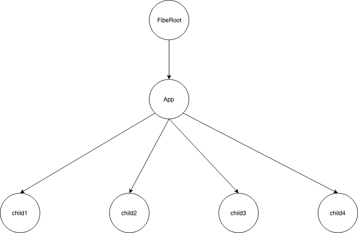
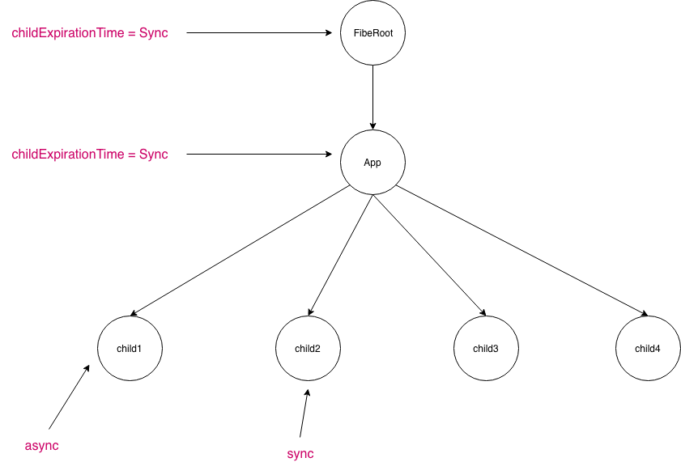

# expirationTime 计算

### expirationTime 公式

讲公式就有必要把代码亮出来了，毕竟代码量也不多

```js
const UNIT_SIZE = 10
const MAGIC_NUMBER_OFFSET = 2

export function msToExpirationTime(ms: number): ExpirationTime {
  return ((ms / UNIT_SIZE) | 0) + MAGIC_NUMBER_OFFSET
}

export function expirationTimeToMs(expirationTime: ExpirationTime): number {
  return (expirationTime - MAGIC_NUMBER_OFFSET) * UNIT_SIZE
}

function ceiling(num: number, precision: number): number {
  return (((num / precision) | 0) + 1) * precision
}

function computeExpirationBucket(currentTime, expirationInMs, bucketSizeMs): ExpirationTime {
  return (
    MAGIC_NUMBER_OFFSET +
    ceiling(
      currentTime - MAGIC_NUMBER_OFFSET + expirationInMs / UNIT_SIZE,
      bucketSizeMs / UNIT_SIZE
    )
  )
}

export const LOW_PRIORITY_EXPIRATION = 5000
export const LOW_PRIORITY_BATCH_SIZE = 250

export function computeAsyncExpiration(currentTime: ExpirationTime): ExpirationTime {
  return computeExpirationBucket(currentTime, LOW_PRIORITY_EXPIRATION, LOW_PRIORITY_BATCH_SIZE)
}

export const HIGH_PRIORITY_EXPIRATION = __DEV__ ? 500 : 150
export const HIGH_PRIORITY_BATCH_SIZE = 100

export function computeInteractiveExpiration(currentTime: ExpirationTime) {
  return computeExpirationBucket(currentTime, HIGH_PRIORITY_EXPIRATION, HIGH_PRIORITY_BATCH_SIZE)
}
```

`React`中有两种类型的`ExpirationTime`，一个是`Interactive`的，另一种是普通的异步。`Interactive`的比如说是由事件触发的，那么他的响应优先级会比较高因为涉及到交互。

在整个计算公式中只有`currentTime`是变量，也就是当前的时间戳。我们拿`computeAsyncExpiration`举例，在`computeExpirationBucket`中接收的就是`currentTime`、`5000`和`250`

最终的公式就是这样的：`((((currentTime - 2 + 5000 / 10) / 25) | 0) + 1) * 25`

其中`25`是`250 / 10`，`| 0`的作用是取整数

翻译一下就是：当前时间加上`498`然后处以`25`取整再加`1`再乘以`5`，需要注意的是这里的`currentTime`是经过`msToExpirationTime`处理的，也就是`((now / 10) | 0) + 2`，所以这里的减去`2`可以无视，而除以`10`取整应该是要抹平`10`毫秒内的误差，当然最终要用来计算时间差的时候会调用`expirationTimeToMs`恢复回去，但是被取整去掉的`10`毫秒误差肯定是回不去的。

现在应该很明白了吧？再解释一下吧：简单来说在这里，最终结果是以`25`为单位向上增加的，比如说我们输入`10002 - 10026`之间，最终得到的结果都是`10525`，但是到了`10027`的到的结果就是`10550`，这就是除以`25`取整的效果。

另外一个要提的就是`msToExpirationTime`和`expirationTimeToMs`方法，他们是想换转换的关系。有一点非常重要，那就是用来计算`expirationTime`的`currentTime`是通过`msToExpirationTime(now)`得到的，也就是预先处理过的，先处以`10`再加了`2`，所以后面计算`expirationTime`要减去`2`也就不奇怪了

### 小结一下

`React`这么设计抹相当于抹平了`25ms`内计算过期时间的误差，那他为什么要这么做呢？我思考了很久都没有得到答案，直到有一天我盯着代码发呆，看到`LOW_PRIORITY_BATCH_SIZE`这个字样，`bacth`，是不是就对应`batchedUpdates`？再细想了一下，这么做也许是为了让非常相近的两次更新得到相同的`expirationTime`，然后在一次更新中完成，相当于一个自动的`batchedUpdates`。

不禁感叹，真的是细啊！

以上就是`expirationTime`的计算方法。

### currentTime

```js
function requestCurrentTime() {
  if (isRendering) {
    return currentSchedulerTime
  }
  findHighestPriorityRoot()
  if (nextFlushedExpirationTime === NoWork || nextFlushedExpirationTime === Never) {
    recomputeCurrentRendererTime()
    currentSchedulerTime = currentRendererTime
    return currentSchedulerTime
  }
  return currentSchedulerTime
}
```

在`React`中我们计算`expirationTime`要基于当前得时钟时间，一般来说我们只需要获取`Date.now`或者`performance.now`就可以了，但是每次获取一下呢比较消耗性能，所以呢`React`设置了`currentRendererTime`来记录这个值，用于一些不需要重新计算得场景。

但是在`React`中呢又提供了`currentSchedulerTime`这个变量，同样也是记录这个值的，那么为什么要用两个值呢？我们看一下`requestCurrentTime`方法的实现。

### 首先是:

```js
if (isRendering) {
  return currentSchedulerTime
}
```

这个`isRendering`只有在`performWorkOnRoot`的时候才会被设置为`true`，而其本身是一个同步的方法，不存在他执行到一半没有设置`isRendering`为`false`的时候就跳出，那么什么情况下会在这里出现新的`requestCurrentTime`呢？

- 在生命周期方法中调用了`setState`
- 需要挂起任务的时候

也就是说`React`要求在一次`rendering`过程中，新产生的`update`用于计算过期时间的`current`必须跟目前的`renderTime`保持一致，同理在这个周期中所有产生的新的更新的过期时间都会保持一致！

### 然后第二个判断：

```js

if (
  nextFlushedExpirationTime === NoWork ||
  nextFlushedExpirationTime === Never
)

```

也就是说在一个`batched`更新中，只有第一次创建更新才会重新计算时间，后面的所有更新都会复用第一次创建更新的时候的时间，这个也是为了保证在一个批量更新中产生的同类型的更新只会有相同的过期时间

### 各种不同的 expirationTime

在`React`的调度过程中存在着非常多不同的`expirationTime`变量帮助`React`去实现在单线程环境中调度不同优先级的任务这个需求，这篇文章我们就来一一列举他们的含义以及作用，来帮助我们更好得理解`React`中的整个调度过程。

- `root.expirationTime`
- `root.nextExpirationTimeToWorkOn`
- `root.childExpirationTime`
- `root.earliestPendingTime & root.lastestPendingTime`
- `root.earliestSuspendedTime & root.lastestSuspendedTime`
- `root.lastestPingedTime`
- `nextFlushedExpirationTime`
- `nextLatestAbsoluteTimeoutMs`
- `currentRendererTime`
- `currentSchedulerTime`

另外，所有节点都会具有`expirationTime`和`childExpirationTime`两个属性

以上所有值初始都是`NoWork`也就是 0，以及他们一共会有三种情况：

- `NoWork`，代表没有更新
- `Sync`，代表同步执行，不会被调度也不会被打断
- `async`模式下计算出来的过期时间，一个时间戳

接下去的例子我们都会根据下面的例子结构来讲，我们假设有如下结构的一个`React`节点树，他的`Fiber`结构如下：



后续我们会在这个基础上讲解不同情况下`expirationTime`的情况

### childExpirationTime

在之前我们说过，每次一个节点调用`setState`或者`forceUpdate`都会产生一个更新并且计算一个`expirationTime`，那么这个节点的`expirationTime`就是当时计算出来的值，因为这个更新本身就是由这个节点产生的

最终因为`React`的更新需要从`FiberRoot`开始，所以会执行一次向上遍历找到`FiberRoot`，而向上遍历则正好是一步步找到创建更新的节点的父节点的过程，这时候`React`就会对每一个该节点的父节点链上的节点设置`childExpirationTime`，因为这个更新是他们的子孙节点造成的



如上图所示，我们先忽略最左边的`child1`产生的一次异步更新，如果当前只有`child2`产生了一个`Sync`更新，那么`App`和`FiberRoot`的`childExpirationTime`都会更新成`Sync`

那么这个值有什么用呢？在我们向下更新整棵`Fiber`树的时候，每个节点都会执行对应的`update`方法，在这个方法里面就会使用节点本身的`expirationTime`和`childExpirationTime`来判断他是否可以直接跳过，不更新子树。`expirationTime`代表他本身是否有更新，如果他本身有更新，那么他的更新可能会影响子树；`childExpirationTime`表示他的子树是否产生了更新；如果两个都没有，那么子树是不需要更新的。

对应图中，如果`child1`，`child3`，`child4`还有子树，那么在这次`child2`的更新中，他们是不需要重新渲染的，在遍历到他们的时候，会直接跳过

注意：这里只讨论没有其他副作用的情况，比如使用老的`context api`之类的最终会强制导致没有更新的组件重新渲染的情况我们先不考虑。

了解了`childExpirationTime`的作用之后，我们再来讲一下他的特性：

- 同一个节点产生的连续两次更新，最红在父节点上只会体现一次`childExpirationTime`
- 不同子树产生的更新，最终体现在跟节点上的是优先级最高的那个更新

第一点很好理解，同一个节点在第一次更新还没有结束的情况下再次产生更新，那么不管他们优先级哪个高，最终都会按照高优先级那个过期时间把所有更新都更新掉了，因为`Fiber`对象只有一个，`updateQueue`也只有一个，无法区分同一个对象上连续的不同更新。

第二点是因为`React`在创建更新向上寻找`root`并设置`childExpirationTime`的时候，会对比之前设置过的和现在的，最终会等于非`NoWork`的最小的`childExpirationTime`，因为`expirationTime`越小优先级越高，`Sync`是最高优先级

对应到上面的例子中，`child1`产生的更新是异步的，所以他的`expirationTime`是计算出来的时间戳，那么肯定比`Sync`大，所以率先记录到父节点的是`child2`，同时也是`child2`的更新先被执行。即便是`child1`的更新先产生，如果他在 chidl2 产生更新的时候他还没更新完，那么也会被打断，先完成`child2`的渲染，再回头来渲染 child1

以上是`childExpirationTime`的作用和特性，他在每个节点`completeWork`的时候会`reset`父链上的`childExpirationTime`，也就是说这个节点已经更新完了，那么他的`childExpirationTime`也就没有意义了。那么这个我们在讲节点更新的时候会讲到，到时候大家再对应起来看效果会更好。

### pendingTime

在`FiberRoot`上有两个值`earliestPendingTime`和`lastestPedingTime`，他们是一对值，用来记录所有子树中需要进行渲染的更新的`expirationTime`的区间


在这个例子里，我们同时在`child1`、`child2`、`child3`产生里更新，并且根据优先级计算出了不同的更新时间（再次重申，请忽略细节，现实中不太会出现同时产生的情况）。

每个更新创建的时候，`React`会通过`markPendingPriorityLevel`标记`root`节点的`earliestPendingTime`和`lastestPedingTime`。他们只记录区间，也就是说现在我们产生了三个不同的过期时间，但是这里只记录最大和最小的。

那么他的作用就很明显了，通过追踪最大和最小值，`React`可以判断在当前更新之后是否还具有优先级更低的任务需要执行（当前过期时间处理这两个值之间）。

### suspendedTime

同样的在`ReactFiber`上有两个值`earliestSuspendedTime`和`lastestSuspendedTime`，这两个值是用来记录被挂起的任务的过期时间的

首先我们定义一下什么情况下任务是被挂起的：

- 出现可捕获的错误并且还有优先级更低的任务的情况下
- 当捕获到`thenable`，并且需要设置`onTimeout`的时候

我们称这个任务被`suspended`(挂起)了。记录这个时间主要是在`resolve`了`promise`之后，判断被挂起的组件更新是否依然处于目前已有的`suspenedTime`中间，如果不是的话是需要重新计算一个新的过期时间，然后从新加入队列进行调度更新的。

另外就是在确定目前需要执行的任务的过期时间，也就是`root.expirationTime`和`root.nextExpirationTimeToWorkOn`的时候也是一个考虑因素。我们接下去会讲到

### lastestPingedTime

这个值是用来记录最新的一次`suspended`组件`resolve`之后，如果挂起之前的`expirationTime`依然在`earliestSuspendedTime`和`lastestSuspendedTime`之间，则会标志这个时间为`pingedTime`

`pingedTime`目前看来没有什么别的作用，唯一跟`suspendedTime`的区别是他的优先级比`suspendedTime`高一些，会优先选择为渲染目标。

### root.expirationTime 和 root.nextExpirationTimeToWorkOn

`root.expirationTime`是用来标志当前渲染的过期时间的，请注意他只管本渲染周期，他并不管你现在的渲染目标是哪个，渲染目标是由`root.nextExpirationTimeToWorkOn`来决定的。

那么他们有什么区别呢？主要区别在于发挥作用的阶段

`expirationTime`作用于调度阶段，主要指责是：

- 决定是异步执行渲染还是同步执行渲染
- 作为`react-scheduler`的`timeout`标准，决定是否要优先渲染

`nextExpirationTimeToWorkOn`主要作用于渲染阶段：

- 决定那些更新要在当前周期中被执行
- 通过跟每个节点的`expirationTime`比较决定该节点是否可以直接`bailout`（跳过）

他们都是通过`pendingTime`、`suspenededTime`和`pingedTime`中删选出来的，唯一的不同是，`nextExpirationTimeToWorkOn`在没有`pending`或者`pinged`的任务的时候会选择最晚的`suspendedTime`，而`expirationTime`会选择最早的

`expirationTime`的变化：

- 在`scheduleWork`的时候通过`markPendingExpirationTime`设置
- 在`beginWork`的时候被设置为`NoWork`
- 在`onUncaughtError`的时候设置为`NoWork`-`onSuspend`的时候又会设置回当次更新的`expirationTime`

```js
function findNextExpirationTimeToWorkOn(completedExpirationTime, root) {
  const earliestSuspendedTime = root.earliestSuspendedTime
  const latestSuspendedTime = root.latestSuspendedTime
  const earliestPendingTime = root.earliestPendingTime
  const latestPingedTime = root.latestPingedTime

  let nextExpirationTimeToWorkOn =
    earliestPendingTime !== NoWork ? earliestPendingTime : latestPingedTime

  if (
    nextExpirationTimeToWorkOn === NoWork &&
    (completedExpirationTime === NoWork || latestSuspendedTime > completedExpirationTime)
  ) {
    nextExpirationTimeToWorkOn = latestSuspendedTime
  }

  let expirationTime = nextExpirationTimeToWorkOn
  if (
    expirationTime !== NoWork &&
    earliestSuspendedTime !== NoWork &&
    earliestSuspendedTime < expirationTime
  ) {
    expirationTime = earliestSuspendedTime
  }

  root.nextExpirationTimeToWorkOn = nextExpirationTimeToWorkOn
  root.expirationTime = expirationTime
}
```

每次开始调度任务，或者设置`pendingTime`、`suspendedTime`、`pingedTime`都会调用这个方法重新删选接下去执行的任务。

需要注意一点，并不是所有情况都是从这个方法删选出这两个值的，比如在`renderRoot`出现错误捕获，并且没有更低优先级的任务的时候，强制以同步的方式把当前`expirationTime`的任务再重新执行了一遍

```js
root.didError = true
const suspendedExpirationTime = (root.nextExpirationTimeToWorkOn = expirationTime)
const rootExpirationTime = (root.expirationTime = Sync)
// 什么事情都不做，回到主线程
onSuspend(
  root,
  rootWorkInProgress,
  suspendedExpirationTime,
  rootExpirationTime,
  -1 // Indicates no timeout
)
return
```

这里直接把`root.expirationTime`设置为`Sync`，然后直接`return`，这样回到`performWork`的时候调用`findHighestPriorityRoot`会直接设置当前`root`为下一个渲染的目标，然后再次进行渲染。`performWork`的循环我们在`fiber-scheduler`中有详细讲解

### nextFlushedExpirationTime

这个是在`fiber-scheduler`中的一个全局变量，用来记录下一个需要渲染的 FiberRoot 的过期时间。注意他删选的时候整个应用中所有`FiberRoot`的优先级（是的，你没看错，应该`React`应用是可以有多个`FiberRoot`，比如你执行两次`ReactDOM.render`），并不关心每个`FiberRoot`子树的优先级。

他是在`findHighestPriorityRoot`中被赋值的，会遍历`firstScheduleRoot`->`lastScheduledRoot`链表中所有`root`，并找到优先级最高（也就是`expirationTime`最小）的那个`root`进行赋值，并安排渲染

### nextLatestAbsoluteTimeoutMs

他的作用是在`Suspense`组件捕获到挂起之后，增加一个`timeout`来强制重新渲染一次的，不过目前看不出这个`timeout`有什么用

这个跟`Suspense`组件的`maxDuration`有关，但是官方没公布用法，从源码中也看不出有什么用处，原以为是多少毫秒内不显示`fallback`的内容，结果测试了一下发现没用。等有空再研究一下，或者等官方正式发布吧，毕竟现在就算研究出来了，可能分分钟就被改了，16.5 的时候还叫`delayMs`，16.6 就改成`maxDuration`了。

### currentSchedulerTime & currentRendererTime

这两个时间是用来是用来记录当前时间的，在计算过期时间和比较任务是否过期的时候都会用到`currentRendererTime`，`currentSchedulerTime`大部分时候都是等于`currentRendererTime`的，那为什么要设置两个时间呢？

这就是因为`batchedUpdates`了，在这种情况下如果同时创建了多个更新是会为每次更新计算过期时间的，而计算是要花时间的，如果每次都是请求当前时间，那么同一个`batch`中的不同更新得到的过期时间就会是不一样的，所以在一个`batch`中获取的当前时间应该是一样的，所以就设置了这么一个值，在我们请求当前时间的方法中有这么一段代码：

```js
findHighestPriorityRoot()
if (nextFlushedExpirationTime === NoWork || nextFlushedExpirationTime === Never) {
  recomputeCurrentRendererTime()
  currentSchedulerTime = currentRendererTime
  return currentSchedulerTime
}
```

`findHighestPriorityRoot`会设置`nextFlushedExpirationTime`，也就是只有在当前没有等待中的更新的情况下，才会重新计算当前时间。
