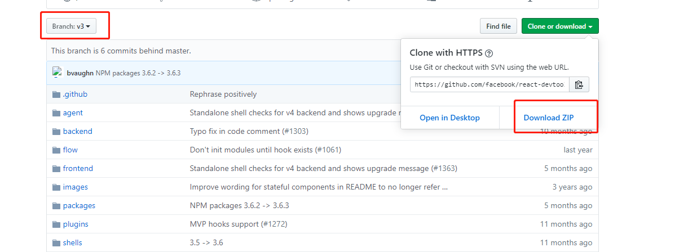
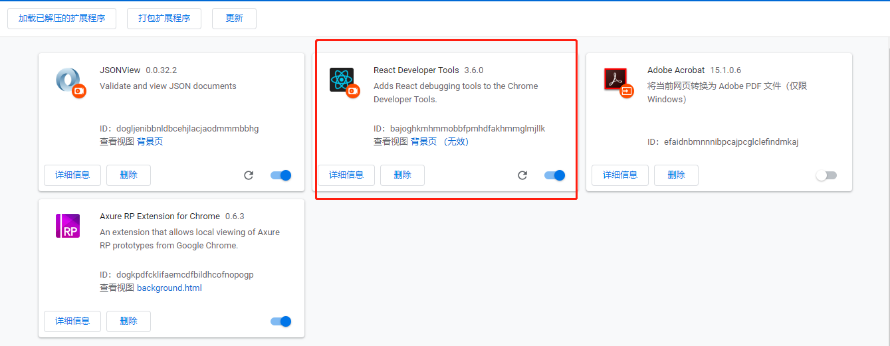

# react-devtools安装

有时候看网上各路大神，写如何安装react-devtools，大神就是大神，好多步骤一笔带过，导致一些学习者看的一脸懵逼，今天我给大家讲超级简单的react-devtools安装步骤，相信看过的小伙伴儿不存在懵逼状态，那就开始吧！首先声明一下，必须安装Node哦，都准备学react了，node都不叫事儿了吧，Let's go!

1.首先打开官网：https://github.com/facebook/react-devtools

进去v3分支，地址：https://github.com/facebook/react-devtools/tree/v3，直接download ZIP格式

2.知道下载位置，解压到自己可以找见的目录下，进入到react-devtools-3目录，cnpm i一下安装一下依赖

3.再进入到react-devtools-3\shells\chrome切换到chrome目录下，运行node build.js，当前目录下会生成build目录 这个build目录下的unpacked目录就是chrome中所需react-devtools的工具扩展程序包

4.打开谷歌浏览器，网址输入chrome://extensions/，

选择react-detools-3目录下的shells->chrome中build目录中的unpacked即可

到此 react-devtools安装成功!

