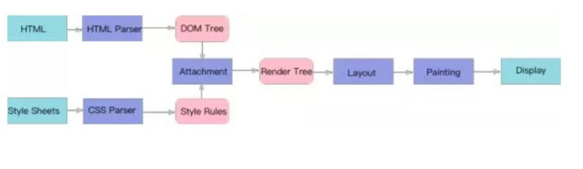
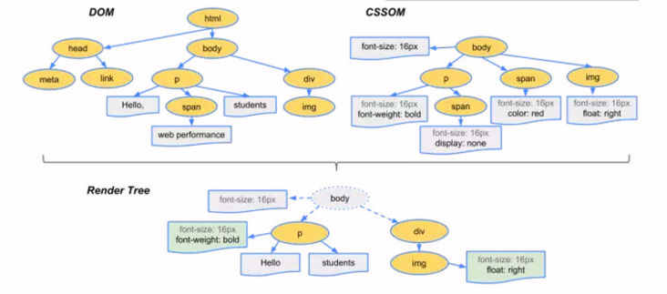
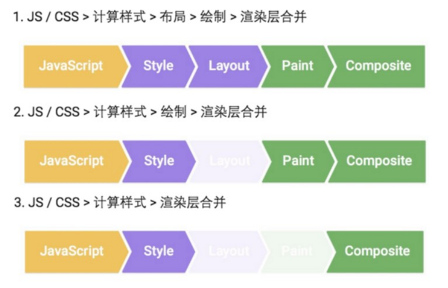

# React virtualized 虚拟化长列表

### 高效渲染大型列表的响应式组件

- 使用窗口特性，即在一个滚动的范围内，呈现你给定数据的一小部分，大量缩减了呈现组件所需的时间，以及创建DOM节点的数量。
- 缺点：滑动过快，可能会出现空白的情况。

### 前端经典问题，在JS中操作渲染大量DOM

 在JS当中直接操作DOM，会导致性能严重下降，所以渲染长列表（也就是大量DOM），会导致浏览器卡顿严重，甚至有可能出现假死状态。（这里延伸一个题外话，不通过JS渲染大量DOM是不会有这个问题的，但是我们很少这么干😂感兴趣的同学可以看接下来的渲染分析）
而解决这种问题的方案主要有这几种

1、滚动加载，逐步渲染DOM（分页，一个意思）。
2、通过合理的逻辑来限制仅渲染可视区域部分。
3、算是1的变种，写一个异步循环渲染，通过异步的方式，给浏览器执行其它task的机会。（React异步渲染可以关注一下哦）
1,3两种方案都会遇到一个问题，DOM结构如果过大, 网页就会出现用户操作体验上的问题, 比如滚动, 点击等常用操作，当用户点击需要再操作DOM时, 就会出现卡顿。

所以我们今天主要讨论的是方案2，也就是前端遇到一些无法使用分页方式来加载的列表。（毕竟有现成的第三方嘛）

### 先复习一下浏览器渲染过程(webkit)

- HTML跟CSS规则解析

- 处理 HTML 标记并构建 DOM 树。
- 处理 CSS 标记并构建 CSSOM(Style Rules) 树。
- 将 DOM 与 CSSOM 合并成一个渲染树(Render Tree)。

根据渲染树(Layout)来布局，以计算每个节点的几何信息。
将各个节点绘制(Painting)到屏幕上

**注意点:**

Render Tree 渲染树并不等同于 DOM Tree，因为一些像 Header标签 或 display:none 的东西就没必要放在渲染树中。
CSS 的Rule Tree 主要是为了完成匹配并把CSS Rule附加上 Render Tree 上的每个 Element，也就是 DOM 节点，也就是所谓的 Frame。
有了Render Tree，浏览器已经能知道网页中有哪些节点、各个节点的CSS定义以及它们的从属关系。
然后，计算每个 Frame（也就是每个Element）的位置，这又叫 layout 和 reflow 过程
五个步骤并不一定一次性顺序完成。如果 DOM 或 CSSOM 被修改，以上过程需要重复执行，这样才能计算出哪些像素需要在屏幕上进行重新渲染。实际页面中，CSS 与 JavaScript 往往会多次修改 DOM 和 CSSOM。

JavaScript：一般来说，我们会使用 JavaScript 来实现一些视觉变化的效果。比如做一个动画或者往页面里添加一些 DOM 元素等。
Style：计算样式，这个过程是根据 CSS 选择器，对每个 DOM 元素匹配对应的 CSS 样式。这一步结束之后，就确定了每个 DOM 元素上该应用什么 CSS 样式规则。
Layout：布局，上一步确定了每个 DOM 元素的样式规则，这一步就是具体计算每个 DOM 元素最终在屏幕上显示的大小和位置。web 页面中元素的布局是相对的，因此一个元素的布局发生变化，会联动地引发其他元素的布局发生变化。比如， 元素的宽度的变化会影响其子元素的宽度，其子元素宽度的变化也会继续对其孙子元素产生影响。因此对于浏览器来说，布局过程是经常发生的。
Paint：绘制，本质上就是填充像素的过程。包括绘制文字、颜色、图像、边框和阴影等，也就是一个 DOM 元素所有的可视效果。一般来说，这个绘制过程是在多个层上完成的。
Composite：渲染层合并，由上一步可知，对页面中 DOM 元素的绘制是在多个层上进行的。在每个层上完成绘制过程之后，浏览器会将所有层按照合理的顺序合并成一个图层，然后显示在屏幕上。对于有位置重叠的元素的页面，这个过程尤其重要，因为一旦图层的合并顺序出错，将会导致元素显示异常。

这里还涉及到了层（GraphicsLayer）的概念，GraphicsLayer 层是作为纹理(texture)上传给 GPU 的，有时页面的一次渲染是CPU跟GPU共同合作的结果。
总流程图

### 为什么在React中渲染大量DOM会导致浏览器假死(15.x)？

事件触发线程：当一个事件被触发时(鼠标点击，键盘敲击等)该线程会把事件添加到待处理队列的队尾，等待JS引擎的处理。
React使用 Virtual DOM跟diff算法来优化DOM的变更，这也意味着React在渲染出真实DOM的时候，所有的Virtual DOM树都在JS内存中。
并且React不会有一次更新就执行一次刷新操作，而是把所有的差异对比，放到一个差异队列，再一次性去执行patch方法进行更新与渲染（时间长）。
等到GUI线程去渲染真实的DOM时，由于渲染的DOM量太大，GUI执行的时间也会很长（页面会出现空白等状况）。

### 部分API的使用

- List
- AutoSizer、CellMeasurer跟List(自适应宽高)
- InfiniteLoader跟List(滚动加载)