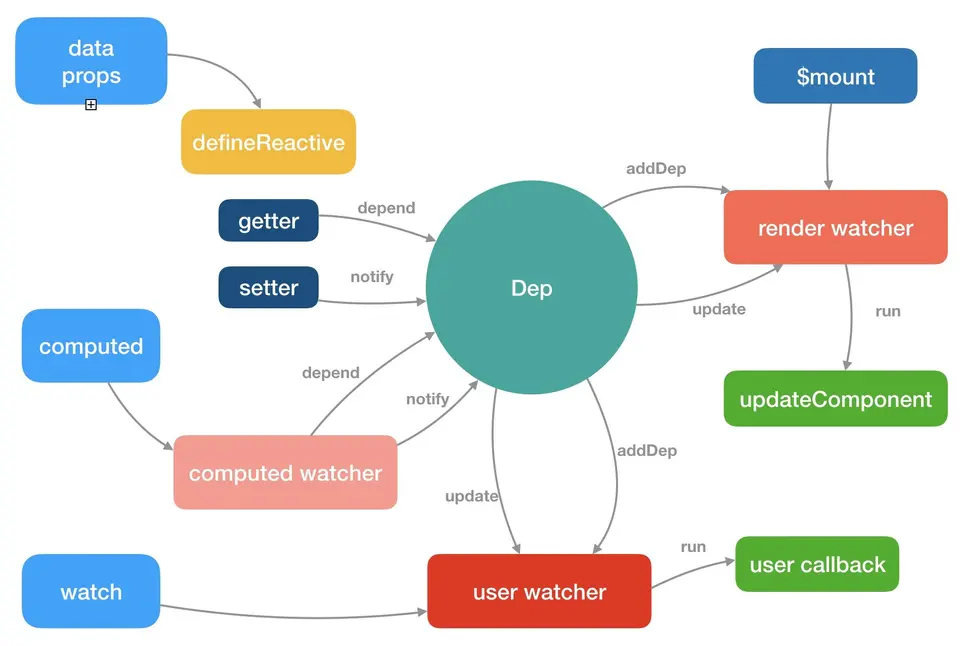

# Vue 数据劫持



上图完整的描述了 Vue 运行的机制，首先数据发生改变，就会经过 Data 处理，然后 Dep 会发出通知(notify)，告诉 Watcher 有数据发生了变化，接着 Watcher 会传达给渲染函数跟他说有数据变化了，可以渲染视图了(数据驱动视图)，进而渲染函数执行 render 方法去更新 VNODE，也就是我们说的虚拟 DOM，最后虚拟 DOM 根据最优算法，去局部更新需要渲染的视图。这里的 Data 就做了我们今天要说的事——数据劫持。

想要更深入地理解如何劫持，我们就需要看源码实现。

## Observer

```js
/**
 * Vue中的每一个变量都是由 Observer 构造函数生成的。
 * 细心的你可能会发现，你打印出来任何一个Vue上的引用类型属性，后面都有 __ob__: Observer 的字样。
 */
var Observer = function Observer(value) {
  this.value = value
  // 这里把发布者 Dep 注册了
  this.dep = new Dep()
  // ···
  // 此处调用 walk
  this.walk(value)
}
```

```js
/**
 * 此处会将 obj 里面的每一个值用 defineReactive$$1 处理，而它就是今晚的主角。
 */
Observer.prototype.walk = function walk(obj) {
  var keys = Object.keys(obj)
  for (var i = 0; i < keys.length; i++) {
    defineReactive$$1(obj, keys[i])
  }
}
```

## 数据劫持

```js
/**
 * 这个函数就是数据劫持的根据地，里面为对象重写了 get 和 set 方法以及固有属性 enumerable 等。
 *
 */
function defineReactive$$1(obj, key, val, customSetter, shallow) {
  // ···
  Object.defineProperty(obj, key, {
    enumerable: true,
    configurable: true,
    get: function reactiveGetter() {
      // ···
      return value
    },
    set: function reactiveSetter(newVal) {
      // ···
      // 此处最为关键，这个函数的主要作用就是通过 notify 告诉 Watcher 有数据变化了。
      dep.notify()
    }
  })
}
```

## Dep

```js
/**
 * subs 是所有 Watcher 的收集器，类型为数组；notify 实则是调用了每个Watcher的 update方法 。
 */

Dep.prototype.notify = function notify() {
  var subs = this.subs.slice()
  // ···
  for (var i = 0, l = subs.length; i < l; i++) {
    subs[i].update()
  }
}
```

## Watcher

```js
/**
 * 更新视图的最直观的方法就是 Watcher 上的 update 方法 ， Dep subs 反复调用
 * 这里最终都是调用 run 方法。
 */
Watcher.prototype.update = function update() {
  /* istanbul ignore else */
  if (this.lazy) {
    this.dirty = true
  } else if (this.sync) {
    this.run()
  } else {
    queueWatcher(this)
  }
}
```


```js

/**
 * run 方法内的 cb 方法建立 Watcher 和 VNode 之间的关联关系，从而引发视图的更新。
 */
Watcher.prototype.run = function run() {
  // ···
  if (this.user) {
    // ···
    this.cb.call(this.vm, value, oldValue)
    // ···
  } else {
    this.cb.call(this.vm, value, oldValue)
  }
  // ···
}
```
