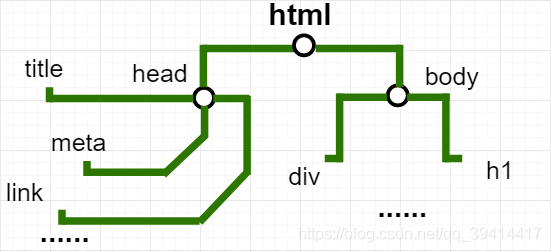
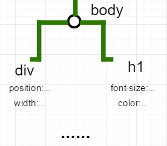
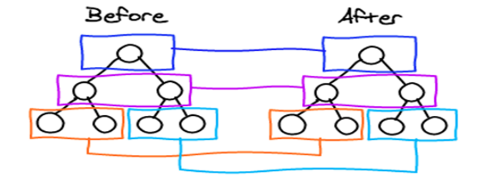
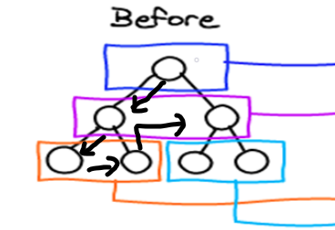

# Vue 的 diff 算法详解和 key 作用

### 一. 什么是 DOM

在实际情况下，用户输入想要访问的网址在通过 DNS 解析后得到服务器地址，浏览器向服务器发起 http 请求,再经过 tcp 三次握手确认连接后服务器将需要的代码发回给浏览器,浏览器在接收代码后进行解析。
其中主要步骤：1.DOM 构造 2.布局 3.渲染呈现
(在这之中也包括执行脚本 js 内容，但脚本可能需要访问或操作之前的 HTML 或样式，所以要等到先前的 CSS 节点构建完成)

1.DOM 构造：由 html 解析器构建 DOM 树，DOM 树是由浏览器由上到下，从左到右读取标签，把他们分解成节点，从而创建的；而 DOM 其实就是文档对象模型，HTML 的文档 document 页面是一切的基础，没有它 dom 就无从谈起，当创建好一个页面并加载到浏览器时，DOM 就悄然而生，它会把网页文档转换为一个文档对象，主要功能是处理网页内容。



之后再由 css 代码通过 css 解析器，将这些样式绑定到对应 DOM 树节点上。



2.布局：确定页面上所有元素的大小和位置；但并没有在页面可视化。 3.渲染呈现：最后将所有页面绘制出来，完成整个页面的渲染，将可视化页面展现给用户。

二、虚拟 dom
     当我们为修改页面展示的内容的时候，通过操作真实的 DOM，但 DOM 操作的执行速度和 js 的速度有差异，js 远比 DOM 操作的执行快
并且 dom 操作也会引起浏览器的回流和重绘，并且随着移动端的发展手机的参数都不同，也会引发性能的问题。

（回流：当页面中的元素的大小或是位置等发生改变，浏览器会根据改变对页面的结构重新计算
（重绘：当页面中元素的背景，颜色改变引发浏览器对元素重新描绘。）

虚拟 DOM 就是为了解决浏览器性能问题而出现，用 js 对象模拟 DOM 节点，把一些 DOM 操作保存到一个 js 对象，在改变 dom 之前，会先比较相应虚拟 dom 的数据，如果需要改变，才会将改变应用到真实 dom 上。
简单概括有三点：
          1.用 JavaScript 模拟 DOM 树，并渲染这个 DOM 树。
          2.比较新老 DOM 树，得到比较的差异对象。
          3.把差异对象应用到渲染的 DOM 树

三、diff 算法
     首先 diff 算法并非 vue 专用，其他的一些框架都在用，凡是涉及虚拟 DOM 的多半都要用到 diff 算法。比如我们已经由 html 解析器构建 DOM 树，我们再根据真实的 DOM 生成一颗 virtual DOM，当 virtual DOM 某个节点的数据改变后，期间就会进行新旧节点的对比，而这个对比的过程就是 diff 算法的一个过程。
     对于 diff 算法的特点用以下图片可以很好的解释：



对于虚拟 DOM 是有父与子的区分，如果把父节点和孩子节点对比是没有意义的，所以 diff 过程整体策略：深度优先，同层比较。



在如上图所示先从最上面的节点比较，在比较根节点的时候做的第一件事是先判断新旧两个节点有没有子节点，都有孩子则比较他们的孩子，进入孩子层级，若发现又有孩子则一直往下找孩子，如上图直接进入到第三层级，当发现往下都没有孩子时，则进入同层比较，同时在左侧两个橙色框内的孩子比较完后，也会返回上一级再按这种方式进行比较。

在源码中 patchVnode 是 diff 发生的地方，下面是 patchVnode 的源码，看其中比较的过程代码：

```js
function patchVnode(oldVnode, vnode, insertedVnodeQueue, removeOnly) {
  /*两个VNode节点相同则直接返回*/
  if (oldVnode === vnode) {
    return
  }
  if (
    isTrue(vnode.isStatic) &&
    isTrue(oldVnode.isStatic) &&
    vnode.key === oldVnode.key &&
    (isTrue(vnode.isCloned) || isTrue(vnode.isOnce))
  ) {
    vnode.elm = oldVnode.elm
    vnode.componentInstance = oldVnode.componentInstance
    return
  }
  let i
  const data = vnode.data
  if (isDef(data) && isDef((i = data.hook)) && isDef((i = i.prepatch))) {
    i(oldVnode, vnode)
  }
  const elm = (vnode.elm = oldVnode.elm)
  const oldCh = oldVnode.children
  const ch = vnode.children
  if (isDef(data) && isPatchable(vnode)) {
    for (i = 0; i < cbs.update.length; ++i) cbs.update[i](oldVnode, vnode)
    if (isDef((i = data.hook)) && isDef((i = i.update))) i(oldVnode, vnode)
  }
  //下面进行比较的代码
  //判断是否元素
  if (isUndef(vnode.text)) {
    //判断双方都有孩子
    if (isDef(oldCh) && isDef(ch)) {
      /*新老节点均有children子节点，则对子节点进行diff操作，调用updateChildren*/
      if (oldCh !== ch) updateChildren(elm, oldCh, ch, insertedVnodeQueue, removeOnly)
    } else if (isDef(ch)) {
      /*如果老节点没有子节点而新节点存在子节点，先清空elm的文本内容，然后为当前节点加入子节点*/
      if (isDef(oldVnode.text)) nodeOps.setTextContent(elm, '')
      addVnodes(elm, null, ch, 0, ch.length - 1, insertedVnodeQueue)
    } else if (isDef(oldCh)) {
      /*当新节点没有子节点而老节点有子节点的时候，则移除所有ele的子节点*/
      removeVnodes(elm, oldCh, 0, oldCh.length - 1)
    } else if (isDef(oldVnode.text)) {
      /*当新老节点都无子节点的时候，只是文本的替换，因为这个逻辑中新节点text没有，所以直接去除ele的文本*/
      nodeOps.setTextContent(elm, '')
    }
  } else if (oldVnode.text !== vnode.text) {
    /*当新老节点text不一样时，直接替换这段文本*/
    nodeOps.setTextContent(elm, vnode.text)
  }

  if (isDef(data)) {
    if (isDef((i = data.hook)) && isDef((i = i.postpatch))) i(oldVnode, vnode)
  }
}
```

总得来说两个节点的比较策略就是：先看看双方是否都有孩子，如果都有则比较孩子；如果新节点有，旧节点没有孩子则是一种处理；旧节点有，新节点没有孩子是另一种处理，都没有则又是一种处理。

不仅仅是同层级对比，在 diff 算法中也会进行同 key 值对比和同组件对比。

在同层级对比是说到 diff 算法源码中的 patchVnode 方法，但其中对于孩子节点如何进行比较在于 updateChildren 的这个方法，这里我结合着 key 值作用来谈下。
     由于 updateChildren 的源代码太长就不列出(有兴趣的可以去看)，我简述下我的理解：在同层孩子比较是会进行首尾两侧的相同节点的猜测和判断，其中涉及到四种情况的判断，判断完后如果在首尾都没有找到相同节点，则会遍历查询，拿出新节点中的当前首个到旧节点中去尝试查找，找到了做相对应的操作，如果没有找到会认为是新增节点。最后操作完后，可能会有剩下节点，最后再处理剩下节点

简单总结下：
    Vue 的 diff 位于 patch.js 文件中，diff 的过程就是调用 patch 函数，就像打补丁一样修改真实 dom 所以说 key 的作用主要是为了高效的更新虚拟 DOM。
     在 patch 的执行过程中当两个节点值得比较时，会调用 patchVnode,在这里我们主要谈比较子节点，在比较子节点的时候就会调用其中的 updateChildren 方法，会去更新两个新旧的子元素，在这个过程中就可以通过 key 值来精确地判断两个节点是否为同一个，从而避免频繁更新不同元素，减少不必要的 DOM 操作，提高性能。
     同时 vue 中在使用同标签名元素的过渡切换是也需要加 key 属性，让他们区分开来,否则如上过渡例子所说的只会替换内容，而不会发送过渡效果。内部优化的算法猜测首位结构的相似性（在新老两个 VNode 节点的左右头尾两侧都有一个变量标记，在遍历过程中这几个变量都会向中间靠拢。）

最后的总结：
    1.diff 算法是虚拟 DOM 的必然， 通过新旧虚拟 DOM 作对比，将变化的地方更新在真实的 DOM 上。
    2.因为新旧 DOM 作对比，所以我们也需要 diff 算法的高效性两个树在比较的过程中如果用树形结构去比较，时间复杂度是 O(n^3)，为了降低整个复杂度引入 diff 算法使时间复杂度到 O(n);
    3.个人认为这些东西都是为了保证一件事，让页面的这些节点，能复用的尽量服用，减少重新创建的次数，减少对 DOM 的频繁操作。
