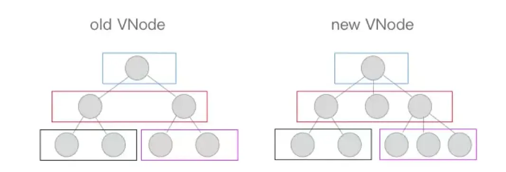
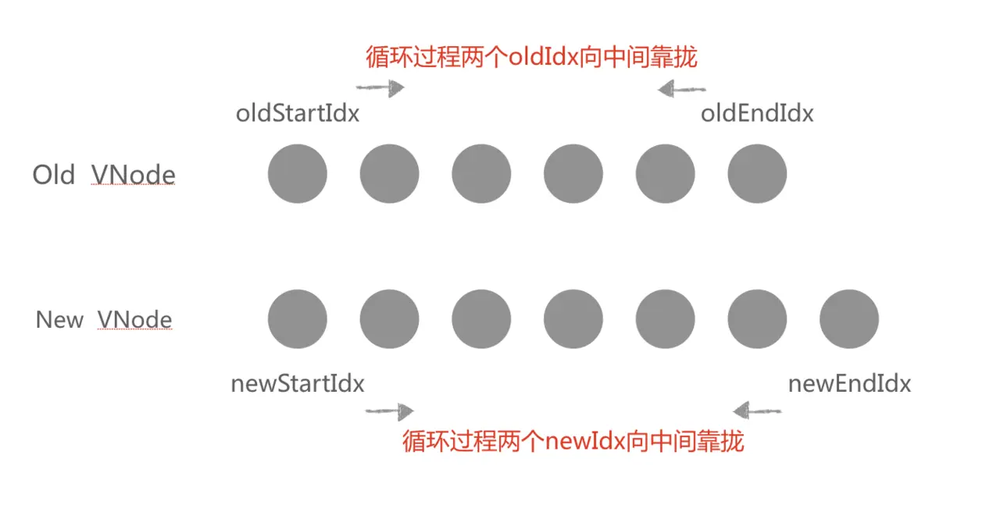
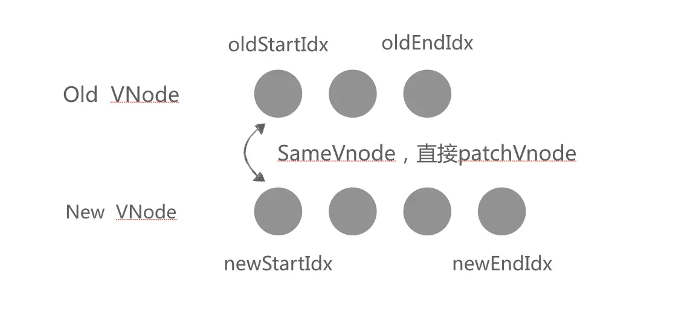
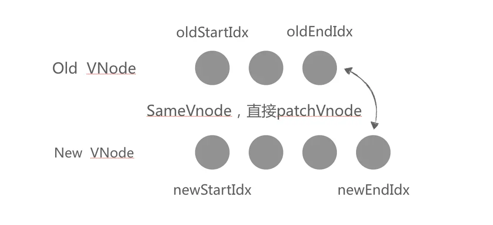
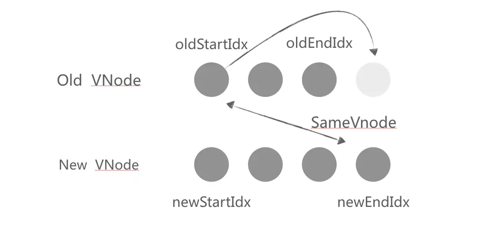
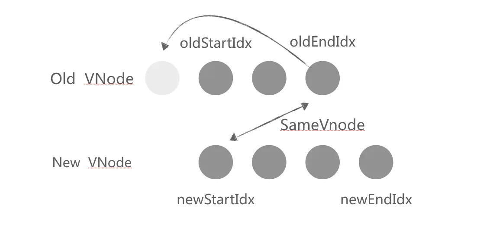
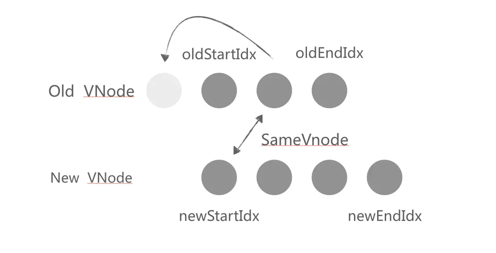
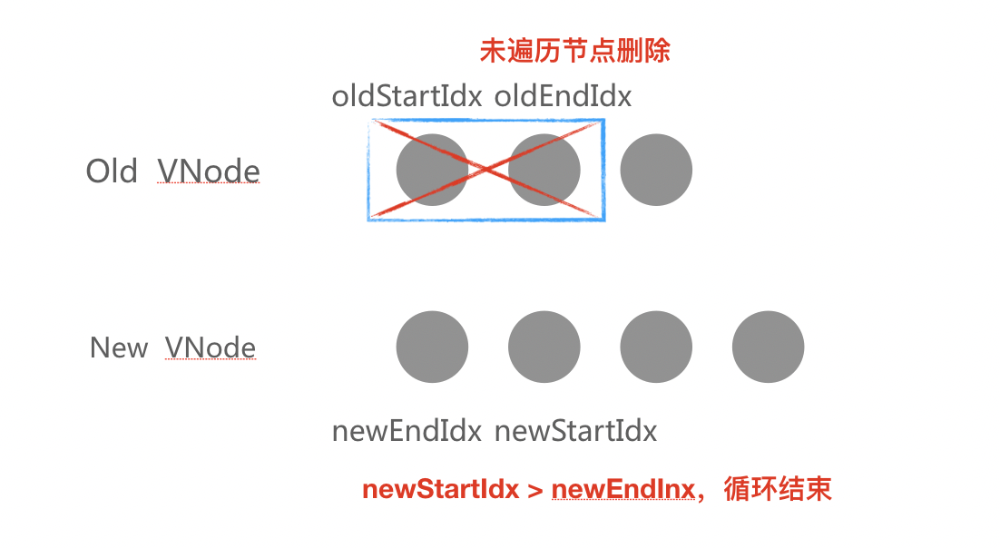
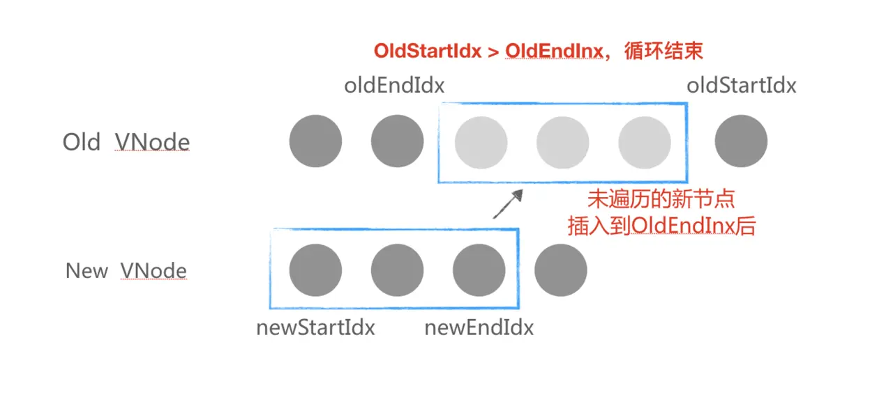
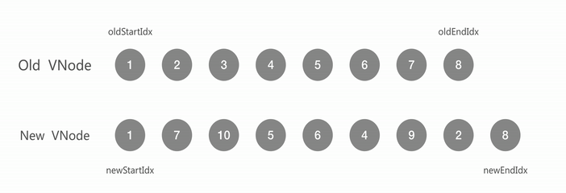

# Vue中的vnode

VNode，全称virtual node，即虚拟节点，对真实 DOM 节点的虚拟描述，在 Vue 的每一个组件实例中，会挂载一个$createElement函数，所有的VNode都是由这个函数创建的。

例如创建一个 div：
```js
// 声明 render function
render: function (createElement) {
    // 也可以使用 this.$createElement 创建 VNode
    return createElement('div', 'hellow world');
}
// 以上 render 方法返回html片段 <div>hellow world</div>
```
 
 render 函数执行后，会根据VNode Tree将 VNode 映射生成真实 DOM，从而完成视图的渲染。

 ## Diff

 Diff 将新老 VNode 节点进行比对，然后将根据两者的比较结果进行最小单位地修改视图，而不是将整个视图根据新的 VNode 重绘，进而达到提升性能的目的。

 ## patch


 Vue.js 内部的 diff 被称为patch。其 diff 算法的是通过同层的树节点进行比较，而非对树进行逐层搜索遍历的方式，所以时间复杂度只有O(n)，是一种相当高效的算法。



 首先定义新老节点是否相同判定函数sameVnode：满足键值key和标签名tag必须一致等条件，返回true，否则false。
在进行patch之前，新老 VNode 是否满足条件sameVnode(oldVnode, newVnode)，满足条件之后，进入流程patchVnode，否则被判定为不相同节点，此时会移除老节点，创建新节点。 

## patchVnode

patchVnode 的主要作用是判定如何对子节点进行更新，

1、如果新旧VNode都是静态的，同时它们的key相同（代表同一节点），并且新的 VNode 是 clone 或者是标记了 once（标记v-once属性，只渲染一次），那么只需要替换 DOM 以及 VNode 即可。
2、新老节点均有子节点，则对子节点进行 diff 操作，进行updateChildren，这个 updateChildren 也是 diff 的核心。
3、如果老节点没有子节点而新节点存在子节点，先清空老节点 DOM 的文本内容，然后为当前 DOM 节点加入子节点。
4、当新节点没有子节点而老节点有子节点的时候，则移除该 DOM 节点的所有子节点。
5、当新老节点都无子节点的时候，只是文本的替换。
 

 ## updateChildren

 Diff 的核心，对比新老子节点数据，判定如何对子节点进行操作，在对比过程中，由于老的子节点存在对当前真实 DOM 的引用，新的子节点只是一个 VNode 数组，所以在进行遍历的过程中，若发现需要更新真实 DOM 的地方，则会直接在老的子节点上进行真实 DOM 的操作，等到遍历结束，新老子节点则已同步结束。

updateChildren内部定义了4个变量，分别是oldStartIdx、oldEndIdx、newStartIdx、newEndIdx，分别表示正在 Diff 对比的新老子节点的左右边界点索引，在老子节点数组中，索引在oldStartIdx与oldEndIdx中间的节点，表示老子节点中为被遍历处理的节点，所以小于oldStartIdx或大于oldEndIdx的表示未被遍历处理的节点。同理，在新的子节点数组中，索引在newStartIdx与newEndIdx中间的节点，表示老子节点中为被遍历处理的节点，所以小于newStartIdx或大于newEndIdx的表示未被遍历处理的节点。

每一次遍历，oldStartIdx和oldEndIdx与newStartIdx和newEndIdx之间的距离会向中间靠拢。当 oldStartIdx > oldEndIdx 或者 newStartIdx > newEndIdx 时结束循环。
 


在遍历中，取出4索引对应的 Vnode节点：

- oldStartIdx：oldStartVnode
- oldEndIdx：oldEndVnode
- newStartIdx：newStartVnode
- newEndIdx：newEndVnode

diff 过程中，如果存在key，并且满足sameVnode，会将该 DOM 节点进行复用，否则则会创建一个新的 DOM 节点。
首先，oldStartVnode、oldEndVnode与newStartVnode、newEndVnode两两比较，一共有 2*2=4 种比较方法。

情况一：当oldStartVnode与newStartVnode满足 sameVnode，则oldStartVnode与newStartVnode进行 patchVnode，并且oldStartIdx与newStartIdx右移动。



情况二：与情况一类似，当oldEndVnode与newEndVnode满足 sameVnode，则oldEndVnode与newEndVnode进行 patchVnode，并且oldEndIdx与newEndIdx左移动。



情况三：当oldStartVnode与newEndVnode满足 sameVnode，则说明oldStartVnode已经跑到了oldEndVnode后面去了，此时oldStartVnode与newEndVnode进行 patchVnode 的同时，还需要将oldStartVnode的真实 DOM 节点移动到oldEndVnode的后面，并且oldStartIdx右移，newEndIdx左移。 



情况四：与情况三类似，当oldEndVnode与newStartVnode满足 sameVnode，则说明oldEndVnode已经跑到了oldStartVnode前面去了，此时oldEndVnode与newStartVnode进行 patchVnode 的同时，还需要将oldEndVnode的真实 DOM 节点移动到oldStartVnode的前面，并且oldStartIdx右移，newEndIdx左移



当这四种情况都不满足，则在oldStartIdx与oldEndIdx之间查找与newStartVnode满足sameVnode的节点，若存在，则将匹配的节点真实 DOM 移动到oldStartVnode的前面。



若不存在，说明newStartVnode为新节点，创建新节点放在oldStartVnode前面即可。



当 newStartIdx > newEndIdx 时，说明新的节点已经遍历完，而老的节点没遍历完，这个时候要将没遍历的老的节点全都删除。




此时已经完成了子节点的匹配。下面是一个例子 patch 过程图：



参考文档

[Vue.js技术揭秘](https://ustbhuangyi.github.io/vue-analysis/v2/prepare/)

[VirtualDOM与diff(Vue实现)](https://juejin.im/post/59bfbd736fb9a00a52065ec7)