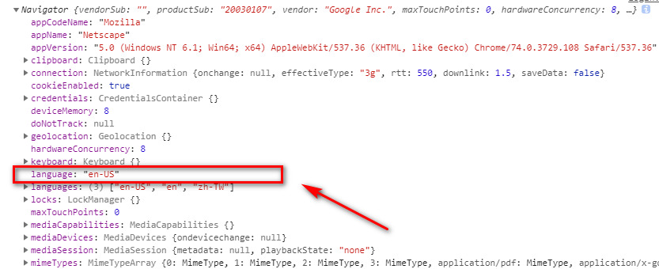

# i18n 实现多语言自动切换

### 什么是 vue-i18n

i18n 是 Internationalization 这个英文的简写，即国际化的意思，vue-i18n 是一款针对于 vue 开发的国际化插件,让项目支持多语言切换，以适应不同地区用户的需求。

### 安装 vue-i18n

直接在项目中执行安装命令：npm install vue-i18n --save，当前版本 8.12.0


### 全局引入 vue-i18n

在项目中引入 vue-i18n，实例化 vue-i18n 将需要加载的语言包通过 require 导入，这里看个人需求我只需要中英文，所以引入 zh-CN.js 和 en-US.js，分别对应中文和英文，你也可以提供多语言包，最后别忘记了将实例挂载至 Vue

```js
import Vue from 'vue'
import VueI18n from 'vue-i18n'
Vue.use(VueI18n)
// 实例化i18n并引入语言文件。
const i18n = new VueI18n({
  locale: 'zh-CN', // 语言标识
  messages: {
    'zh-CN': require('@/assets/langs/zh-CN.js'),
    'en-US': require('@/assets/langs/en-US.js')
  }
})
new Vue({
  router,
  store,
  i18n, // 挂载
  render: h => h(App)
}).$mount('#app')
```

### 定义语言包

语言包已 json 格式书写，数据以键值对的形式呈现，所以每个语言包的键都是对应的，只是值不想同，为避免编码问题问题，我们键统一用英文，所以创建语言包的时候我们先从英文开始，搞定之后直接复制再修改对应的值就好了，最后记得 export 导出对象。定义数据的形式可以根据个人需求来，我喜欢把相同的放一起，这样找起来方便点。如果你觉得每次都要通过 lang 来获取数据比较麻烦，我们可以再优化下，把 export const lang=改写成 module.exports= 模式，这样就可以直接获取对象中的对象了。


### 页面渲染

静态渲染时，用双大括号包裹，把数据当成变量引入，\$t 用来调用语言包中键对应的值。如果用的是 element-ui 动态绑定值，双引号即可。动态渲染时，我们可以借助计算属性，再拿这个计算属性去遍历 DOM 元素即可。

```html
//静态渲染
<h3>{{$t('other.login')}}</h3>
//动态渲染 computed:{ navlist(){ return this.$t('nav') } },
<li v-for="(item,id) in navlist" :key="id">{{item}}</li>
```

### 手动切换语言

在页面中写个 DOM 元素，添加点击事件，来判断当前 this.$i18n.locale属性值，当当前this.$i18n.locale 值为 'zh-CN'将其切换成'en-US'，反则互换即可，如果你是多种语言，那么直接把你当前的选择的语言标识赋值给 this.\$i18n.locale。

```js
change(){
 if ( this.$i18n.locale === 'zh-CN' ) {
 this.$i18n.locale = 'en-US';//关键语句
 }else {
 this.$i18n.locale = 'zh-CN';//关键语句
 }
}
```

### 自动切换语言

根据我们前两篇的基础，我们可以通过两种方式来实现自动切换语言功能，第一种就是根据客户端浏览器设置语言来自动切换语言，如何获取浏览器语言可以参考：Vue 实战 042：获取客户端浏览器以及操作系统信息，第二种方式是根据外网 IP 地址来实现语言的切换，由于 IP 只能定位到市，所以我们需要一套国内各省列表，通过判断 ip 是否在此列表范围内来实现语言的设定，这里我们以浏览器语言来实例演示。



修改配置信息，将语言配置信息存入 localStorage 中，默认 locale 从获取 localStorage 获取，切换语言时同时修改 localStorage 中的信息，这样下次进来时系统就会根据用户上次设定的语言进行显示了。

```js
// 实例化i18n并引入语言文件。
const i18n = new VueI18n({
    locale: localStorage.getItem('lang'), // 默认语言
    messages: {
        'zh-CN': require('@/assets/langs/zh-CN.js'),
        'en-US': require('@/assets/langs/en-US.js')
    }
})
//手动切换语言
change(){
    if (this.$i18n.locale === 'zh-CN') {
        this.$i18n.locale = 'en-US';
      localStorage.setItem('lang','en-US')
    }else {
     this.$i18n.locale = 'zh-CN';
    localStorage.setItem('lang','zh-CN')
  }
}
```
