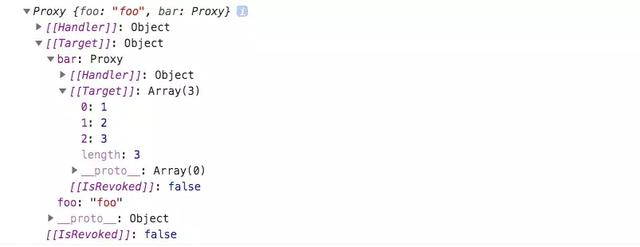
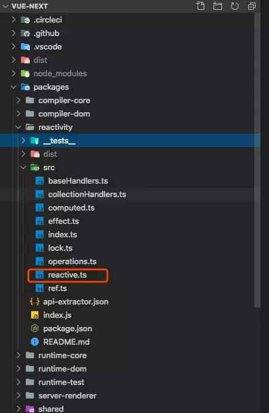
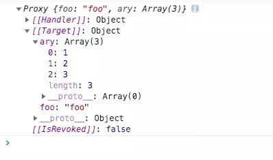
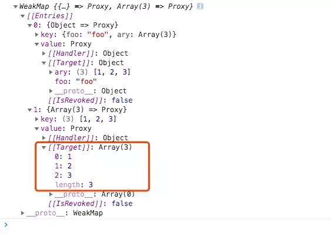
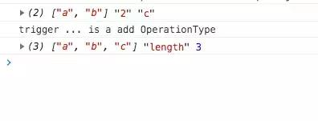

# Vue3 的源代码发布

在 10 月 05 日凌晨 Vue3 的源代码正式发布了，来自官方的消息：


目前的版本是 Pre-Alpha ， 仓库地址： Vue-next， 可以通过 Composition API 了解更多新版本的信息， 目前版本单元测试相关情况 vue-next-coverage。

Vue 的核心之一就是响应式系统，通过侦测数据的变化，来驱动更新视图。

实现可响应对象的方式

通过可响应对象，实现对数据的侦测，从而告知外界数据变化。实现可响应对象的方式：

getter 和 setter
defineProperty
Proxy
关于前两个 API 的使用方式不多赘述，单一的访问器 getter/setter 功能相对简单，而作为 Vue2.x 实现可响应对象的 API - defineProperty ， API 本身存在较多问题。

Vue2.x 中，实现数据的可响应，需要对 Object 和 Array 两种类型采用不同的处理方式。 Object 类型通过 Object.defineProperty 将属性转换成 getter/setter ，这个过程需要递归侦测所有的对象 key，来实现深度的侦测。

为了感知 Array 的变化，对 Array 原型上几个改变数组自身的内容的方法做了拦截，虽然实现了对数组的可响应，但同样存在一些问题，或者说不够方便的情况。 同时，defineProperty 通过递归实现 getter/setter 也存在一定的性能问题。

更好的实现方式是通过 ES6 提供的 Proxy API。

Proxy API 的一些细节

Proxy API 具有更加强大的功能， 相比旧的 defineProperty API ，Proxy 可以代理数组，并且 API 提供了多个 traps ，可以实现诸多功能。

这里主要说两个 trap: get 、 set ， 以及其中的一些比较容易被忽略的细节。

```js
let data = { foo: 'foo' }
let p = new Proxy(data, {
  get(target, key, receiver) {
    return target[key]
  },
  set(target, key, value, receiver) {
    console.log('set value')
    target[key] = value // ?
  }
})
p.foo = 123
// set value
```

通过 proxy 返回的对象 p 代理了对原始数据的操作，当对 p 设置时，便可以侦测到变化。但是这么写实际上是有问题， 当代理的对象数据是数组时，会报错。

```js
let data = [1, 2, 3]
let p = new Proxy(data, {
  get(target, key, receiver) {
    return target[key]
  },
  set(target, key, value, receiver) {
    console.log('set value')
    target[key] = value
  }
})
p.push(4) // VM438:12 Uncaught TypeError: 'set' on proxy: trap returned falsish for property '3'
```

将代码更改为：

```js
let data = [1, 2, 3]
let p = new Proxy(data, {
  get(target, key, receiver) {
    return target[key]
  },
  set(target, key, value, receiver) {
    console.log('set value')
    target[key] = value
    return true
  }
})
p.push(4)
// set value // 打印2次
```

实际上，当代理对象是数组，通过 push 操作，并不只是操作当前数据，push 操作还触发数组本身其他属性更改。

```js
let data = [1, 2, 3]
let p = new Proxy(data, {
  get(target, key, receiver) {
    console.log('get value:', key)
    return target[key]
  },
  set(target, key, value, receiver) {
    console.log('set value:', key, value)
    target[key] = value
    return true
  }
})
p.push(1)
// get value: push
// get value: length
// set value: 3 1
// set value: length 4
```

先看 set 操作，从打印输出可以看出，push 操作除了给数组的第 3 位下标设置值 1 ，还给数组的 length 值更改为 4。 同时这个操作还触发了 get 去获取 push 和 length 两个属性。

我们可以通过 Reflect 来返回 trap 相应的默认行为，对于 set 操作相对简单，但是一些比较复杂的默认行为处理起来相对繁琐得多，Reflect 的作用就显现出来了。

```js
let data = [1, 2, 3]
let p = new Proxy(data, {
  get(target, key, receiver) {
    console.log('get value:', key)
    return Reflect.get(target, key, receiver)
  },
  set(target, key, value, receiver) {
    console.log('set value:', key, value)
    return Reflect.set(target, key, value, receiver)
  }
})
p.push(1)
// get value: push
// get value: length
// set value: 3 1
// set value: length 4
```

相比自己处理 set 的默认行为，Reflect 就方便得多。

细节二：多次触发 set / get

从前面的例子中可以看出，当代理对象是数组时，push 操作会触发多次 set 执行，同时，也引发 get 操作，这点非常重要，vue3 就很好的使用了这点。 我们可以从另一个例子来看这个操作：

```js
let data = [1, 2, 3]
let p = new Proxy(data, {
  get(target, key, receiver) {
    console.log('get value:', key)
    return Reflect.get(target, key, receiver)
  },
  set(target, key, value, receiver) {
    console.log('set value:', key, value)
    return Reflect.set(target, key, value, receiver)
  }
})
p.unshift('a') // get value: unshift
// get value: length
// get value: 2
// set value: 3 3
// get value: 1
// set value: 2 2
// get value: 0
// set value: 1 1
// set value: 0 a
// set value: length 4
```

可以看到，在对数组做 unshift 操作时，会多次触发 get 和 set 。 仔细观察输出，不难看出，get 先拿数组最末位下标，开辟新的下标 3 存放原有的末位数值，然后再将原数值都往后挪，将 0 下标设置为了 unshift 的值 a ，由此引发了多次 set 操作。

而这对于 通知外部操作 显然是不利，我们假设 set 中的 console 是触发外界渲染的 render 函数，那么这个 unshift 操作会引发 多次 render 。

我们后面会讲述如何解决相应的这个问题，继续。

细节三：proxy 只能代理一层

```js
let data = { foo: 'foo', bar: { key: 1 }, ary: ['a', 'b'] }
let p = new Proxy(data, {
  get(target, key, receiver) {
    console.log('get value:', key)
    return Reflect.get(target, key, receiver)
  },
  set(target, key, value, receiver) {
    console.log('set value:', key, value)
    return Reflect.set(target, key, value, receiver)
  }
})
p.bar.key = 2
// get value: bar
```

执行代码，可以看到并没有触发 set 的输出，反而是触发了 get ，因为 set 的过程中访问了 bar 这个属性。 由此可见，proxy 代理的对象只能代理到第一层，而对象内部的深度侦测，是需要开发者自己实现的。同样的，对于对象内部的数组也是一样。

```js
p.ary.push('c')
// get value: ary
```

同样只走了 get 操作，set 并不能感知到。

我们注意到 get/set 还有一个参数：receiver ，对于 receiver ，其实接收的是一个代理对象：

```js
let data = { a: { b: { c: 1 } } }
let p = new Proxy(data, {
  get(target, key, receiver) {
    console.log(receiver)
    const res = Reflect.get(target, key, receiver)
    return res
  },
  set(target, key, value, receiver) {
    return Reflect.set(target, key, value, receiver)
  }
})
// Proxy {a: {…}}
```

这里 receiver 输出的是当前代理对象，注意，这是一个已经代理后的对象。

```js
let data = { a: { b: { c: 1 } } }
let p = new Proxy(data, {
  get(target, key, receiver) {
    const res = Reflect.get(target, key, receiver)
    console.log(res)
    return res
  },
  set(target, key, value, receiver) {
    return Reflect.set(target, key, value, receiver)
  }
})
// {b: {c: 1} }
```

当我们尝试输出 Reflect.get 返回的值，会发现，当代理的对象是多层结构时，Reflect.get 会返回对象的内层结构。
记住这一点，Vue3 实现深度的 proxy ，便是很好的使用了这点。
解决 proxy 中的细节问题
前面提到了使用 Proxy 来侦测数据变化，有几个细节问题，包括：

1、使用 Reflect 来返回 trap 默认行为

2、对于 set 操作，可能会引发代理对象的属性更改，导致 set 执行多次

3、proxy 只能代理对象中的一层，对于对象内部的操作 set 未能感知，但是 get 会被执行

接下来，我们将先自己尝试解决这些问题，后面再分析 Vue3 是如何解决这些细节的。

setTimeout 解决重复 trigger

```js
function reactive(data, cb) {
  let timer = null
  return new Proxy(data, {
    get(target, key, receiver) {
      return Reflect.get(target, key, receiver)
    },
    set(target, key, value, receiver) {
      clearTimeout(timer)
      timer = setTimeout(() => {
        cb && cb()
      }, 0)
      return Reflect.set(target, key, value, receiver)
    }
  })
}
let ary = [1, 2]
let p = reactive(ary, () => {
  console.log('trigger')
})
p.push(3)
// trigger
```

程序输出结果为一个： trigger

这里实现了 reactive 函数，接收两个参数，第一个是被代理的数据 data ，还有一个回调函数 cb， 我们这里先简单的在 cb 中打印 trigger 操作，来模拟通知外部数据的变化。

解决重复的 cb 调用有很多中方式，比方通过标志，来决定是否调用。而这里是使用了定时器 setTimeout ， 每次调用 cb 之前，都清除定时器，来实现类似于 debounce 的操作，同样可以解决重复的 callback 问题。

解决数据深度侦测

目前还有一个问题，那便是深度的数据侦测，我们可以使用递归代理的方式来实现：

```js
function reactive(data, cb) {
  let res = null
  let timer = null
  res = data instanceof Array ? [] : {}
  for (let key in data) {
    if (typeof data[key] === 'object') {
      res[key] = reactive(data[key], cb)
    } else {
      res[key] = data[key]
    }
  }
  return new Proxy(res, {
    get(target, key) {
      return Reflect.get(target, key)
    },
    set(target, key, val) {
      let res = Reflect.set(target, key, val)
      clearTimeout(timer)
      timer = setTimeout(() => {
        cb && cb()
      }, 0)
      return res
    }
  })
}
let data = { foo: 'foo', bar: [1, 2] }
let p = reactive(data, () => {
  console.log('trigger')
})
p.bar.push(3)
// trigger
```

对代理的对象进行遍历，对每个 key 都做一次 proxy，这是递归实现的方式。 同时，结合前面提到的 timer 避免重复 set 的问题。

这里我们可以输出代理后的对象 p ：


可以看到深度代理后的对象，都携带 proxy 的标志。

到这里，我们解决了使用 proxy 实现侦测的系列细节问题，虽然这些处理方式可以解决问题，但似乎并不够优雅，尤其是递归 proxy 是一个性能隐患， 当数据对象比较大时，递归的 proxy 会消耗比较大的性能，并且有些数据并非需要侦测，我们需要对数据侦测做更细的控制。

接下来我们就看下 Vue3 是如何使用 Proxy 实现数据侦测的。

Vue3 中的 reactivity

Vue3 项目结构采用了 lerna 做 monorepo 风格的代码管理，目前比较多的开源项目切换到了 monorepo 的模式， 比较显著的特征是项目中会有个 packages/ 的文件夹。

Vue3 对功能做了很好的模块划分，同时使用 TS 。我们直接在 packages 中找到响应式数据的模块：



其中，reactive.ts 文件提供了 reactive 函数，该函数是实现响应式的核心。 同时这个函数也挂载在了全局的 Vue 对象上。

这里对源代码做一点程度的简化：

```js
const rawToReactive = new WeakMap()
const reactiveToRaw = new WeakMap()
// utils
function isObject(val) {
  return typeof val === 'object'
}
function hasOwn(val, key) {
  const hasOwnProperty = Object.prototype.hasOwnProperty
  return hasOwnProperty.call(val, key)
}
// traps
function createGetter() {
  return function get(target, key, receiver) {
    const res = Reflect.get(target, key, receiver)
    return isObject(res) ? reactive(res) : res
  }
}
function set(target, key, val, receiver) {
  const hadKey = hasOwn(target, key)
  const oldValue = target[key]
  val = reactiveToRaw.get(val) || val
  const result = Reflect.set(target, key, val, receiver)
  if (!hadKey) {
    console.log('trigger ...')
  } else if (val !== oldValue) {
    console.log('trigger ...')
  }
  return result
}
// handler
const mutableHandlers = {
  get: createGetter(),
  set: set
}
// entry
function reactive(target) {
  return createReactiveObject(target, rawToReactive, reactiveToRaw, mutableHandlers)
}
function createReactiveObject(target, toProxy, toRaw, baseHandlers) {
  let observed = toProxy.get(target)
  // 原数据已经有相应的可响应数据, 返回可响应数据
  if (observed !== void 0) {
    return observed
  }
  // 原数据已经是可响应数据
  if (toRaw.has(target)) {
    return target
  }
  observed = new Proxy(target, baseHandlers)
  toProxy.set(target, observed)
  toRaw.set(observed, target)
  return observed
}
```

rawToReactive 和 reactiveToRaw 是两个弱引用的 Map 结构，这两个 Map 用来保存 原始数据 和 可响应数据 ，在函数 createReactiveObject 中，toProxy 和 toRaw 传入的便是这两个 Map 。

我们可以通过它们，找到任何代理过的数据是否存在，以及通过代理数据找到原始的数据。

除了保存了代理的数据和原始数据，createReactiveObject 函数仅仅是返回了 new Proxy 代理后的对象。 重点在 new Proxy 中传入的 handler 参数 baseHandlers。

还记得前面提到的 Proxy 实现数据侦测的细节问题吧，我们尝试输入：

```js
let data = { foo: 'foo', ary: [1, 2] }
let r = reactive(data)
r.ary.push(3)
```

打印结果：


可以看到打印输出了一次 trigger ...

问题一：如何做到深度的侦测数据的 ？

深度侦测数据是通过 createGetter 函数实现的，前面提到，当对多层级的对象操作时，set 并不能感知到，但是 get 会触发， 于此同时，利用 Reflect.get() 返回的“多层级对象中内层” ，再对“内层数据”做一次代理。

```js
function createGetter() {
  return function get(target, key, receiver) {
    const res = Reflect.get(target, key, receiver)
    return isObject(res) ? reactive(res) : res
  }
}
```

可以看到这里判断了 Reflect 返回的数据是否还是对象，如果是对象，则再走一次 proxy ，从而获得了对对象内部的侦测。

并且，每一次的 proxy 数据，都会保存在 Map 中，访问时会直接从中查找，从而提高性能。

当我们打印代理后的对象时：



可以看到这个代理后的对象内层并没有代理的标志，这里仅仅是代理外层对象。

输出其中一个存储代理数据的 rawToReactive ：



对于内层 ary: [1, 2] 的代理，已经被存储在了 rawToReactive 中。
由此实现了深度的数据侦测。

问题二：如何避免多次 trigger ？

```js
function hasOwn(val, key) {
  const hasOwnProperty = Object.prototype.hasOwnProperty
  return hasOwnProperty.call(val, key)
}
function set(target, key, val, receiver) {
  console.log(target, key, val)
  const hadKey = hasOwn(target, key)
  const oldValue = target[key]

  val = reactiveToRaw.get(val) || val
  const result = Reflect.set(target, key, val, receiver)
  if (!hadKey) {
    console.log('trigger ... is a add OperationType')
  } else if (val !== oldValue) {
    console.log('trigger ... is a set OperationType')
  }
  return result
}
```

关于多次 trigger 的问题，vue 处理得很巧妙。
在 set 函数中 hasOwn 前打印 console.log(target, key, val) 。
输入：

```js
let data = ['a', 'b']
let r = reactive(data)
r.push('c')
```

输出结果：



.push('c') 会触发 set 执行两次，一次是值本身 'c' ，一次是 length 属性设置。

设置值 'c' 时，传入的新增索引 key 为 2，target 是原始的代理对象 ['a', 'c'] ，hasOwn(target, key) 显然返回 false ，这是一个新增的操作，此时可以执行 trigger ... is a add OperationType 。

当传入 key 为 length 时，hasOwn(target, key) ，length 是自身属性，返回 true，此时判断 val !== oldValue , val 是 3, 而 oldValue 即为 target['length'] 也是 3，此时不执行 trigger 输出语句。

所以通过 判断 key 是否为 target 自身属性，以及设置 val 是否跟 target[key]相等 可以确定 trigger 的类型，并且避免多余的 trigger。

总结

实际上本文主要集中讲解 Vue3 中是如何使用 Proxy 来侦测数据的。 而在分析源码之前，需要讲清楚 Proxy 本身的一些特性，所以讲了很多 Proxy 的前置知识。同时，我们也通过自己的方式来解决这些问题。

最后，我们对比了 Vue3 中， 是如何处理这些细节的。可以看出，Vue3 并非简单的通过 Proxy 来递归侦测数据， 而是通过 get 操作来实现内部数据的代理，并且结合 WeakMap 来对数据保存，这将大大提高响应式数据的性能。
