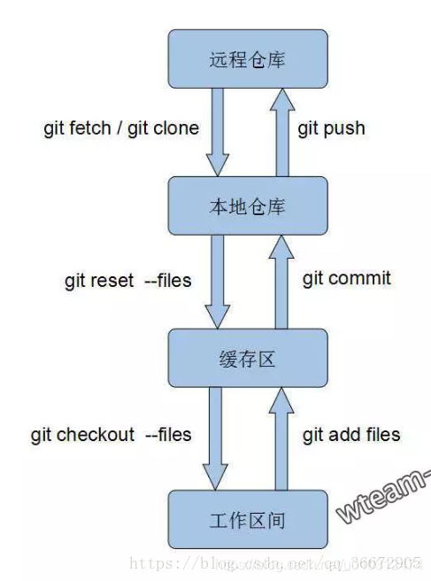

# git重置或还原已提交的代码--git reset和git revert

```js

git reset --hard commit_id
git reset --hard HEAD~100
git reset --hard HEAD^

```





在多人协作时，对代码的管理，难免会出现错误。如果出现错误，我们分析下来是要进行一些回退操作，那么解决办法有如下两种：
**git reset**
**git revert**


### 两种方式
**git reset**
在使用git reset命令前，需要先了解一个概念：HEAD
HEAD 是当前分支引用的指针，它总是指向该分支上的最后一次提交。这表示 HEAD 将是下一次提交的父结点。
通常，理解 HEAD 的最简方式，就是将它看做 你的上一次提交 的快照。
查看快照的操作如下：
下例就显示了 HEAD 快照实际的目录列表，以及其中每个文件的 SHA-1 校验和

```
git cat-file -p HEAD
git ls-tree -r HEAD

```

git reset的作用就是修改HEAD的位置，即将HEAD指向的位置改变为之前存在的某个版本。
适用场景：
如果我们想直接回到之前的某一版本，但是不想保留该目标版本后面的版本，就可以用这种方法。

分支操作者， 操作如下：

```
git checkout <branch_name>
# 切换到目标分支上

git reset --hard <commit_id>
# 本地目标分支上重置代码到上面指定的commit_id, 
# 注意：该commit_id之后的所有提交都会丢失。
# 执行完后，HEAD的位置已经在该commit_id的位置
git reset --hard HEAD^  # 回到最新的一次提交
git push -f     等同于  git push --force
# 在上一条命令中，已经在本地分支中reset好，接下来让远程分支也有相同的效果，可以直接运行这条命令。
# 执行后，可以去代码托管网站查看

git push -f origin <branch_name>
# 如果目标分支和远程分支没有关联上，可以用这条命令，指出远程分支
复制代码
其他分支使用者：

复制代码
git checkout <branch_name>
# 切换到目标分支上

git reset --hard origin/branch_name
# 这步就是其他同事把自己本地branch_name重置到与origin/branch_name一致，
# 注意
# --hard参数会丢弃超过origin的所有commit
# 如果不想丢弃可以用 --mixed 或 --soft，具体用哪个根据自己情况来

```
 

**git revert**
Git的 “还原” 操作。
Git 给你一个生成一个新提交的选项，提交将会撤消一个已存在提交的所有修改。

适用场景：
如果我们想撤销之前的某一版本，但是又想保留该目标版本后面的版本，记录下这整个版本变动流程，就可以用这种方法。

```
git revert -n <commit_id>
# 本地目标分支撤销指定的commit_id
# 注意：做完上面的操作后，可能会出现冲突，需要先解决冲突，在git add，
# 然后使用 git commit 提交

git push
# 在上一条命令中，已经在本地分支中revert好，接下来让远程分支也有相同的效果，可以直接运行这条命令。
# 执行后，可以去代码托管网站查看

```
 

注意，git revert后填的commit_id不能是 merge操作产生的commit_id.