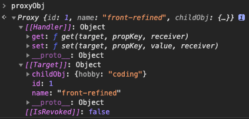

# Vue3 内置的 20 个响应式 API

### 1、reactive

先看 Proxy

在了解 reactive 之前，我们先了解实现 reactive API 的关键类: ES6 的 Proxy，它还有一个好基友: Reflect.

```js
const targetObj = {
  id: 1,
  name: 'front-refined',
  childObj: {
    hobby: 'coding'
  }
}

const proxyObj = new Proxy(targetObj, {
  get(target, key, receiver) {
    console.log(`get key: ${key}`)
    return Reflect.get(target, key, receiver)
  },
  set(target, key, value, receiver) {
    console.log(`set key: ${key}, value: ${value}`)
    return Reflect.set(target, key, value, receiver)
  }
})
```

- 代理之后的对象



[[Handler]]：处理器，目前拦截了 get、set
[[Target]]：代理的目标对象
[[IsRevoked]]：代理是否撤销

### reactive 源码（深层对象的代理）

```js
// 工具方法：判断是否一个对象（注：typeof 数组 也等于 'object'
const isObject = (val) => val !== null && typeof val === 'object'

// 工具方法： 值是否改变，改变才触发更新
const hasChanged = (val, oldVal) => val !== oldVal && (val === val || oldVal === oldVal)

// 工具方法： 判断当前的key是否已经存在的
const hasOwn = (val, key) => Object.hasOwnProperty.call(val, key)

// 闭包：生成一个get  方法
function createGetter() {
  return function get(target, key, receiver) {
    const res = Reflect.get(target, key, receiver)
    console.log(`getting key: ${key}`)
    // track(target, 'get' /** GET **/, key)

    // 深层代理对象的关键！ 判断这个属性是否是一个对象，是的划继续代理动作，是对象内部的值可追踪
    if (isObject(res)) {
      return reactive(res)
    }
    return res
  }
}

// 闭包：生成一个set 方法
function createSetter() {
  return function set(target, key, value, receiver) {
    const oldValue = target[key]
    const hadKey = hasOwn(target, key)
    const result = Reflect.set(target, key, value, receiver)

    // 判断当前key是否已经存在，不存在的划表示为新增的key，后续Vue“标记”新的值使他成为响应式
    if (!hadKey) {
      console.log(`add key: ${key}, value: ${value}`)
      // trigger(target, 'add' /** ADD **/, key, value)
    } else if (hasChanged(value, oldValue)) {
      console.log(`set key ${key}, value: ${value}`)
      // trigger(target, 'set' /** SET **/, key, value, oldValue)
    }

    return result
  }
}

const get = createGetter()

const set = createSetter()

// 基础的处理器对象
const mutableHandlers = {
  get,
  set
}

// 暴露出去的方法： reactive
function reactive(target) {
  return createReactiveObject(target, mutableHandlers)
}

// 创建一个响应式对象
function createReactiveObject(target, baseHandlers) {
  const proxy = new Proxy(target, baseHandlers)
  return proxy
}
```

```js
proxyObj = reactive(targetObj)

proxyObj.childObj.hobby
// get key：childObj
// get key：hobby
proxyObj.childObj.hobby = 'play'
// get key：childObj
// set key：hobby，value：play
```

### 2、shallowReactive

```js
// +++ 新增了 shallow 入参
// 闭包：生成一个get  方法
function createGetter(shallow = false) {
  return function get(target, key, receiver) {
    const res = Reflect.get(target, key, receiver)
    console.log(`getting key: ${key}`)
    // track(target, 'get' /** GET **/, key)

    // +++
    // shallow 为 true 就直接return 结果，所以不会深层追踪
    if (shallow) {
      return res
    }
    // 深层代理对象的关键！ 判断这个属性是否是一个对象，是的划继续代理动作，是对象内部的值可追踪
    if (isObject(res)) {
      return reactive(res)
    }
    return res
  }
}

const shallowGet = createGetter(true)

const shallowReactiveHandlers = Object.assign({}, mutableHandlers, { get: shallowGet })

function shallowReactive(target) {
  return createReactiveObject(target, shallowReactiveHandlers)
}
```

### 3、readonly

```js
// +++ 新增了 isReadonly 参数
// 闭包：生成一个get  方法
function createGetter(shallow = false, isReadonly = false) {
  return function get(target, key, receiver) {
    const res = Reflect.get(target, key, receiver)
    console.log(`getting key: ${key}`)

    if (!isReadonly) {
      // track(target, 'get' /** GET **/, key)
    }

    // +++
    // shallow 为 true 就直接return 结果，所以不会深层追踪
    if (shallow) {
      return res
    }
    // 深层代理对象的关键！ 判断这个属性是否是一个对象，是的划继续代理动作，是对象内部的值可追踪
    if (isObject(res)) {
      // +++
      // 如果是只读，也要同步进行深层代理
      return isReadonly ? readonly(res) : reactive(res)
    }
    return res
  }
}

// +++
const readonlyGet = createGetter(false, true)
// +++
// 只读处理器对象
const readonlyHandlers = {
  get: readonlyGet,
  set(target, key) {
    console.wanr(`Set operation on key ${String(key)} failed: target is readonly.`, target)
  }
}

// +++
// 暴露出去的方法： readonly

function readonly(target) {
  return createReactiveObject(target, readonlyHandlers)
}
```

我们平常接触最多的子组件接收父组件传递的 props。它就是用 readonly 创建的，所以保持了只读。要修改的话只能通过 emit 提交至父组件，从而保证了 Vue 传统的单向数据流

### 4、shallowReadonly

顾名思义，就是这个代理对象 shallow = true & readonly = true

就是代理对象的属性不能修改，但是代理对象的属性对象可以修改

```js
// +++
// shallow = true & readonly = true

const shallowReadonlyGet = createGetter(true, true)

const shallowReadonlyHandlers = Object.assign({}, readonlyHandlers, { get: shallowReadonlyGet })

// +++
// 暴露出去的方法，shallowReadonly

function shallowReadonly(target) {
  return createReactiveObject(target, shallowReadonlyHandlers)
}
```

### 5、ref

> 就是把一个简单类型保证成一个对象，使他可以被追踪

ref 返回的是一个包含 .value 属性的对象

```js

class RefImpl {
  constructor(_rawValue, _shallow = false) {
    this._rawValue = _rawValue
    this._shallow = _shallow
    this.__v_isRef = true
    this._value = _shallow ? _rawValue: convert(_rawValue)
  }
  get value() {
    // track(toRaw(this),'get' /* GET */, 'value')
    return this._value
  },
  set value(newValue) {
    if(hasChanged(toRaw(newVal), this._rawValue)) {
      this._rawValue = newValue
      this._value = this._shallow ? newValue : convert(newVal)
      // trigger(toRaw(this), 'set' /* SET */, value, newValue)
    }
  }
}

// 创建一个ref

function createRef(rawValue, shallow = false) {
  return new RefImp(rawValue, shallow)
}

// 暴露出去的方法： ref
function ref(value) {
  return createRef(value)
}

// 暴露出去的方法： shallowRef
function shallowRef(value) {
  return createRef(value, true)
}
```

核心类 RefImpl ，我们可以看到在类中使用了经典的 get/set 存取器，来进行追踪和触发。
convert 方法让我们知道了 ref 不仅仅用来包装一个值类型，也可以是一个对象/数组，然后把对象/数组再交给 reactive 进行代理。直接看个例子：

```js
const refArr = ref([1, 2, 3])
const refObj = ref({ id: 1, name: 'front-refined' })
```

// 操作它们
refArr.value.push(1);
refObj.value.id = 2; 6. unref
展开一个 ref：判断参数为 ref ，则返回 .value ，否则返回参数本身。

源码：

```js
function isRef(r) {
  return Boolean(r && r._isRef === true)
}
function unref(ref) {
  return isRef(ref) ? ref.value : ref
}
```

为了方便开发，Vue 处理了在 template 中用到的 ref 将会被自动展开，也就是不用写 .value 了，背后的实现，让我们一起来看一下：

这里用「模拟」的方式来阐述，核心逻辑没有改变~

```js
// 模拟：在 setup 内定义一个 ref
const num = ref(1)
// 模拟：在 setup 返回，提供 template 使用
function setup() {
  return { num }
}
// 模拟：接收了 setup 返回的对象
const setupReturnObj = setup()
// 定义处理器对象，get 访问器里的 unref 是关键
const shallowUnwrapHandlers = {
  get: (target, key, receiver) => unref(Reflect.get(target, key, receiver)),
  set: (target, key, value, receiver) => {
    const oldValue = target[key]
    if (isRef(oldValue) && !isRef(value)) {
      oldValue.value = value
      return true
    } else {
      return Reflect.set(target, key, value, receiver)
    }
  }
}
```

```js
// 模拟：返回组件实例上下文
const ctx = new Proxy(setupReturnObj, shallowUnwrapHandlers);
// 模拟：template 最终被编译成 render 函数
/\_
<template>
<input v-model="num" />

<div>num：{{num}}</div>
</template>
_/
function render(ctx) {
with (ctx) {
// 模拟：在 template 中，进行赋值动作 "onUpdate:modelValue": $event => (num = $event)
// num = 666;
// 模拟：在 template 中，进行读取动作 {{num}}
console.log('num :>> ', num);
}
}
render(ctx);

// 模拟：在 setup 内部进行赋值动作
num.value += 1;
// 模拟：num 改变 trigger 视图渲染 effect，更新视图
render(ctx);
```

### 7. shallowRef

ref 的介绍已经包含了 shallowRef 方法的实现：
this.\_value = \_shallow ? \_rawValue : convert(\_rawValue);
如果传入的 shallow 值为 true 那么直接返回传入的原始值，也就是说，不会再去深层代理对象了，让我们来看两个场景：

传入的是一个对象

```js
const shallowRefObj = shallowRef({
  id: 1,
  name: 'front-refiend'
})
```

上面的对象加工之后，我们可以简单的理解成:

```js
const shallowRefObj = {
  value: {
    id: 1,
    name: 'front-refiend'
  }
}
```

既然是 shallow（浅层）那就止于 value ，不再进行深层代理。也就是说，对于嵌套对象的属性不会进行追踪，但是我们修改 shallowRefObj 本身的 value 属性还是响应式的，如：shallowRefObj.value = 'hello~';

传入的是一个简单类型
const shallowRefNum = shallowRef(1);
当传入的值是一个简单类型时候，结合这两句代码：
const convert = val => (isObject(val) ? reactive(val) : val); ，
this.\_value = \_shallow ? \_rawValue : convert(\_rawValue);
我们就可以知道 shallowRef 和 ref 对于入参是一个简单类型时，其最终效果是一致的。

### 8. triggerRef

个人觉得这个 API 理解起来较为抽象，小伙伴们一起仔细琢磨琢磨~

triggerRef 是和 shallowRef 配合使用的，例子：

```js
const shallowRefObj = shallowRef({
  name: 'front-refined'
})
// 这里不会触发副作用，因为是这个 ref 是浅层的
shallowRefObj.value.name = 'hello~'
```

// 手动执行与 shallowRef 关联的任何副作用，这样子就能触发了。
triggerRef(shallowRefObj);
看下背后的实现原理：

在开篇我们有讲到的 effect 这个概念，假设当前正在走 视图渲染 effect 。

template 绑定的了值，如：

```html
<template> {{shallowRefObj.name}} </template>
```

当执行 “render” 时，就会读取到了 shallowRefObj.value.name ，由于当前的 ref 是浅层的，只能追踪到 value 的变化，所以在 value 的 get 方法进行 track 如：
track(toRaw(this), "get" /_ GET _/, 'value');

track 方法源码精简：

```js
// targetMap 是一个大集合
// activeEffect 表示当前正在走的 effect ，假设当前是 视图渲染 effect
function track(target, type, key) {
  let depsMap = targetMap.get(target)
  if (!depsMap) {
    targetMap.set(target, (depsMap = new Map()))
  }
  let dep = depsMap.get(key)
  if (!dep) {
    depsMap.set(key, (dep = new Set()))
  }
  if (!dep.has(activeEffect)) {
    dep.add(activeEffect)
  }
}
```

打印 targetMap

图片
也就是说，如果 shallowRefObj.value 有改变就可以 trigger 视图渲染 effect 来更新视图，或着我们也可以手动 trigger 它。

但是，我们目前改变的是 shallowRefObj.value.name = 'hello~';，所以我们要 “骗” trigger 方法。手动 trigger，只要我们的入参对了，就会响应式更新视图了，看一下 triggerRef 与 trigger 的源码：

```js
function triggerRef(ref) {
trigger(toRaw(ref), 'set' /_ SET _/, 'value', ref.value);
}

// trigger 响应式触发
function trigger(target, type, key, newValue, oldValue, oldTarget) {
const depsMap = targetMap.get(target);
if (!depsMap) {
// 没有被追踪，直接 return
return;
}
// 拿到了 视图渲染 effect 就可以进行排队更新 effect 了
const run = depsMap.get(key);

/_ 开始执行 effect，这里做了很多事... _/
run();
}

```

我们用 target 和 key 拿到了 视图渲染的 effect。至此，就可以完成一个手动更新了~

### 9. customRef

自定义的 ref 。这个 API 就更显式的让我们了解 track 与 trigger，看个例子：

```html
<template>
  <div>name：{{name}}</div>
  <input v-model="name" />
</template>

// ... setup() { let value = 'front-refined'; // 参数是一个工厂函数 const name = customRef((track,
trigger) => { return { get() { // 收集依赖它的 effect track(); return value; }, set(newValue) {
value = newValue; // 触发更新依赖它的所有 effect trigger(); } }; }); return { name }; }
```

让我们看下源码实现：

```js
// 自定义 ref 实现类
class CustomRefImpl {
constructor(factory) {
this.\_\_v*isRef = true;
const { get, set } = factory(
() => track(this, 'get' /* GET _/, 'value'),
() => trigger(this, 'set' /_ SET \_/, 'value')
);
this.\_get = get;
this.\_set = set;
}
get value() {
return this.\_get();
}
set value(newVal) {
this.\_set(newVal);
}
}
function customRef(factory) {
return new CustomRefImpl(factory);
}
```

结合我们上面有提过的 ref 源码相关，我们可以看到 customRef 只是把 ref 内部的实现，更显式的暴露出来，让我们更灵活的控制。比如可以延迟 trigger ，如：

```js
// ...
set(newValue) {
clearTimeout(timer);
timer = setTimeout(() => {
value = newValue;
// 触发更新依赖它的所有 effect
trigger();
}, 2000);
}
// ...
```

### 10. toRef

可以用来为响应式对象上的 property 新创建一个 ref ，从而保持对其源 property 的响应式连接。举个例子：

假设我们传递给一个组合式函数一个响应式数据，在组合式函数内部就可以响应式的修改它：

```js
// 1. 传递整个响应式对象
function useHello(state) {
  state.name = 'hello~'
}
// 2. 传递一个具体的 ref
function useHello2(name) {
  name.value = 'hello~'
}

export default {
  setup() {
    const state = reactive({
      id: 1,
      name: 'front-refiend'
    })
    // 1. 直接传递整个响应式对象
    useHello(state)
    // 2. 传递一个新创建的 ref
    useHello2(toRef(state, 'name'))
  }
}
```

让我们看下源码实现：

```js
// ObjectRef 实现类
class ObjectRefImpl {
  constructor(\_object, \_key) {
    this.\_object = \_object
    this.\_key = \_key
    this.\_\_\_\_\_\_\_\_\_\_\_\_\_\_\_\_\_\_\_\_\_v_isRef = true
  }
  get value() {
    return this.\_object[this._key]
  }
  set value(newVal) {
    this.\_object[this._key] = newVal
  }
}
// 暴露出去的方法
function toRef(object, key) {
  return new ObjectRefImpl(object, key)
}
```

即使 name 属性不存在，toRef 也会返回一个可用的 ref，如：我们在上面那个例子指定了一个对象没有的属性：

useHello2(toRef(state, 'other'));
这个动作就相当于往对象新增了一个属性 other，且会响应式。

### 11. toRefs

    toRefs 底层就是 toRef。

将响应式对象转换为普通对象，其中结果对象的每个 property 都是指向原始对象相应 property 的 ref，保持对其源 property 的响应式连接。

toRefs 的出现其实也是为了开发上的便利。让我们直接来看看它的几个使用场景：

解构 props

```js
export default {
  props: {
    id: Number,
    name: String
  },
  setup(props, ctx) {
    const { id, name } = toRefs(props)
    watch(id, () => {
      console.log('id change')
    })

    // 没有使用 toRefs 的话，需要通过这种方式监听
    watch(
      () => props.id,
      () => {
        console.log('id change')
      }
    )
  }
}
```

这样子我们就能保证能监听到 id 的变化（没有使用 toRefs 的解构是不行的），因为通过 toRefs 方法之后，id 其实就是一个 ref 对象。

setup return 时转换

```html
<template>
  <div>id：{{id}}</div>
  <div>name：{{name}}</div>
</template>
// ... setup() { const state = reactive({ id: 1, name: 'front-refiend' }); return { ...toRefs(state)
}; }
```

这样的写法我们就更加方便的在模板上直接写对应的值，而不需要 {{state.id}} ，{{state.name}}

让我们看下源码：

```js
function toRefs(object) {
  const ret = {}
  for (const key in object) {
    ret[key] = toRef(object, key)
  }
  return ret
}
```

### 12. compouted

开头有讲过，compouted 是一个 “计算属性 effect” 。它依赖响应式基础数据，当数据变化时候会触发它的更新。computed 主要的靓点就是缓存了，可以缓存性能开销比较大的计算。它返回一个 ref 对象。

让我们一起来看一个 computed 闭环的精简源码（主要是了解思路，虽然精简了，但代码还是有一丢丢多，不够看完你肯定有收获。直接 copy 可以运行哦~）：

```html
<body>
  <fieldset>
    <legend>包含get/set方法的 computed</legend>
    <button onclick="handleChangeFirsttName()">changeFirsttName</button>
    <button onclick="handleChangeLastName()">changeLastName</button>
    <button onclick="handleSetFullName()">setFullName</button>
  </fieldset>

  <fieldset>
    <legend>只读 computed</legend>
    <button onclick="handleAddCount1()">handleAddCount1</button>
    <button onclick="handleSetCount()">handleSetCount</button>
  </fieldset>

  <script>
    // 大集合，存放依赖相关
    const targetMap = new WeakMap()
    // 当前正在走的 effect
    let activeEffect
    // 精简：创建一个 effect
    const createReactiveEffect = (fn, options) => {
      const effect = function reactiveEffect() {
        try {
          activeEffect = effect
          return fn()
        } finally {
          // 当前的 effect 走完之后（相关的依赖收集完毕之后），就退出
          activeEffect = undefined
        }
      }
      effect.options = options
      // 该副作用的依赖集合
      effect.deps = []
      return effect
    }

    //#region 精简：ref 方法
    // 工具方法：值是否改变，改变才触发更新
    const hasChanged = (value, oldValue) =>
      value !== oldValue && (value === value || oldValue === oldValue)
    // ref 实现类
    class RefImpl {
      constructor(_rawValue) {
        this._rawValue = _rawValue
        this.__v_isRef = true
        this._value = _rawValue
      }
      get value() {
        track(this, 'get', 'value')
        return this._value
      }
      set value(newVal) {
        if (hasChanged(newVal, this._rawValue)) {
          this._rawValue = newVal
          this._value = newVal
          trigger(this, 'set', 'value', newVal)
        }
      }
    }
    // 创建一个 ref
    function createRef(rawValue) {
      return new RefImpl(rawValue)
    }
    // 暴露出去的方法，ref
    function ref(value) {
      return createRef(value)
    }
    //#endregion

    //#region 精简：track、trigger
    const track = (target, type, key) => {
      if (activeEffect === undefined) {
        return
      }
      let depsMap = targetMap.get(target)
      if (!depsMap) {
        targetMap.set(target, (depsMap = new Map()))
      }
      let dep = depsMap.get(key)
      if (!dep) {
        depsMap.set(key, (dep = new Set()))
      }
      if (!dep.has(activeEffect)) {
        dep.add(activeEffect)

        // 存储该副作用相关依赖集合
        activeEffect.deps.push(dep)
      }
    }
    const trigger = (target, type, key, newValue) => {
      const depsMap = targetMap.get(target)
      if (!depsMap) {
        // 没有被追踪，直接 return
        return
      }
      const effects = depsMap.get(key)
      const run = (effect) => {
        if (effect.options.scheduler) {
          // 调度执行
          effect.options.scheduler()
        }
      }
      effects.forEach(run)
    }
    //#endregion

    //#region 精简：computed 方法
    const isFunction = (val) => typeof val === 'function'
    // 暴露出去的方法
    function computed(getterOrOptions) {
      let getter
      let setter
      if (isFunction(getterOrOptions)) {
        getter = getterOrOptions
        setter = () => {
          // 提示，当前的 computed 如果是只读的，也就是说没有在调用的时候传入 set 方法
          console.warn('Write operation failed: computed value is readonly')
        }
      } else {
        getter = getterOrOptions.get
        setter = getterOrOptions.set
      }
      return new ComputedRefImpl(getter, setter)
    }

    // computed 核心方法
    class ComputedRefImpl {
      constructor(getter, _setter) {
        this._setter = _setter
        this._dirty = true
        this.effect = createReactiveEffect(getter, {
          scheduler: () => {
            // 依赖的数据改变了，标记为脏值，等 get value 时进行计算获取
            if (!this._dirty) {
              this._dirty = true
            }
          }
        })
      }
      get value() {
        // 脏值需要计算 _dirty=true 代表需要计算
        if (this._dirty) {
          console.log('脏值，需要计算...')
          this._value = this.effect()
          // 标记脏值为 false，进行缓存值（下次获取时，不需要计算)
          this._dirty = false
        }
        return this._value
      }
      set value(newValue) {
        this._setter(newValue)
      }
    }
    //#endregion

    //#region 例子

    // 1. 创建一个只读 computed
    const count1 = ref(0)
    const count = computed(() => {
      return count1.value * 10
    })
    const handleAddCount1 = () => {
      count1.value++
      console.log('count.value :>> ', count.value)
    }
    const handleSetCount = () => {
      count.value = 1000
    }

    // 2. 创建一个包含 get/set 方法的 computed
    // 获取的 computed 数据
    const consoleFullName = () => console.log('fullName.value :>> ', fullName.value)

    const firsttName = ref('san')
    const lastName = ref('zhang')

    const fullName = computed({
      get: () => firsttName.value + '.' + lastName.value,
      set: (val) => {
        lastName.value += val
      }
    })

    // 改变依赖的值触发 computed 更新
    const handleChangeFirsttName = () => {
      firsttName.value = 'si'
      consoleFullName()
    }
    // 改变依赖的值触发 computed 更新
    const handleChangeLastName = () => {
      lastName.value = 'li'
      consoleFullName()
    }
    // 触发 fullName set，如果 computed 为只读就警告
    const handleSetFullName = () => {
      fullName.value = ' happy niu year~'
      consoleFullName()
    }

    // 必须要有读取行为，才会进行依赖收集。当依赖改变时候，才会响应式更新！
    consoleFullName()
    //#endregion
  </script>
</body>
```

computed 的闭环流程是这样子的：
computed 创建的 ref 对象初次被调用 get（读 computed 的 value），会进行依赖收集，当依赖改变时，调度执行触发 dirty = true，标记脏值，需要计算。下一次再去调用 computed 的 get 时候，就需要重新计算获取新值，如此反复。

### 13. watch

    关于 watch ，这里直接先上一段稍长的源码例子（代码挺长，但是都是精简过的，而且有注释分块。小伙伴们耐心看，copy 可以直接运行哦~）

```html
<body>
  <button onclick="handleChangeCount()">点我触发watch</button>
  <button onclick="handleChangeCount2()">点我触发watchEffect</button>
  <script>
    // 大集合，存放依赖相关
    const targetMap = new WeakMap()
    // 当前正在走的 effect
    let activeEffect
    // 精简：创建一个 effect
    const createReactiveEffect = (fn, options) => {
      const effect = function reactiveEffect() {
        try {
          activeEffect = effect
          return fn()
        } finally {
          // 当前的 effect 走完之后（相关的依赖收集完毕之后），就退出
          activeEffect = undefined
        }
      }
      effect.options = options
      // 该副作用的依赖集合
      effect.deps = []
      return effect
    }

    //#region 精简：ref 方法
    // 工具方法：判断是否是一个 ref 对象
    const isRef = (r) => {
      return Boolean(r && r.__v_isRef === true)
    }
    // 工具方法：值是否改变，改变才触发更新
    const hasChanged = (value, oldValue) =>
      value !== oldValue && (value === value || oldValue === oldValue)
    // 工具方法：判断是否是一个方法
    const isFunction = (val) => typeof val === 'function'

    // ref 实现类
    class RefImpl {
      constructor(_rawValue) {
        this._rawValue = _rawValue
        this.__v_isRef = true
        this._value = _rawValue
      }
      get value() {
        track(this, 'get', 'value')
        return this._value
      }
      set value(newVal) {
        if (hasChanged(newVal, this._rawValue)) {
          this._rawValue = newVal
          this._value = newVal
          trigger(this, 'set', 'value', newVal)
        }
      }
    }
    // 创建一个 ref
    function createRef(rawValue) {
      return new RefImpl(rawValue)
    }
    // 暴露出去的方法，ref
    function ref(value) {
      return createRef(value)
    }
    //#endregion

    //#region 精简：track、trigger
    const track = (target, type, key) => {
      if (activeEffect === undefined) {
        return
      }
      let depsMap = targetMap.get(target)
      if (!depsMap) {
        targetMap.set(target, (depsMap = new Map()))
      }
      let dep = depsMap.get(key)
      if (!dep) {
        depsMap.set(key, (dep = new Set()))
      }
      if (!dep.has(activeEffect)) {
        dep.add(activeEffect)

        // 存储该副作用相关依赖集合
        activeEffect.deps.push(dep)
      }
    }
    const trigger = (target, type, key, newValue) => {
      const depsMap = targetMap.get(target)
      if (!depsMap) {
        // 没有被追踪，直接 return
        return
      }
      const effects = depsMap.get(key)
      const run = (effect) => {
        if (effect.options.scheduler) {
          // 调度执行
          effect.options.scheduler()
        }
      }
      effects.forEach(run)
    }
    //#endregion

    //#region 停止监听相关
    // 停止侦听，如果有 onStop 方法一并调用，onStop 也就是 onInvalidate 回调方法
    function stop(effect) {
      cleanup(effect)
      if (effect.options.onStop) {
        effect.options.onStop()
      }
    }
    // 清空改 effect 收集的依赖相关，这样子改变了就不再继续触发了，也就是“停止侦听”
    function cleanup(effect) {
      const { deps } = effect
      if (deps.length) {
        for (let i = 0; i < deps.length; i++) {
          deps[i].delete(effect)
        }
        deps.length = 0
      }
    }
    //#endregion

    //#region 暴露出去的 watchEffect 方法
    function watchEffect(effect, options) {
      return doWatch(effect, null, options)
    }
    //#endregion

    //#region 暴露出去的 watch 方法
    function watch(source, cb, options) {
      return doWatch(source, cb, options)
    }
    function doWatch(source, cb, { immediate, deep } = {}) {
      let getter
      // 判断是否 ref 对象
      if (isRef(source)) {
        getter = () => source.value
      }
      // 判断是一个 reactive 对象，默认递归追踪 deep=true
      else if (/*isReactive(source)*/ 0) {
        // 省略...
        // getter  = () => source;
        // deep = true;
      }
      // 判断是一个数组，也就是 Vue3 新的特性，watch 可以以数组的方式侦听
      else if (/*isArray(source)*/ 0) {
        // 省略...
      }

      // 判断是否是一个方法，这样子的入参
      else if (isFunction(source)) {
        debugger
        // 这里是类似这样子的入参，() => proxyObj.id
        if (cb) {
          // 省略...
        } else {
          // cb 为 null，表示当前为 watchEffect
          getter = () => {
            if (cleanup) {
              cleanup()
            }
            return source(onInvalidate)
          }
        }
      }

      // 判断是否 deep 就会递归追踪
      if (/*cb && deep*/ 0) {
        // const baseGetter = getter;
        // getter = () => traverse(baseGetter());
      }

      // 清理 effect
      let cleanup
      const onInvalidate = (fn) => {
        cleanup = runner.options.onStop = () => {
          fn()
        }
      }
      let oldValue = undefined

      const job = () => {
        if (cb) {
          // 获取改变改变后的新值
          const newValue = runner()
          if (hasChanged(newValue, oldValue)) {
            if (cleanup) {
              cleanup()
            }
            // 触发回调
            cb(newValue, oldValue, onInvalidate)
            // 把新值赋值给旧值
            oldValue = newValue
          }
        } else {
          // watchEffect
          runner()
        }
      }

      // 调度
      let scheduler
      // default: 'pre'
      scheduler = () => {
        job()
      }

      // 创建一个 effect，调用 runner 其实就是在进行依赖收集
      const runner = createReactiveEffect(getter, {
        scheduler
      })
      // 初始化 run
      if (cb) {
        if (immediate) {
          job()
        } else {
          oldValue = runner()
        }
      } else {
        // watchEffect 默认立即执行
        runner()
      }
      // 返回一个方法，调用即停止侦听
      return () => {
        stop(runner)
      }
    }
    //#endregion

    //#region 例子

    // 1. watch 例子
    const count = ref(0)
    const myStop = watch(
      count,
      (val, oldVal, onInvalidate) => {
        onInvalidate(() => {
          console.log('watch-clear...')
        })
        console.log('watch-val :>> ', val)
        console.log('watch-oldVal :>> ', oldVal)
      },
      { immediate: true }
    )
    // 改变依赖的值触发 触发侦听器回调
    const handleChangeCount = () => {
      count.value++
    }
    // 停止侦听
    // myStop();

    // 2. watchEffect 例子
    const count2 = ref(0)
    watchEffect(() => {
      console.log('watchEffect-count2.value :>> ', count2.value)
    })

    // 改变依赖的值触发 触发侦听器回调
    const handleChangeCount2 = () => {
      count2.value++
    }
    //#endregion
  </script>
</body>
```

以上的代码简单的实现了 watch 监听 ref 对象的例子，那么我们该如何去正确的使用 watch 呢？让我们一起结合源码一起看两点：

关于侦听源的写法，官网有描述，可以是返回值的 getter 函数，也可以直接是 ref，也就是：
const state = reactive({ id: 1 });
// 使用
() => state.id
// 或
const count = ref(0);
// 使用 count
count
// 看完源码，我们也可以这样子写~
() => count.value
结合源码，我们发现也可以直接侦听一个 reactive 对象，而且默认会进进行深度监听（deep=true），会对对象进行递归遍历追踪。但是侦听一个数组的话，只有当数组被替换时才会触发回调。如果你需要在数组改变时触发回调，必须指定 deep 选项。当没有指定 deep = true：

const arr = ref([1, 2, 3]);
// 只有这种方式才会生效
arr.value = [4, 5, 6];
// 其他的无法触发回调
arr.value[0] = 111;
arr.value.push(4);
个人建议尽量避免深度侦听，因为这可能会影响性能，大部分场景我们都可以使用侦听一个 getter 的方式，比如需要侦听数组的变化 () => arr.value.length。如果你想要同时监听一个对象多个值的变化，Vue3 提供了数组的操作：

```js
watch([() => state.id, () => state.name], ([id, name], [oldId, oldName]) => {
  ;/_ ... _/
})
```

watch 返回值也就是一个停止侦听的方法，它与 onInvalidate 本质是不同的，当我们调用了停止侦听，底层是做了移除当前清空该 effect 收集的依赖集合，这样子依赖数据改变了就不再继续触发了，也就是“停止侦听”。而 onInvalidate，个人认为，它就是提供了一个在回调之前的操作，具体的例子，可以参考之前写过的一篇文章《Vue3 丨从 5 个维度来讲 Vue3》 变化 详情看 watchEffect vs watch 内容。 14. watchEffect
和 watch 共享底层代码，在 watch 分析中我们已经有体现了，小伙伴们可以往上再看看，这里不再赘述~

看了那么多有些许复杂的源码之后，让我们来轻松一下，来看下 Vue3 一些响应式 API 的小工具。小伙伴应该都有看到一些源码中带有 `__v_` 前缀的属性，其实这些属性是用来做一些判断的标识，让我们一起来看看：

### 15. isReadonly

    检查对象是否是由 readonly 创建的只读 proxy。

```js
function isReadonly(value) {
  return !!(value && value['__v_isReadonly' /* IS_READONLY */])
}

// readonly
const originalObj = reactive({ id: 1 })
const copyObj = readonly(originalObj)
isReadonly(copyObj) // true

// 只读 computed
const firsttName = ref('san')
const lastName = ref('zhang')
const fullName = computed(() => firsttName.value + ' ' + lastName.value)
isReadonly(fullName) // true
```

其实在创建一个 get 访问器的时候，利用闭包就已经记录了，然后通过对应的 key 去获取，如：

```js
function createGetter(isReadonly = false, shallow = false) {
return function get(target, key, receiver) {
// ...
if (key === '\_\_v_isReadonly') {
return isReadonly;
}
// ...
};
} 16. isReactive
检查对象是否是 reactive 创建的响应式 proxy。

function isReactive(value) {
if (isReadonly(value)) {
return isReactive(value["__v_raw" /* RAW */]);
}
return !!(value && value["__v_isReactive" /* IS_REACTIVE */]);
}
createGetter 方法判断相关：

// ...
if (key === '**v*isReactive' /* IS*REACTIVE */) {
return !isReadonly;
} else if (key === '**v*isReadonly' /* IS*READONLY */) {
return isReadonly;
}
// ...
```

### 17. isProxy

检查对象是否是由 reactive 或 readonly 创建的 proxy。

```js
function isProxy(value) {
  return isReactive(value) || isReadonly(value)
}
```

### 18. toRaw

toRaw 可以用来打印原始对象，有时候我们在调试查看控制台的时候，就比较方便。

```js
function toRaw(observed) {
  return (observed && toRaw(observed['__v_raw' /* RAW */])) || observed
}
```

toRaw 对于转换 ref 对象，仍然保留包装过的对象，例子：

```js
const obj = reactive({ id: 1, name: 'front-refiend' })
console.log(toRaw(obj))
// {id: 1, name: "front-refiend"}
const count = ref(0)
console.log(toRaw(count))
// {\_\_v_isRef: true, \_rawValue: 0, \_shallow: false, \_value: 0, value: 0}
```

createGetter 方法判断相关：

```js
// ...
if (
key === '\_\_v*raw' /* RAW \_/ &&
receiver === reactiveMap.get(target)
) {
return target;
}
// ...
```

我们可以在 createGetter 时就会把对象用 {key:原始对象，value:proxy 代理对象} 这样子的形式存放于 reactiveMap ，然后根据键来取值。

### 19. markRaw

标记一个对象，使其永远不会转换为 proxy。返回对象本身。

```js
const def = (obj, key, value) => {
    Object.defineProperty(obj, key, {
        configurable: true,
        enumerable: false,
        value
    });
};

function markRaw(value) {
    // 标记跳过对该对象的代理
    def(value, "__v_skip" /* SKIP */, true);
    return value;
}
createReactiveObject 方法相关：

function createReactiveObject(target) {
  //...
  // 判断对象中是否含有 __v_skip 属性是的话，直接返回对象本身
  if (target['__v_skip']) {
    return target;
  }
  const proxy = new Proxy(target);
  // ...
  return proxy;
}
```

### 20. isRef

判断是否是 ref 对象。**v_isRef 标识就是我们在创建 ref 的时候在 RefImpl 实现类里赋值的 this.**v_isRef = true;

```js
function isRef(r) {
  return Boolean(r && r.__v_isRef === true)
}
```
