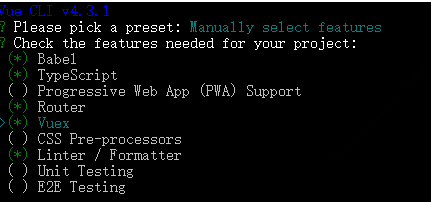
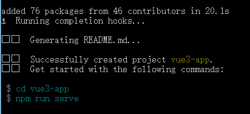

# 基于Vue3创建新项目

Vue3已经发布了，我们需要创建新的项目熟悉Vue3的API及特性
目前可以使用vue-cli工具建立vue3-typescript项目
- 1、检查vue-cli 工具版本是否最新的 >@vue/cli 4.3.1,如果不是最新的需要 npm install -g @vue/cli 重新安装最新版本 
```
>vue -V
>@vue/cli 4.3.1
```
- 2、执行命令：vue create vue3-app，选择typescript+router+vuex等（注：空格键是选中与取消，A键是全选）



- 3、进到项目中执行命令：vue add vue-next



- 4、删除src目录下的shims-tsx.d.ts

- 5、修改src目录下的shims-vue.d.ts 文件中的内容如下：

```ts
declare module '*.vue' {
  import { defineComponent } from 'vue'
  const Component: ReturnType<typeof defineComponent>
  export default Component
}

```

- 6、components目录下删除HelloWorld.vue，添加Counter.vue, 文件中的内容如下：
```vue
<template>
  <div>
    <h1>{{ msg }}</h1>
    <h3>Count: {{ count }}</h3>
    <button @click="increase">click me!</button>
  </div>
</template>
<script lang="ts">
import { defineComponent,ref } from 'vue'
export default defineComponent({
  props: {
    msg: {
      type: String,
      default: 'welcome to study vue3！'
    }
  },
  setup(){
    const count = ref(0)
    const increase = () => {
      count.value++
    }
    return {
      count,
      increase
    }
  }
})
</script>
```
- 7.修改src目录下的 Home.vue 文件中的内容如下：

```vue
<template>
  <div class="home">
    <Counter msg="Welcome to Your Vue.js App" />
  </div>
</template>
<script>
import Counter from '@/components/Counter'
export default {
  name: 'Home',
  components: {
    Counter
  }
}
</script>

```

- 8.修改router目录下的 index.ts 文件中的内容如下：

```ts
import { RouteRecordRaw, createRouter, createWebHistory } from 'vue-router'
import Home from '../views/Home.vue'

const routes: Array<RouteRecordRaw> = [
  {
    path: '/',
    name: 'Home',
    component: Home
  },
  {
    path: '/about',
    name: 'About',
    component: () => import(/* webpackChunkName: "about" */ '../views/About.vue')
  }
]

const router = createRouter({
  history: createWebHistory(process.env.BASE_URL),
  routes
})

export default router

```

- 9.修改store目录下的 index.ts 文件中的内容如下：

```ts
import { createStore } from 'vuex'

export default createStore({
  state: {},
  mutations: {},
  actions: {},
  modules: {},
})

```

- 10、执行命令 npm run serve

这样一个新的项目就建起来了，在新的项目中可以练习下vue的新特性