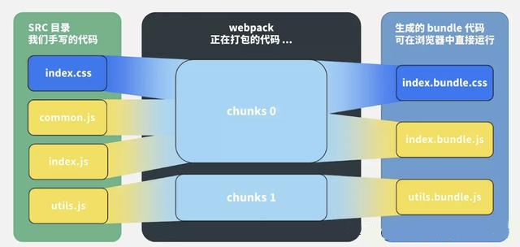
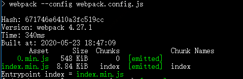
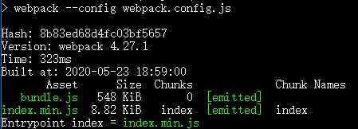
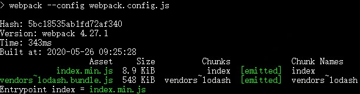
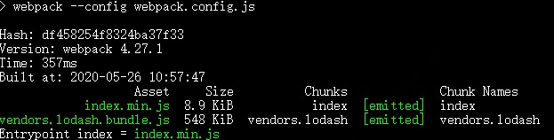
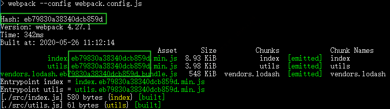
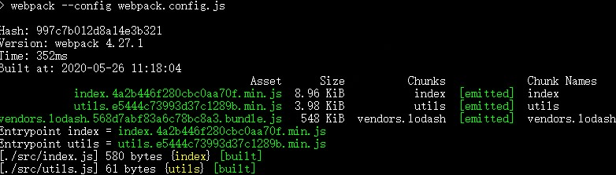

# webpack 中比较难懂的几个变量名称

## 1、webpack 中，module，chunk 和 bundle 的区别是什么？

首先我们来看一张图：



> 对于一份同逻辑的代码，当我们手写了一个个的文件，他们无论是 ESM 还是 commonJs 或者 AMD，他们都是 module。
> 当我们写的 module 源文件传到 webpack 进行打包时，webpack 会根据文件引用关系生成 chunk 文件，webpack 会对这个 chunk 文件进行一些操作。
> webpack 处理好 chunk 文件后，最后会输出 bundle 文件，这个 bundle 文件包含警告加载和编译的最终源文件，所以它是可以在浏览器中运行。

一般来说一个 chunk 对应一个 bundle，比如上图的 utils.js -> chunks 1 -> utils.bundle.js;但也有例外，比如上图中，用 MinCssExtraPlugin 从 chunks 0 中抽离出了 index.bundle.css 文件。

一句话总结：

module，chunk 和 bundle 其实就是同一份逻辑代码再不跳转换场景下的取了三个名字:

我们直接写出出来的是 module。

webpack 处理时的是 chunk。

最后生成浏览器可以直接运行的 bundle。


## 2、filename 和 chunkFilename 的区别

- filename:

  filename 是一个很常见的配置，就是对应于 entry 里面的输入文件，经过 webpack 打包后输出文件的文件名。比如说经过下面的配置，生成出来的文件名为 index.min.js。

```js
module.exports = {
  mode: 'development',
  entry: {
    index: './src/index.js'
  },
  output: {
    filename: '[name].min.js' // index.min.js
  },
}
```

- chunkFilename：

  chunkFilename 指未被列入在 entry 中，却又需要被打包出来的 chunk 文件的名称。一般来说，这个 chunk 文件指的就是要懒加载的代码。
  比如说我们的业务代码中写了一份懒加载 lodash 的代码：

```js
let btn = document.createElement('button')
btn.innerHTML = 'click me'
document.body.appendChild(btn)
// 异步加载代码
async function getAsyncComponent() {
  var element = document.createElement('div')
  const { default: _ } = await import('lodash')
  element.innerHTML = _.join(['Hello!', 'dynamic', 'imports', 'async'], ' ')
  return element
}
// 点击 button 时，懒加载 lodash，在网页上显示 Hello! dynamic imports async
btn.addEventListener('click', () => {
  getAsyncComponent().then((component) => {
    document.body.appendChild(component)
  })
})
```

我们的 webpack 不做任何配置，还是原来的配置代码：

```js
module.exports = {
  mode: 'development',
  entry: {
    index: './src/index.js'
  },
  output: {
    filename: '[name].min.js' // index.min.js
  },
}
```

这时候的打包结果如下：



这个 0.min.js 就是异步加载的 chunk 文件。文档里这么解析：

> output.chunkFilename 默认使用[id].js 或者从 output.filename 中推断出的值（[name]会被预先替换为[id]或[id]）

文档写的太抽象，我们不如结果上面的例子来看：

output.filename 输出的文件名是[name].min.js，[name]根据 entry 的配置推动为 index，所以输出为 index.min.js;
由于 output.chunkFilename 没有显示指定，就会把[name]替换为 chunk 文件的 id 号，这里文件的 id 号是 0 所以文件名就是 0.min.js。
如果我们显式配置 chunkFilename，就会按照配置的名字生成文件

```js
module.exports = {
  mode: 'development',
  entry: {
    index: './src/index.js'
  },
  output: {
    filename: '[name].min.js' // index.min.js
    chunkFilename: 'bundle.js' // bundle.js
  },
}
```



一句话总结：

filename 指列在 entry 中，打包后输出的文件的名称。

chunkFilename 指未列在 entry 中，却又需要被打包出来的文件的名称。

## 3、path 和 publicPath 的区别

- path 是指 output 中的 path，打包后文件所在的路面。

- publicPath 是指资源的访问路径

## 4、webpackPrefetch、webpackPreload 和 webpackChunkName 到底是干什么的？

- webpackChunkName
  前面举了个异步加载 lodash 的例子，我们最后吧 output.chunkFilename 写死成 bundle.js。
  在我们的因为代码中，不可能只一部加载一个文件，所以写死肯定是不行的，但是写成[name].bundle.js 时，打包的文件又是意义不明、辨识度不搞得 chunk id

这时候 webpackChunkName 就可以派上用场了。我们可以在 import 文件时，在 import 里面以注释的心声为 chunk 文件取别名：
```js
let btn = document.createElement('button')
btn.innerHTML = 'click me'
document.body.appendChild(btn)
// 异步加载代码
async function getAsyncComponent() {
  var element = document.createElement('div')
  const { default: _ } = await import(/* webpackChunkName: "lodash" */ 'lodash')
  element.innerHTML = _.join(['Hello!', 'dynamic', 'imports', 'async'], ' ')
  return element
}
// 点击 button 时，懒加载 lodash，在网页上显示 Hello! dynamic imports async
btn.addEventListener('click', () => {
  getAsyncComponent().then((component) => {
    document.body.appendChild(component)
  })
})

```
这时候打包生成的文件是这样的



现在问题来了，lodash 是我们取的名字，按道理来说应该生成 lodash.bundle.js,前面的 vendors~是什么玩意？
其实 webpack 懒加载是用内置的一个插件 SplitChunksPlugin 实现的，这个插件里面有些默认配置项，比如说 authomaticNameDelimiter，默认的分割符就是~，所以最后的文件名才会出现这个符号。
可以通过修改optimization配置
```js
module.exports = {
  mode: 'development',
  entry: {
    index: './src/index.js'
  },
  output: {
    filename: '[name].min.js', // index.min.js
    chunkFilename: '[name].bundle.js' // bundle.js
  },
  optimization: {
    splitChunks: {
      automaticNameDelimiter: '.'
    }
  }
}
```



- webpackPrefetch 和 webpackPrelaod
  这两个配置一个叫预拉取（Prefetch），一个叫预加载（Preload），两者有些细微的不同，

在上面的懒加载代码里，我们是点击按钮时，才会触发异步加载 lodash 的动作，这时候会动态的生成一个 script 标签，加载到 head 头里：

如果我们 import 的时候添加 webpackPrefetch:
```js
const { default: _ } = await import(/* webpackChunkName: "lodash" */ /* webpackPrefetch: true */ 'lodash');
```
就会以<link rel="prefetch" as="script">的形式预拉取 lodash 代码

这个异步加载的代码不需要手动点击 button 触发，webpack 会在父 chunk 完成加载后，闲时加载 lodash 文件。

webpackPreload 是预加载当前导航下可能需要的资源，他和 webpackPrefetch 的主要区别是：

1、preload chunk 会在父 chunk 加载时，以并行方式开始加载。prefetch chunk 会在父 chunk 加载结束后开始加载。

2、preload chunk 具有中等优先级，并立即下载。prefetch chunk 在浏览器闲置时下载。

3、 preload chunk 会在父 chunk 中立即请求，用于当下时刻。prefetch chunk 会用于未来的某个时刻。

一句话总结：

webpackChunkName 是为预加载的文件取别名，webpackPrefetch 会在浏览器闲置下载文件，webpackPreload 会在父 chunk 加载时并行下载文件

## 5、sourse-map 中 eval、cheap、inline 和 module 各是什么意思？

开发常用配置：

- 1、source-map
  大而全，什么都有，就因为什么都有可能会让 webpack 构建事件变长，看情况使用

- 2、cheap-module-eval-source-map

这个一般是开发环境（dev）推荐使用，在构建速度保持提醒上做了比较好的均衡

- 3、cheap-module-source-map

一般来说，生产环境是不配置 source-map，如果想捕捉线上的代码报错，我们可以用这个

## 6、hash，chunkhash，contenthash 有什么不同

首先来个背景介绍，哈希一般是结合 CDN 缓存来使用的，如果文件内容改变的话，那么对象文件哈希值也会改变，对应的 html 引用的 url 地址也会改变，触发 CDN 服务器从源服务器上拉取对应数据，进而更新本地缓存。

- hash
  hash 计算是跟整个项目的构建相关，

webpack 的核心配置如下：
```js
module.exports = {
  mode: 'development',
  entry: {
    index: './src/index.js',
    utils: './src/utils.js'
  },
  output: {
    filename: '[name].[hash].min.js',  // [hash:8] 保留8位
    chunkFilename: '[name].[hash].bundle.js'  // [hash:8] 保留8位
  },
  optimization: {
    splitChunks: {
      automaticNameDelimiter: '.'
    }
  }
}
```
生成的文件名如下：



我们可以发现，生成文件的 hash 和项目的构建 hash 都是一模一样的

- chunkhash

因为 hash 是项目构建的哈希值，项目中如果有些变动，hash 一定会变，比如说我改动了 utils.js 的代码，index.js 里面的代码虽然没有改变，但是大家都是用的同一份 hash。hash 一变，缓存一定失效了，这样子是没办法实现 cdn 和浏览器缓存的。

chunkhash 就是解决这个问题的，它根据不同的入口文件进行依赖文件解析、构建对应的 chunk，生成对应的哈希值。
```js

module.exports = {
  mode: 'development',
  entry: {
    index: './src/index.js',
    utils: './src/utils.js'
  },
  output: {
    filename: '[name].[chunkhash].min.js', // [chunkhash:8] 保留8位
    chunkFilename: '[name].[chunkhash].bundle.js' // [chunkhash:8] 保留8位
  },
  optimization: {
    splitChunks: {
      automaticNameDelimiter: '.'
    }
  }
}

```


- contenthash
  我们更近一步，index.js 和 index.css 同为一个 chunk，如果 index.js 内容发生变化，但是 index.css 没有变化，打包后他们的 hash 都发生变化，这对 css 文件来说是一种浪费。如何解决这个问题呢？
  contenthasn 将根据资源内容创建出唯一 hash，也就是说文件内容不变，hash 就不变

一句话中间：
hash 计算与整个项目的构建相关。

chunkhash 计算与同一 chunk 内容相关。

contenthash 计算与文件内容本身相关。
